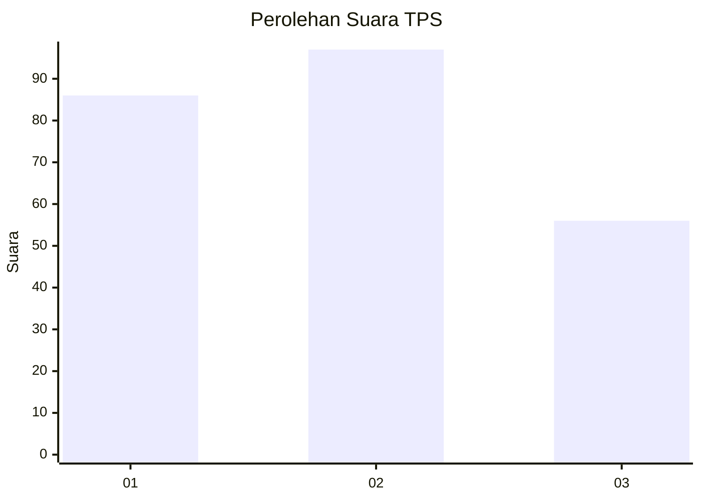
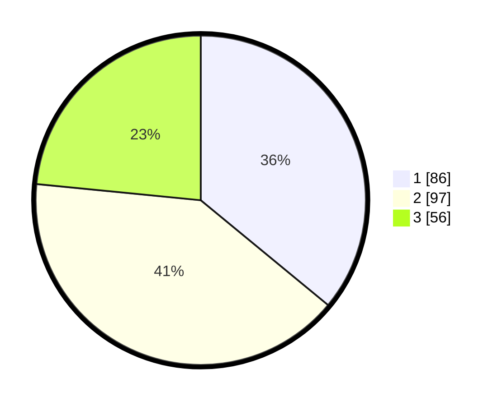

# Hasil

## Grafik

## Tabel

| No. | Nama Paslon    | Suara | Suara (raw) | Persentase |
|:--- |:-------------- | -----:| -----------:| ----------:|
| 1   | ANIES MUHAIMIN | 86    | [86][p-1]   | 35,98      |
| 2   | PRABOWO GIBRAN | 97    | [97][p-2]   | 40,59      |
| 3   | GANJAR MAHFUD  | 56    | [56][p-3]   | 23,43      |

[p-1]: https://github.com/gigit-pemilu/pemilu-2024-34-di-yogyakarta/blob/main/pilpres/hitung-suara/sub/34-di-yogyakarta/sub/02-bantul/sub/16-kasihan/sub/2003-tamantirto/sub/013-tps/sub/paslon-1.txt
[p-2]: https://github.com/gigit-pemilu/pemilu-2024-34-di-yogyakarta/blob/main/pilpres/hitung-suara/sub/34-di-yogyakarta/sub/02-bantul/sub/16-kasihan/sub/2003-tamantirto/sub/013-tps/sub/paslon-2.txt
[p-3]: https://github.com/gigit-pemilu/pemilu-2024-34-di-yogyakarta/blob/main/pilpres/hitung-suara/sub/34-di-yogyakarta/sub/02-bantul/sub/16-kasihan/sub/2003-tamantirto/sub/013-tps/sub/paslon-3.txt

## Foto C Plano

https://sirekap-obj-formc.kpu.go.id/e8fa/pemilu/ppwp/34/02/16/20/03/3402162003013-20240214-234441--7826dfc4-7912-41f0-b2eb-7695c229387c.jpg

https://sirekap-obj-formc.kpu.go.id/e8fa/pemilu/ppwp/34/02/16/20/03/3402162003013-20240215-014201--c71eec75-e911-49d2-9dbf-f7544d2540ca.jpg

https://sirekap-obj-formc.kpu.go.id/e8fa/pemilu/ppwp/34/02/16/20/03/3402162003013-20240215-014253--f3384d9c-40e1-4c62-a4b8-b336184d0ad4.jpg

## Metadata

| Key        | Value               |
| ---------- | ------------------- |
| Time Stamp | 2024-02-15 20:00:44 |

