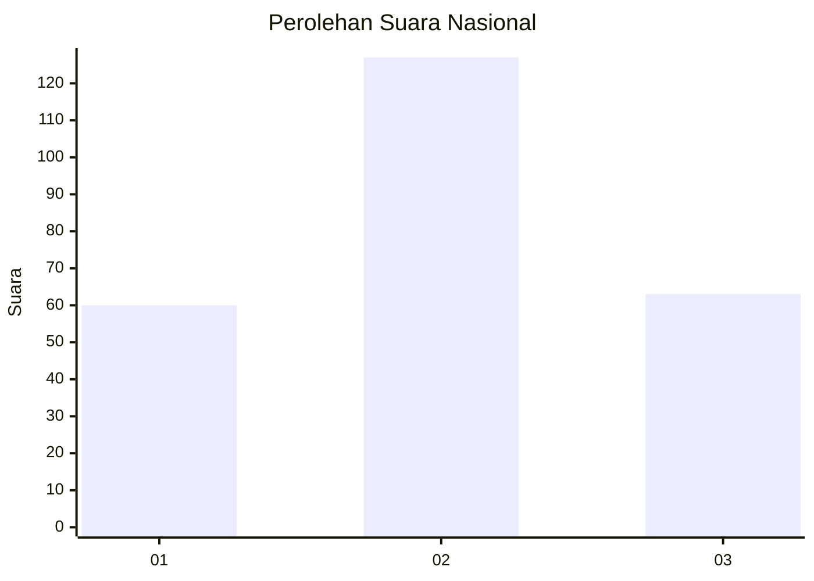
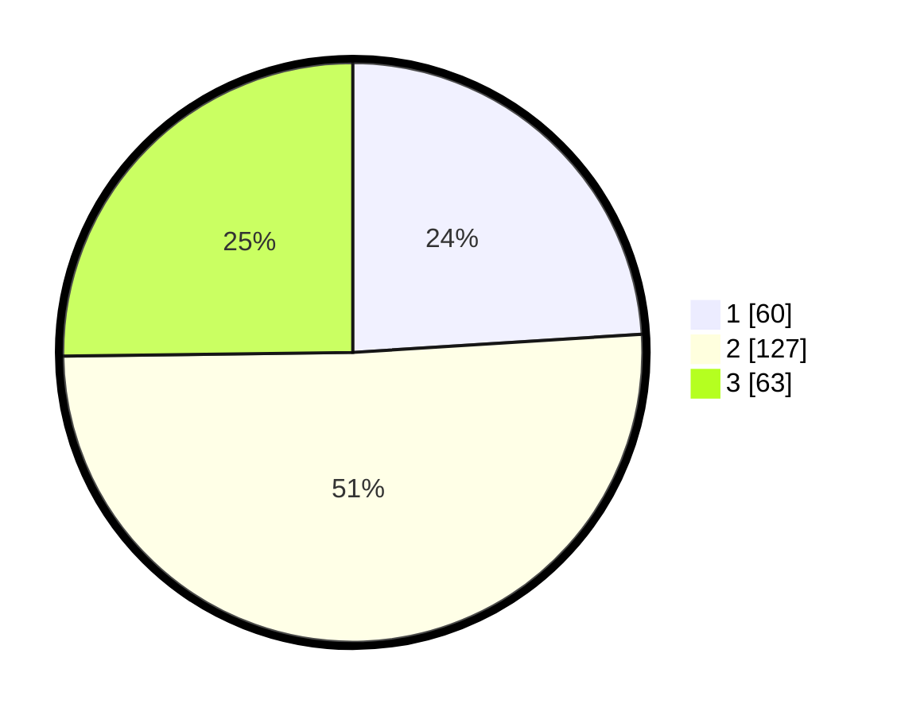

# Hasil

## Grafik

## Tabel

| No. | Nama Paslon    | Suara | Suara (raw) | Persentase |
|:--- |:-------------- | -----:| -----------:| ----------:|
| 1   | ANIES MUHAIMIN | 60    | [60][p-1]   | 24,00      |
| 2   | PRABOWO GIBRAN | 127   | [127][p-2]  | 50,80      |
| 3   | GANJAR MAHFUD  | 63    | [63][p-3]   | 25,20      |

[p-1]: https://github.com/gigit-pemilu/pemilu-2024/blob/main/pilpres/hitung-suara/sub/34-di-yogyakarta/sub/02-bantul/sub/16-kasihan/sub/2003-tamantirto/sub/018-tps/sub/paslon-1.txt
[p-2]: https://github.com/gigit-pemilu/pemilu-2024/blob/main/pilpres/hitung-suara/sub/34-di-yogyakarta/sub/02-bantul/sub/16-kasihan/sub/2003-tamantirto/sub/018-tps/sub/paslon-2.txt
[p-3]: https://github.com/gigit-pemilu/pemilu-2024/blob/main/pilpres/hitung-suara/sub/34-di-yogyakarta/sub/02-bantul/sub/16-kasihan/sub/2003-tamantirto/sub/018-tps/sub/paslon-3.txt

## Foto C Plano

https://sirekap-obj-formc.kpu.go.id/643e/pemilu/ppwp/34/02/16/20/03/3402162003018-20240215-041659--149316d8-e963-4314-ae52-14959ede5bdf.jpg

https://sirekap-obj-formc.kpu.go.id/643e/pemilu/ppwp/34/02/16/20/03/3402162003018-20240215-041813--28d03800-d92c-440b-97a3-cbbb0efadd54.jpg

https://sirekap-obj-formc.kpu.go.id/643e/pemilu/ppwp/34/02/16/20/03/3402162003018-20240215-042105--7539d111-e68d-41bf-b8c2-479c1ab864b1.jpg

## Metadata

| Key        | Value               |
| ---------- | ------------------- |
| Time Stamp | 2024-02-24 22:31:28 |

