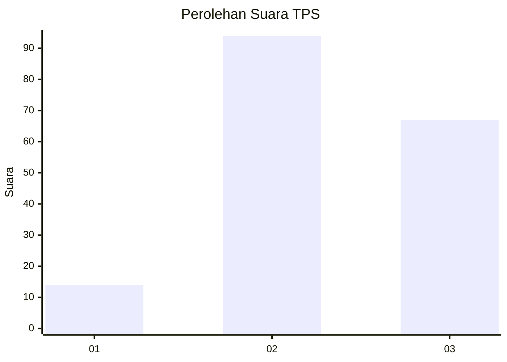
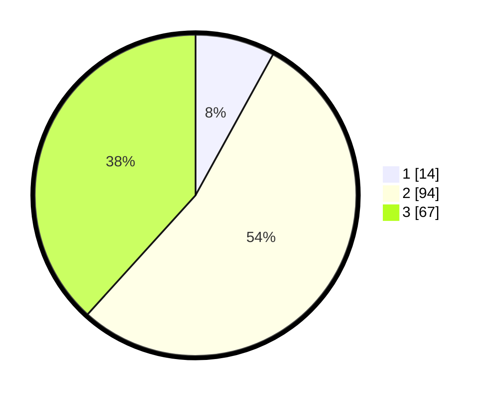

# Hasil

## Grafik

## Tabel

| No. | Nama Paslon    | Suara | Suara (raw) | Persentase |
|:--- |:-------------- | -----:| -----------:| ----------:|
| 1   | ANIES MUHAIMIN | 14    | [14][p-1]   | 8,00       |
| 2   | PRABOWO GIBRAN | 94    | [94][p-2]   | 53,71      |
| 3   | GANJAR MAHFUD  | 67    | [67][p-3]   | 38,29      |

[p-1]: https://github.com/gigit-pemilu/pemilu-2024-34-di-yogyakarta/blob/main/pilpres/hitung-suara/sub/34-di-yogyakarta/sub/02-bantul/sub/16-kasihan/sub/2003-tamantirto/sub/034-tps/sub/paslon-1.txt
[p-2]: https://github.com/gigit-pemilu/pemilu-2024-34-di-yogyakarta/blob/main/pilpres/hitung-suara/sub/34-di-yogyakarta/sub/02-bantul/sub/16-kasihan/sub/2003-tamantirto/sub/034-tps/sub/paslon-2.txt
[p-3]: https://github.com/gigit-pemilu/pemilu-2024-34-di-yogyakarta/blob/main/pilpres/hitung-suara/sub/34-di-yogyakarta/sub/02-bantul/sub/16-kasihan/sub/2003-tamantirto/sub/034-tps/sub/paslon-3.txt

## Foto C Plano

https://sirekap-obj-formc.kpu.go.id/6889/pemilu/ppwp/34/02/16/20/03/3402162003034-20240222-165745--d463bbfc-9ca9-450c-a6a1-a24eeff00e86.jpg

https://sirekap-obj-formc.kpu.go.id/6889/pemilu/ppwp/34/02/16/20/03/3402162003034-20240222-165923--e5c03da9-693a-4b61-aaa9-310bdba1c5e9.jpg

https://sirekap-obj-formc.kpu.go.id/6889/pemilu/ppwp/34/02/16/20/03/3402162003034-20240222-170042--18956d9e-361c-4f7c-938e-c7dce0398b88.jpg

## Metadata

| Key        | Value               |
| ---------- | ------------------- |
| Time Stamp | 2024-02-25 12:00:00 |

