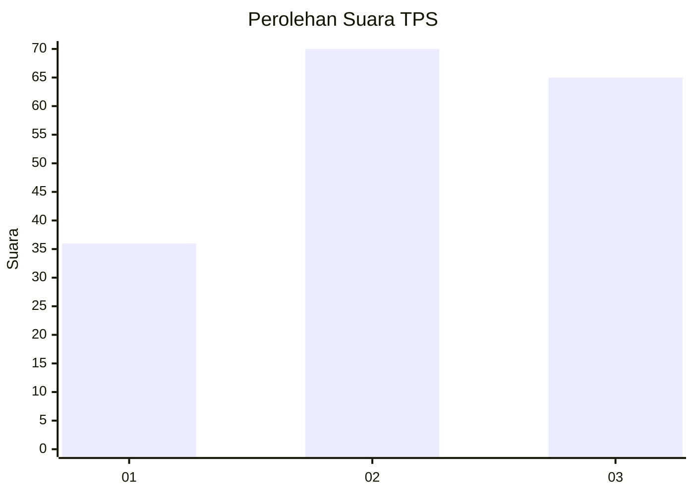
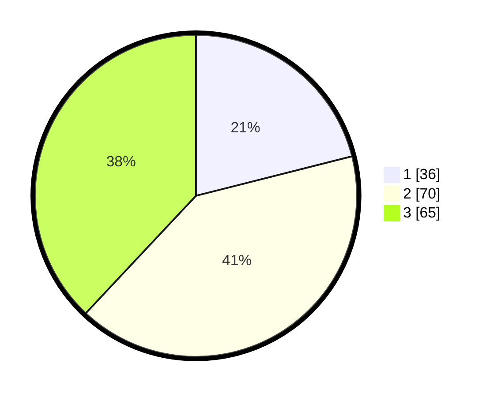

# Hasil

## Grafik

## Tabel

| No. | Nama Paslon    | Suara | Suara (raw) | Persentase |
|:--- |:-------------- | -----:| -----------:| ----------:|
| 1   | ANIES MUHAIMIN | 36    | [36][p-1]   | 21,05      |
| 2   | PRABOWO GIBRAN | 70    | [70][p-2]   | 40,94      |
| 3   | GANJAR MAHFUD  | 65    | [65][p-3]   | 38,01      |

[p-1]: https://github.com/gigit-pemilu/pemilu-2024-34-di-yogyakarta/blob/main/pilpres/hitung-suara/sub/34-di-yogyakarta/sub/02-bantul/sub/16-kasihan/sub/2003-tamantirto/sub/036-tps/sub/paslon-1.txt
[p-2]: https://github.com/gigit-pemilu/pemilu-2024-34-di-yogyakarta/blob/main/pilpres/hitung-suara/sub/34-di-yogyakarta/sub/02-bantul/sub/16-kasihan/sub/2003-tamantirto/sub/036-tps/sub/paslon-2.txt
[p-3]: https://github.com/gigit-pemilu/pemilu-2024-34-di-yogyakarta/blob/main/pilpres/hitung-suara/sub/34-di-yogyakarta/sub/02-bantul/sub/16-kasihan/sub/2003-tamantirto/sub/036-tps/sub/paslon-3.txt

## Foto C Plano

https://sirekap-obj-formc.kpu.go.id/ee07/pemilu/ppwp/34/02/16/20/03/3402162003036-20240214-203303--7f41a3f5-fb45-45d1-b545-79040262af65.jpg

https://sirekap-obj-formc.kpu.go.id/ee07/pemilu/ppwp/34/02/16/20/03/3402162003036-20240214-203308--c5e32729-c667-4a24-b840-fd9ca151c6cf.jpg

https://sirekap-obj-formc.kpu.go.id/ee07/pemilu/ppwp/34/02/16/20/03/3402162003036-20240214-203314--2a695430-9707-4d27-aa69-26228faa599f.jpg

## Metadata

| Key        | Value               |
| ---------- | ------------------- |
| Time Stamp | 2024-02-24 22:31:28 |

