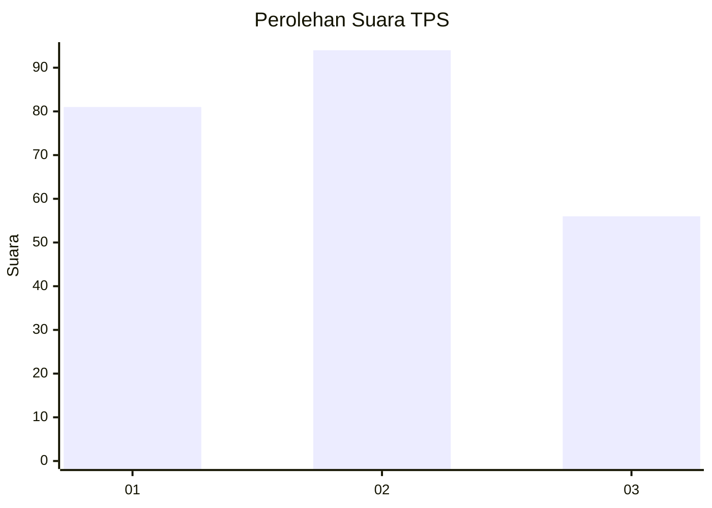
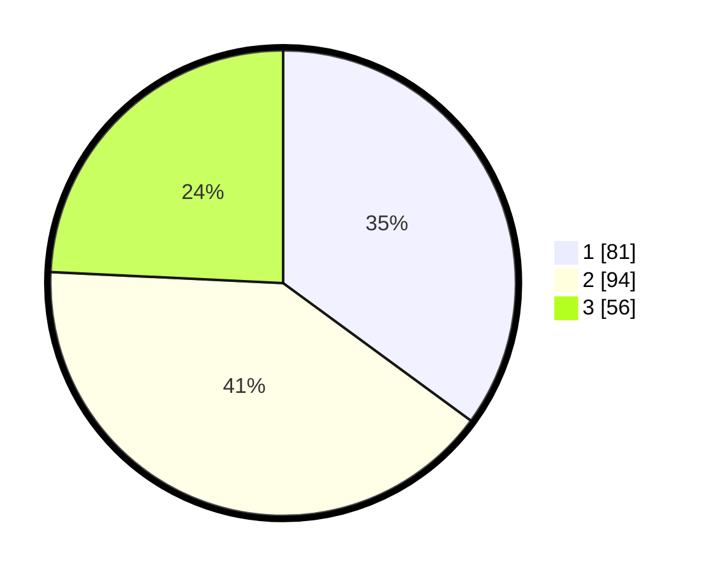

# Hasil

## Grafik

## Tabel

| No. | Nama Paslon    | Suara | Suara (raw) | Persentase |
|:--- |:-------------- | -----:| -----------:| ----------:|
| 1   | ANIES MUHAIMIN | 81    | [81][p-1]   | 35,06      |
| 2   | PRABOWO GIBRAN | 94    | [94][p-2]   | 40,69      |
| 3   | GANJAR MAHFUD  | 56    | [56][p-3]   | 24,24      |

[p-1]: https://github.com/gigit-pemilu/pemilu-2024-34-di-yogyakarta/blob/main/pilpres/hitung-suara/sub/34-di-yogyakarta/sub/02-bantul/sub/16-kasihan/sub/2003-tamantirto/sub/039-tps/sub/paslon-1.txt
[p-2]: https://github.com/gigit-pemilu/pemilu-2024-34-di-yogyakarta/blob/main/pilpres/hitung-suara/sub/34-di-yogyakarta/sub/02-bantul/sub/16-kasihan/sub/2003-tamantirto/sub/039-tps/sub/paslon-2.txt
[p-3]: https://github.com/gigit-pemilu/pemilu-2024-34-di-yogyakarta/blob/main/pilpres/hitung-suara/sub/34-di-yogyakarta/sub/02-bantul/sub/16-kasihan/sub/2003-tamantirto/sub/039-tps/sub/paslon-3.txt

## Foto C Plano

https://sirekap-obj-formc.kpu.go.id/429e/pemilu/ppwp/34/02/16/20/03/3402162003039-20240215-050109--732a916e-c1e4-437f-9365-70e0013db5af.jpg

https://sirekap-obj-formc.kpu.go.id/429e/pemilu/ppwp/34/02/16/20/03/3402162003039-20240215-034418--e7508d9a-f339-47f9-8e4b-ccfd5ba4ac21.jpg

https://sirekap-obj-formc.kpu.go.id/429e/pemilu/ppwp/34/02/16/20/03/3402162003039-20240215-050219--2587324f-0c95-4b57-af64-b943bb49f44e.jpg

## Metadata

| Key        | Value               |
| ---------- | ------------------- |
| Time Stamp | 2024-02-24 22:31:28 |

