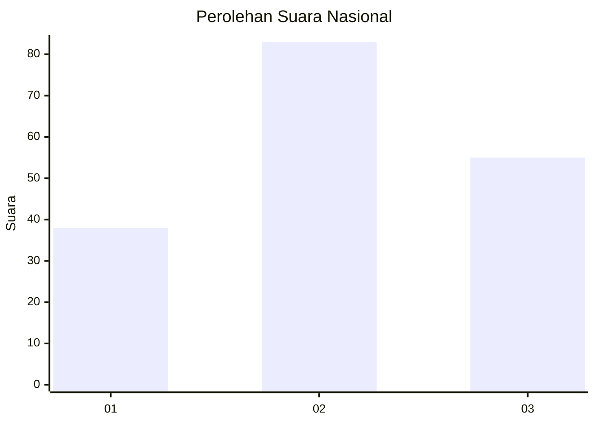
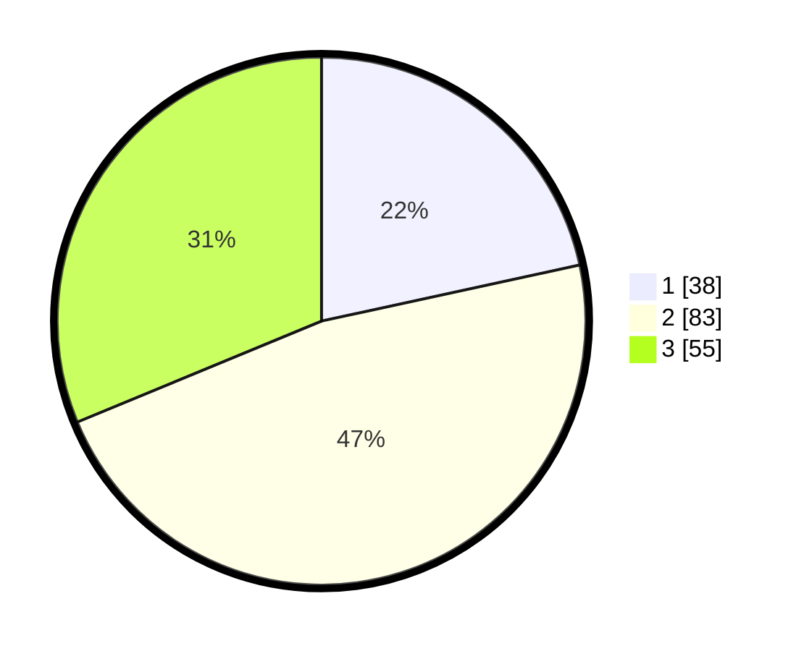

# Hasil

## Grafik

## Tabel

| No. | Nama Paslon    | Suara | Suara (raw) | Persentase |
|:--- |:-------------- | -----:| -----------:| ----------:|
| 1   | ANIES MUHAIMIN | 38    | [38][p-1]   | 21,59      |
| 2   | PRABOWO GIBRAN | 83    | [83][p-2]   | 47,16      |
| 3   | GANJAR MAHFUD  | 55    | [55][p-3]   | 31,25      |

[p-1]: https://github.com/gigit-pemilu/pemilu-2024/blob/main/pilpres/hitung-suara/sub/34-di-yogyakarta/sub/02-bantul/sub/16-kasihan/sub/2003-tamantirto/sub/045-tps/sub/paslon-1.txt
[p-2]: https://github.com/gigit-pemilu/pemilu-2024/blob/main/pilpres/hitung-suara/sub/34-di-yogyakarta/sub/02-bantul/sub/16-kasihan/sub/2003-tamantirto/sub/045-tps/sub/paslon-2.txt
[p-3]: https://github.com/gigit-pemilu/pemilu-2024/blob/main/pilpres/hitung-suara/sub/34-di-yogyakarta/sub/02-bantul/sub/16-kasihan/sub/2003-tamantirto/sub/045-tps/sub/paslon-3.txt

## Foto C Plano

https://sirekap-obj-formc.kpu.go.id/a4c4/pemilu/ppwp/34/02/16/20/03/3402162003045-20240214-234104--8e53a904-d37a-48ee-aa65-447789bce912.jpg

https://sirekap-obj-formc.kpu.go.id/a4c4/pemilu/ppwp/34/02/16/20/03/3402162003045-20240214-234214--8325ffc6-83be-41b0-809a-f882ac8bd166.jpg

https://sirekap-obj-formc.kpu.go.id/a4c4/pemilu/ppwp/34/02/16/20/03/3402162003045-20240214-234332--e170afeb-3dec-41cc-8394-4b53b40957ad.jpg

## Metadata

| Key        | Value               |
| ---------- | ------------------- |
| Time Stamp | 2024-02-25 17:00:00 |

