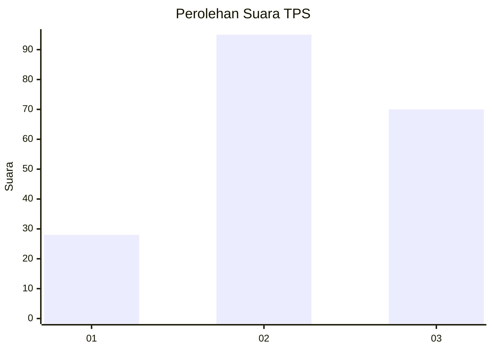
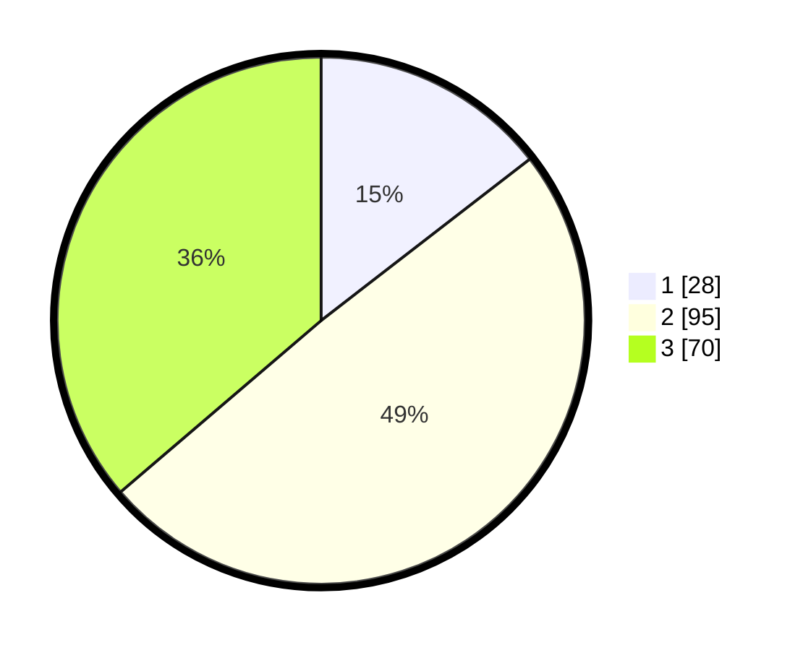

# Hasil

## Grafik

## Tabel

| No. | Nama Paslon    | Suara | Suara (raw) | Persentase |
|:--- |:-------------- | -----:| -----------:| ----------:|
| 1   | ANIES MUHAIMIN | 28    | [28][p-1]   | 14,51      |
| 2   | PRABOWO GIBRAN | 95    | [95][p-2]   | 49,22      |
| 3   | GANJAR MAHFUD  | 70    | [70][p-3]   | 36,27      |

[p-1]: https://github.com/gigit-pemilu/pemilu-2024-34-di-yogyakarta/blob/main/pilpres/hitung-suara/sub/34-di-yogyakarta/sub/02-bantul/sub/16-kasihan/sub/2003-tamantirto/sub/046-tps/sub/paslon-1.txt
[p-2]: https://github.com/gigit-pemilu/pemilu-2024-34-di-yogyakarta/blob/main/pilpres/hitung-suara/sub/34-di-yogyakarta/sub/02-bantul/sub/16-kasihan/sub/2003-tamantirto/sub/046-tps/sub/paslon-2.txt
[p-3]: https://github.com/gigit-pemilu/pemilu-2024-34-di-yogyakarta/blob/main/pilpres/hitung-suara/sub/34-di-yogyakarta/sub/02-bantul/sub/16-kasihan/sub/2003-tamantirto/sub/046-tps/sub/paslon-3.txt

## Foto C Plano

https://sirekap-obj-formc.kpu.go.id/94b6/pemilu/ppwp/34/02/16/20/03/3402162003046-20240214-225425--f279e2e4-53c0-4a8e-af38-a338cd5bbb62.jpg

https://sirekap-obj-formc.kpu.go.id/94b6/pemilu/ppwp/34/02/16/20/03/3402162003046-20240214-225435--a1dde1e7-e0ce-45fd-9053-06195c61e82f.jpg

https://sirekap-obj-formc.kpu.go.id/94b6/pemilu/ppwp/34/02/16/20/03/3402162003046-20240214-225444--5a140ef3-8455-4621-8b02-7e9944a0cc25.jpg

## Metadata

| Key        | Value               |
| ---------- | ------------------- |
| Time Stamp | 2024-02-25 15:00:00 |

