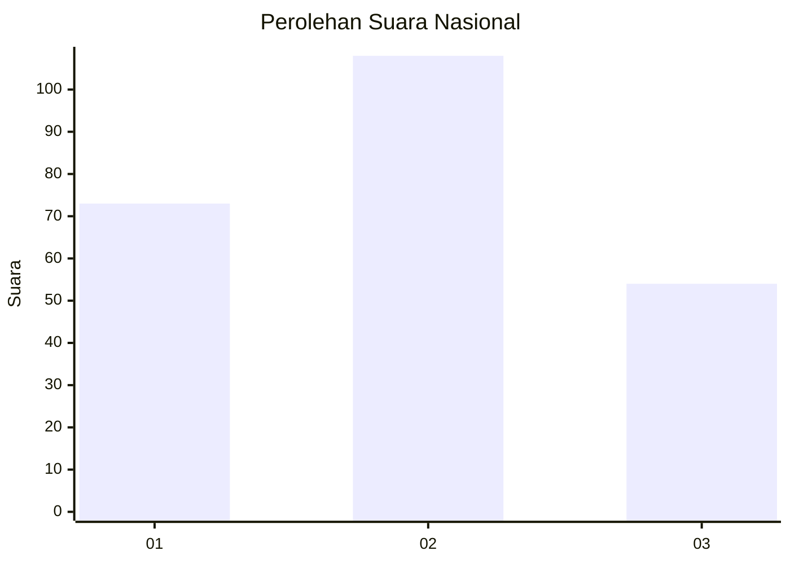
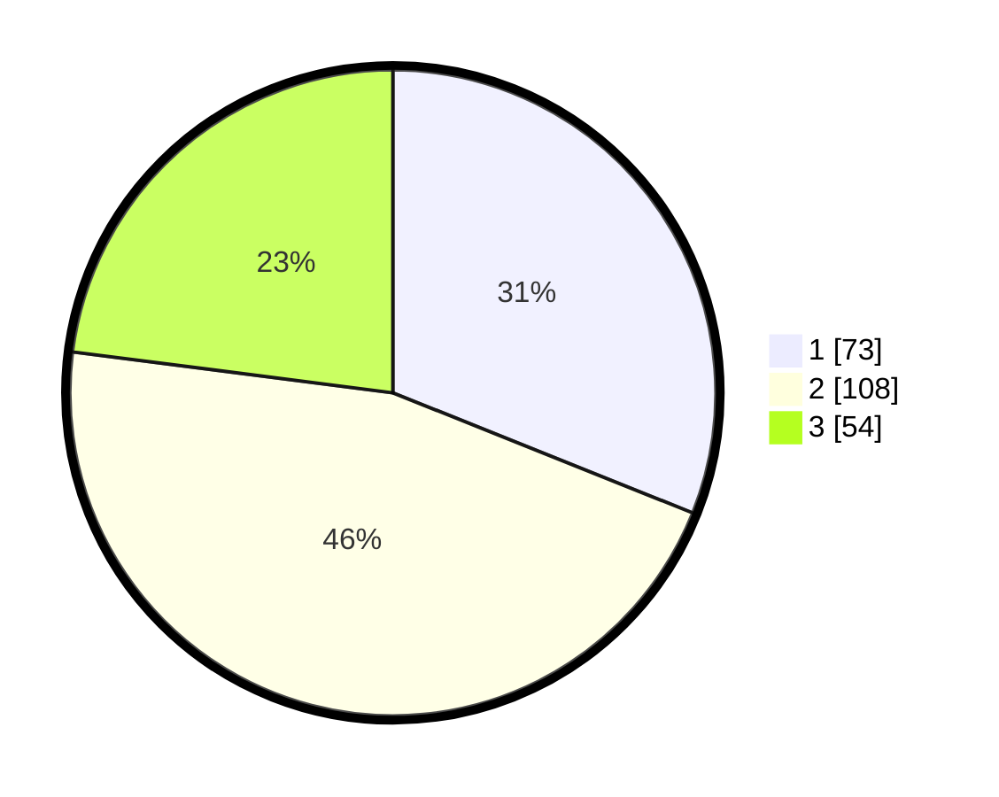

# Hasil

## Grafik

## Tabel

| No. | Nama Paslon    | Suara | Suara (raw) | Persentase |
|:--- |:-------------- | -----:| -----------:| ----------:|
| 1   | ANIES MUHAIMIN | 73    | [73][p-1]   | 31,06      |
| 2   | PRABOWO GIBRAN | 108   | [108][p-2]  | 45,96      |
| 3   | GANJAR MAHFUD  | 54    | [54][p-3]   | 22,98      |

[p-1]: https://github.com/gigit-pemilu/pemilu-2024/blob/main/pilpres/hitung-suara/sub/34-di-yogyakarta/sub/02-bantul/sub/16-kasihan/sub/2003-tamantirto/sub/047-tps/sub/paslon-1.txt
[p-2]: https://github.com/gigit-pemilu/pemilu-2024/blob/main/pilpres/hitung-suara/sub/34-di-yogyakarta/sub/02-bantul/sub/16-kasihan/sub/2003-tamantirto/sub/047-tps/sub/paslon-2.txt
[p-3]: https://github.com/gigit-pemilu/pemilu-2024/blob/main/pilpres/hitung-suara/sub/34-di-yogyakarta/sub/02-bantul/sub/16-kasihan/sub/2003-tamantirto/sub/047-tps/sub/paslon-3.txt

## Foto C Plano

https://sirekap-obj-formc.kpu.go.id/db75/pemilu/ppwp/34/02/16/20/03/3402162003047-20240216-152405--6383088a-0795-40f7-82ca-70fe25a088da.jpg

https://sirekap-obj-formc.kpu.go.id/db75/pemilu/ppwp/34/02/16/20/03/3402162003047-20240216-152406--9db434c1-3032-4335-9605-8f68301f2666.jpg

https://sirekap-obj-formc.kpu.go.id/db75/pemilu/ppwp/34/02/16/20/03/3402162003047-20240216-152405--08a7e564-75c5-4b94-885f-89fabf7e0586.jpg

## Metadata

| Key        | Value               |
| ---------- | ------------------- |
| Time Stamp | 2024-02-21 09:00:00 |

## DATA PEMILIH TETAP

Jumlah pemilih dalam DPT: **267**.
 * L: **133**.
 * P: **134**.

## DATA PENGGUNA HAK PILIH

Jumlah pengguna hak pilih dalam DPT: **221**.
 * L: **107**.
 * P: **114**.

Jumlah pengguna hak pilih dalam DPTb: **12**.
 * L: **4**.
 * P: **8**.

Jumlah pengguna hak pilih dalam DPK: **7**.
 * L: **3**.
 * P: **4**.

Jumlah pengguna hak pilih: **240**.
 * L: **114**.
 * P: **126**.

## JUMLAH SUARA SAH DAN TIDAK SAH

JUMLAH SELURUH SUARA SAH: **235**.

JUMLAH SUARA TIDAK SAH: **5**.

JUMLAH SELURUH SUARA SAH DAN SUARA TIDAK SAH: **240**.

