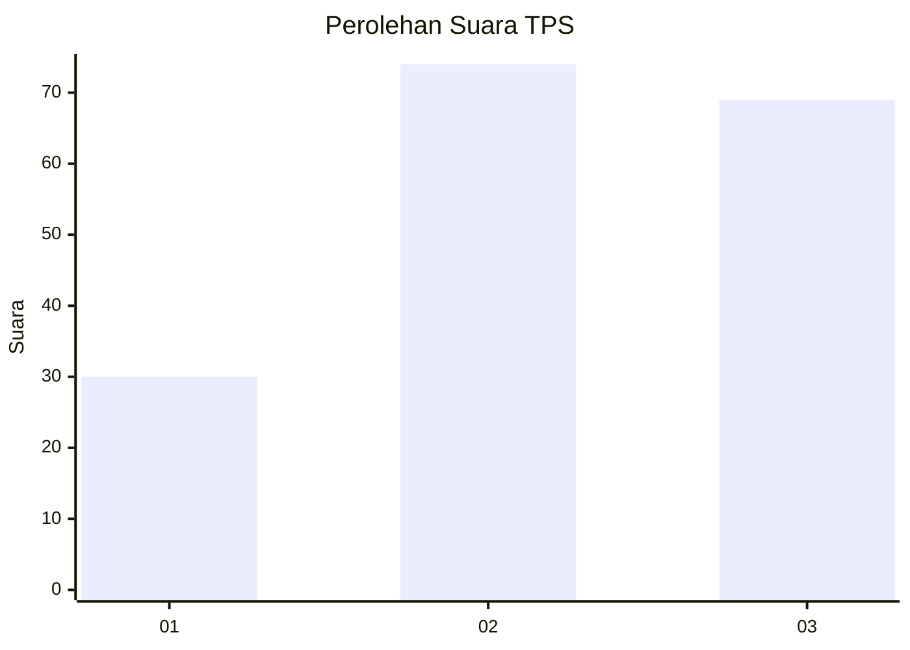
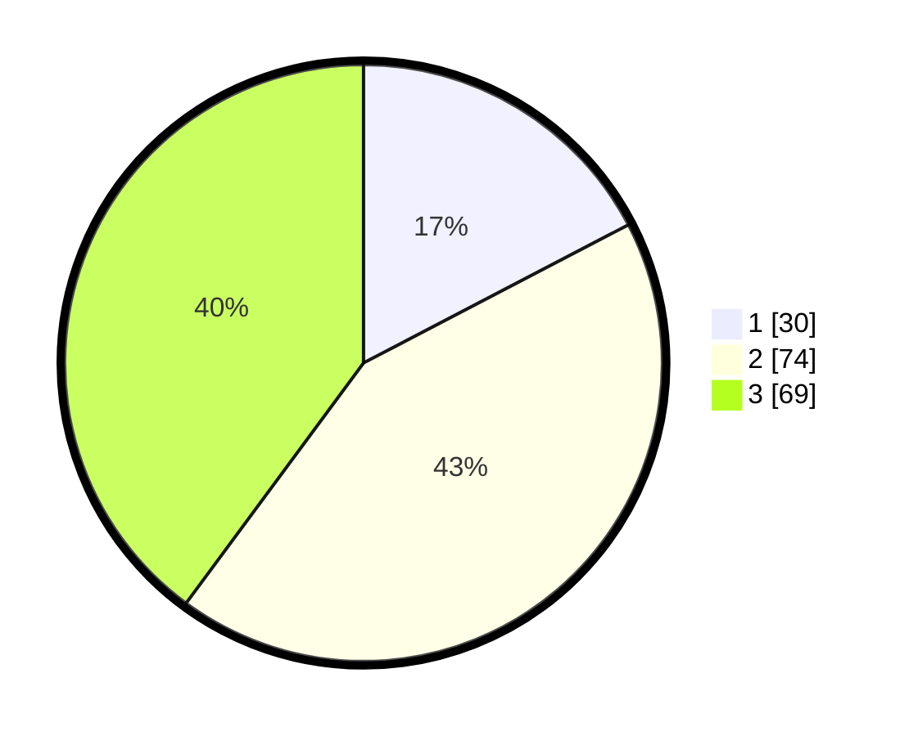

# Hasil

## Grafik

## Tabel

| No. | Nama Paslon    | Suara | Suara (raw) | Persentase |
|:--- |:-------------- | -----:| -----------:| ----------:|
| 1   | ANIES MUHAIMIN | 30    | [30][p-1]   | 17,34      |
| 2   | PRABOWO GIBRAN | 74    | [74][p-2]   | 42,77      |
| 3   | GANJAR MAHFUD  | 69    | [69][p-3]   | 39,88      |

[p-1]: https://github.com/gigit-pemilu/pemilu-2024-34-di-yogyakarta/blob/main/pilpres/hitung-suara/sub/34-di-yogyakarta/sub/02-bantul/sub/16-kasihan/sub/2003-tamantirto/sub/055-tps/sub/paslon-1.txt
[p-2]: https://github.com/gigit-pemilu/pemilu-2024-34-di-yogyakarta/blob/main/pilpres/hitung-suara/sub/34-di-yogyakarta/sub/02-bantul/sub/16-kasihan/sub/2003-tamantirto/sub/055-tps/sub/paslon-2.txt
[p-3]: https://github.com/gigit-pemilu/pemilu-2024-34-di-yogyakarta/blob/main/pilpres/hitung-suara/sub/34-di-yogyakarta/sub/02-bantul/sub/16-kasihan/sub/2003-tamantirto/sub/055-tps/sub/paslon-3.txt

## Foto C Plano

https://sirekap-obj-formc.kpu.go.id/a8c3/pemilu/ppwp/34/02/16/20/03/3402162003055-20240214-232114--13480a0d-78e1-4449-9624-d6068b77f307.jpg

https://sirekap-obj-formc.kpu.go.id/a8c3/pemilu/ppwp/34/02/16/20/03/3402162003055-20240214-232250--b3229d85-e4ef-4e7c-b1d9-9fc80afbca22.jpg

https://sirekap-obj-formc.kpu.go.id/a8c3/pemilu/ppwp/34/02/16/20/03/3402162003055-20240214-232404--6deb4bbf-95c8-4b4f-84f0-40faa2d4ba2d.jpg

## Metadata

| Key        | Value               |
| ---------- | ------------------- |
| Time Stamp | 2024-02-24 22:31:28 |

