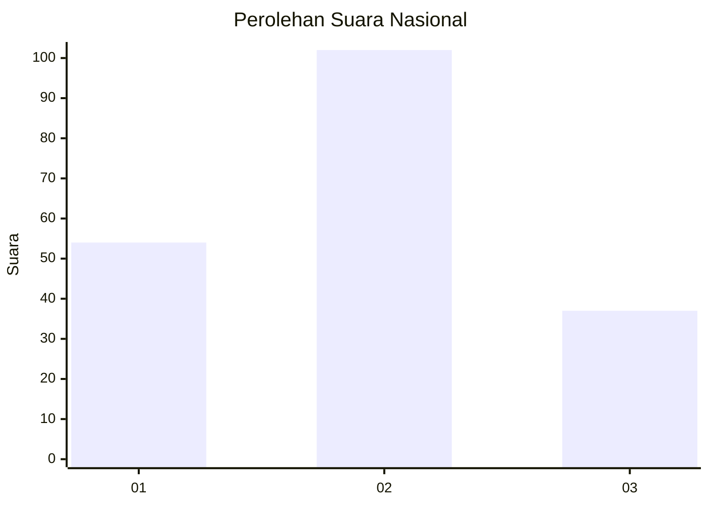
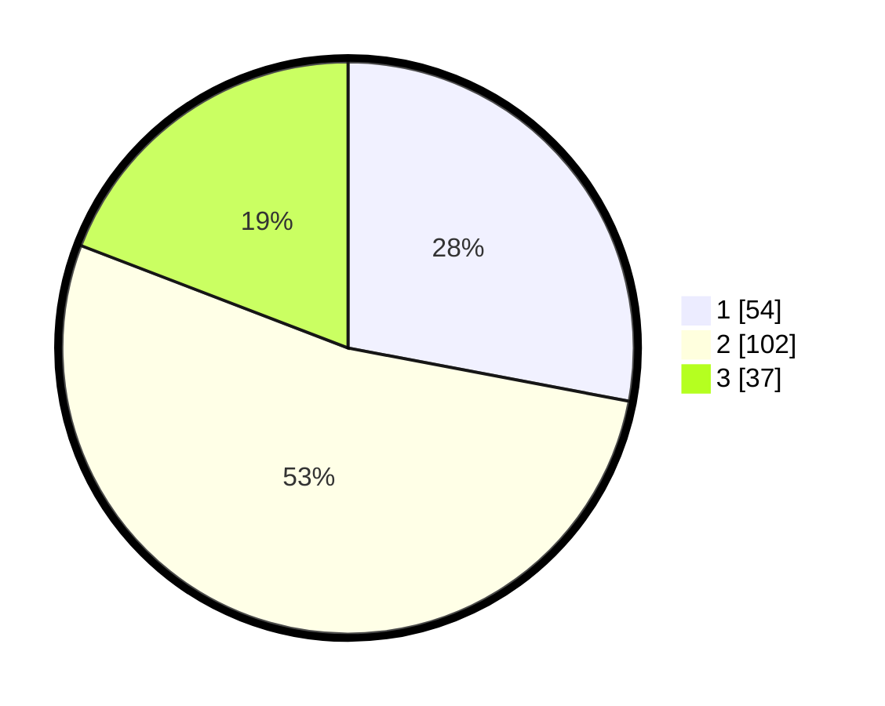

# Hasil

## Grafik

## Tabel

| No. | Nama Paslon    | Suara | Suara (raw) | Persentase |
|:--- |:-------------- | -----:| -----------:| ----------:|
| 1   | ANIES MUHAIMIN | 54    | [54][p-1]   | 27,98      |
| 2   | PRABOWO GIBRAN | 102   | [102][p-2]  | 52,85      |
| 3   | GANJAR MAHFUD  | 37    | [37][p-3]   | 19,17      |

[p-1]: https://github.com/gigit-pemilu/pemilu-2024/blob/main/pilpres/hitung-suara/sub/34-di-yogyakarta/sub/02-bantul/sub/16-kasihan/sub/2003-tamantirto/sub/058-tps/sub/paslon-1.txt
[p-2]: https://github.com/gigit-pemilu/pemilu-2024/blob/main/pilpres/hitung-suara/sub/34-di-yogyakarta/sub/02-bantul/sub/16-kasihan/sub/2003-tamantirto/sub/058-tps/sub/paslon-2.txt
[p-3]: https://github.com/gigit-pemilu/pemilu-2024/blob/main/pilpres/hitung-suara/sub/34-di-yogyakarta/sub/02-bantul/sub/16-kasihan/sub/2003-tamantirto/sub/058-tps/sub/paslon-3.txt

## Foto C Plano

https://sirekap-obj-formc.kpu.go.id/450d/pemilu/ppwp/34/02/16/20/03/3402162003058-20240215-034722--cba92d67-d64b-4da6-9626-b2651a70a4f3.jpg

https://sirekap-obj-formc.kpu.go.id/450d/pemilu/ppwp/34/02/16/20/03/3402162003058-20240215-034858--c0fe6514-dbae-4492-8495-af0307773e3f.jpg

https://sirekap-obj-formc.kpu.go.id/450d/pemilu/ppwp/34/02/16/20/03/3402162003058-20240215-035009--bb22701d-0ff8-4a6e-9f4f-08b014ed0a2c.jpg

## Metadata

| Key        | Value               |
| ---------- | ------------------- |
| Time Stamp | 2024-02-24 22:31:28 |

