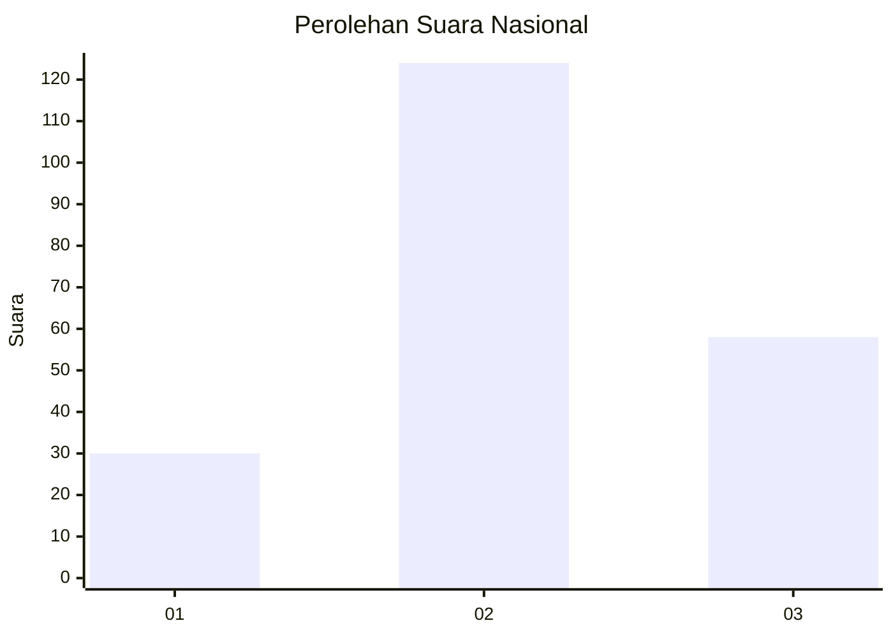
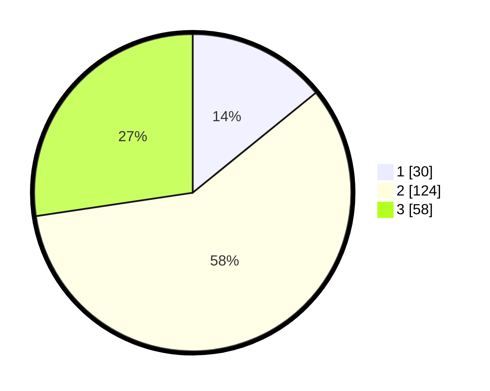

# Hasil

## Grafik

## Tabel

| No. | Nama Paslon    | Suara | Suara (raw) | Persentase |
|:--- |:-------------- | -----:| -----------:| ----------:|
| 1   | ANIES MUHAIMIN | 30    | [30][p-1]   | 14,15      |
| 2   | PRABOWO GIBRAN | 124   | [124][p-2]  | 58,49      |
| 3   | GANJAR MAHFUD  | 58    | [58][p-3]   | 27,36      |

[p-1]: https://github.com/gigit-pemilu/pemilu-2024/blob/main/pilpres/hitung-suara/sub/34-di-yogyakarta/sub/02-bantul/sub/16-kasihan/sub/2003-tamantirto/sub/072-tps/sub/paslon-1.txt
[p-2]: https://github.com/gigit-pemilu/pemilu-2024/blob/main/pilpres/hitung-suara/sub/34-di-yogyakarta/sub/02-bantul/sub/16-kasihan/sub/2003-tamantirto/sub/072-tps/sub/paslon-2.txt
[p-3]: https://github.com/gigit-pemilu/pemilu-2024/blob/main/pilpres/hitung-suara/sub/34-di-yogyakarta/sub/02-bantul/sub/16-kasihan/sub/2003-tamantirto/sub/072-tps/sub/paslon-3.txt

## Foto C Plano

https://sirekap-obj-formc.kpu.go.id/1833/pemilu/ppwp/34/02/16/20/03/3402162003072-20240215-005506--fcdc9b4c-0f4b-43a4-aff9-279a0e8db556.jpg

https://sirekap-obj-formc.kpu.go.id/1833/pemilu/ppwp/34/02/16/20/03/3402162003072-20240215-021718--ba8a2ee5-c827-4d09-91b9-fdf374ffafd2.jpg

https://sirekap-obj-formc.kpu.go.id/1833/pemilu/ppwp/34/02/16/20/03/3402162003072-20240215-021625--89f33839-6305-4be8-933b-516959ff1731.jpg

## Metadata

| Key        | Value               |
| ---------- | ------------------- |
| Time Stamp | 2024-02-24 22:31:28 |

