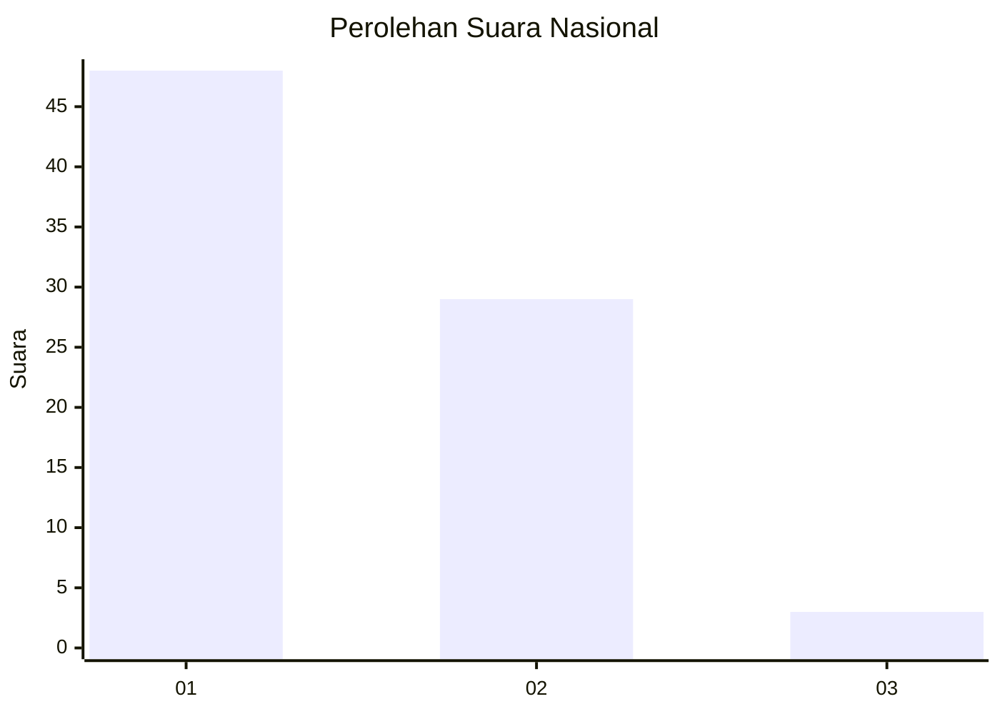
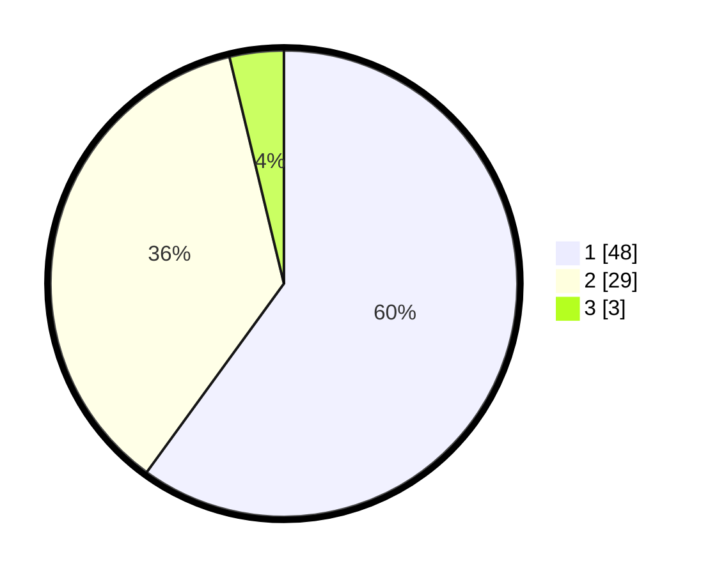

# Hasil

## Grafik

## Tabel

| No. | Nama Paslon    | Suara | Suara (raw) | Persentase |
|:--- |:-------------- | -----:| -----------:| ----------:|
| 1   | ANIES MUHAIMIN | 48    | [48][p-1]   | 60,00      |
| 2   | PRABOWO GIBRAN | 29    | [29][p-2]   | 36,25      |
| 3   | GANJAR MAHFUD  | 3     | [3][p-3]    | 3,75       |

[p-1]: https://github.com/gigit-pemilu/pemilu-2024/blob/main/pilpres/hitung-suara/sub/34-di-yogyakarta/sub/02-bantul/sub/16-kasihan/sub/2003-tamantirto/sub/901-tps/sub/paslon-1.txt
[p-2]: https://github.com/gigit-pemilu/pemilu-2024/blob/main/pilpres/hitung-suara/sub/34-di-yogyakarta/sub/02-bantul/sub/16-kasihan/sub/2003-tamantirto/sub/901-tps/sub/paslon-2.txt
[p-3]: https://github.com/gigit-pemilu/pemilu-2024/blob/main/pilpres/hitung-suara/sub/34-di-yogyakarta/sub/02-bantul/sub/16-kasihan/sub/2003-tamantirto/sub/901-tps/sub/paslon-3.txt

## Foto C Plano

https://sirekap-obj-formc.kpu.go.id/741d/pemilu/ppwp/34/02/16/20/03/3402162003901-20240216-040419--af2c89a6-86ec-457a-9376-5845d407d024.jpg

https://sirekap-obj-formc.kpu.go.id/741d/pemilu/ppwp/34/02/16/20/03/3402162003901-20240216-040421--e365aa95-3bee-47d4-a73e-cbf86a0c2834.jpg

https://sirekap-obj-formc.kpu.go.id/741d/pemilu/ppwp/34/02/16/20/03/3402162003901-20240216-040420--e15e6d2c-127f-4eab-8ddf-ea58eee74da3.jpg

## Metadata

| Key        | Value               |
| ---------- | ------------------- |
| Time Stamp | 2024-02-21 08:00:00 |

## DATA PEMILIH TETAP

Jumlah pemilih dalam DPT: **116**.
 * L: **54**.
 * P: **62**.

## DATA PENGGUNA HAK PILIH

Jumlah pengguna hak pilih dalam DPT: **73**.
 * L: **41**.
 * P: **32**.

Jumlah pengguna hak pilih dalam DPTb: **7**.
 * L: **7**.
 * P: **0**.

Jumlah pengguna hak pilih dalam DPK: **0**.
 * L: **0**.
 * P: **0**.

Jumlah pengguna hak pilih: **80**.
 * L: **48**.
 * P: **32**.

## JUMLAH SUARA SAH DAN TIDAK SAH

JUMLAH SELURUH SUARA SAH: **80**.

JUMLAH SUARA TIDAK SAH: **0**.

JUMLAH SELURUH SUARA SAH DAN SUARA TIDAK SAH: **80**.

