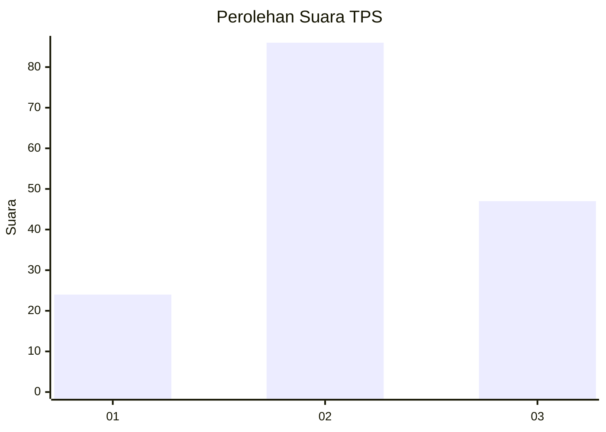
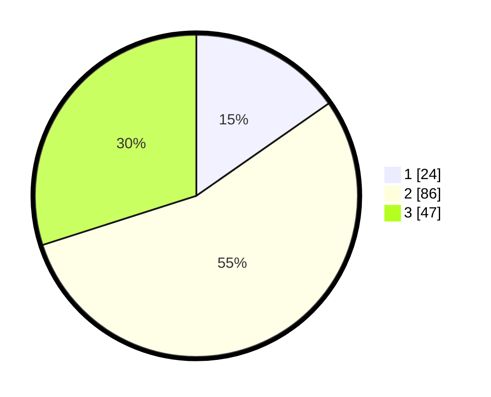

# Hasil

## Grafik

## Tabel

| No. | Nama Paslon    | Suara | Suara (raw) | Persentase |
|:--- |:-------------- | -----:| -----------:| ----------:|
| 1   | ANIES MUHAIMIN | 24    | [24][p-1]   | 15,29      |
| 2   | PRABOWO GIBRAN | 86    | [86][p-2]   | 54,78      |
| 3   | GANJAR MAHFUD  | 47    | [47][p-3]   | 29,94      |

[p-1]: https://github.com/gigit-pemilu/pemilu-2024-34-di-yogyakarta/blob/main/pilpres/hitung-suara/sub/34-di-yogyakarta/sub/02-bantul/sub/16-kasihan/sub/2004-ngestiharjo/sub/002-tps/sub/paslon-1.txt
[p-2]: https://github.com/gigit-pemilu/pemilu-2024-34-di-yogyakarta/blob/main/pilpres/hitung-suara/sub/34-di-yogyakarta/sub/02-bantul/sub/16-kasihan/sub/2004-ngestiharjo/sub/002-tps/sub/paslon-2.txt
[p-3]: https://github.com/gigit-pemilu/pemilu-2024-34-di-yogyakarta/blob/main/pilpres/hitung-suara/sub/34-di-yogyakarta/sub/02-bantul/sub/16-kasihan/sub/2004-ngestiharjo/sub/002-tps/sub/paslon-3.txt

## Foto C Plano

https://sirekap-obj-formc.kpu.go.id/b5bf/pemilu/ppwp/34/02/16/20/04/3402162004002-20240215-041730--39647538-5259-4472-9f35-55444b892638.jpg

https://sirekap-obj-formc.kpu.go.id/b5bf/pemilu/ppwp/34/02/16/20/04/3402162004002-20240215-035513--cd2fb7bb-4c11-4359-bd0b-70014c9a5b8e.jpg

https://sirekap-obj-formc.kpu.go.id/b5bf/pemilu/ppwp/34/02/16/20/04/3402162004002-20240215-035732--a6119ba7-efc6-45f0-9e3a-ddcd7b7506ed.jpg

## Metadata

| Key        | Value               |
| ---------- | ------------------- |
| Time Stamp | 2024-02-24 22:31:28 |

