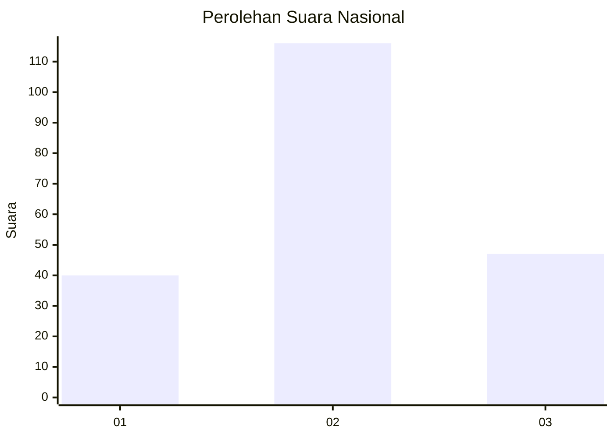
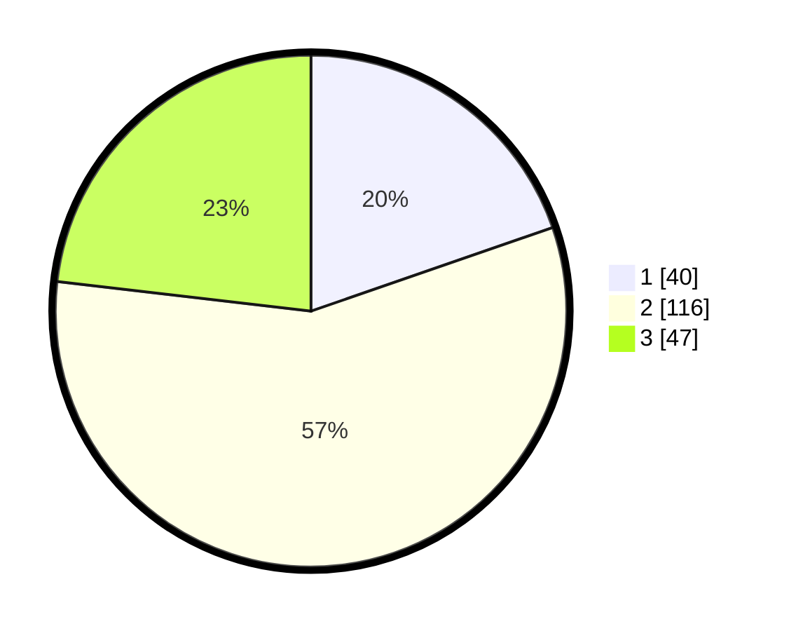

# Hasil

## Grafik

## Tabel

| No. | Nama Paslon    | Suara | Suara (raw) | Persentase |
|:--- |:-------------- | -----:| -----------:| ----------:|
| 1   | ANIES MUHAIMIN | 40    | [40][p-1]   | 19,70      |
| 2   | PRABOWO GIBRAN | 116   | [116][p-2]  | 57,14      |
| 3   | GANJAR MAHFUD  | 47    | [47][p-3]   | 23,15      |

[p-1]: https://github.com/gigit-pemilu/pemilu-2024/blob/main/pilpres/hitung-suara/sub/34-di-yogyakarta/sub/02-bantul/sub/16-kasihan/sub/2004-ngestiharjo/sub/007-tps/sub/paslon-1.txt
[p-2]: https://github.com/gigit-pemilu/pemilu-2024/blob/main/pilpres/hitung-suara/sub/34-di-yogyakarta/sub/02-bantul/sub/16-kasihan/sub/2004-ngestiharjo/sub/007-tps/sub/paslon-2.txt
[p-3]: https://github.com/gigit-pemilu/pemilu-2024/blob/main/pilpres/hitung-suara/sub/34-di-yogyakarta/sub/02-bantul/sub/16-kasihan/sub/2004-ngestiharjo/sub/007-tps/sub/paslon-3.txt

## Foto C Plano

https://sirekap-obj-formc.kpu.go.id/9a90/pemilu/ppwp/34/02/16/20/04/3402162004007-20240214-160100--008168cf-b4bd-4f06-b12f-85a548e83a97.jpg

https://sirekap-obj-formc.kpu.go.id/9a90/pemilu/ppwp/34/02/16/20/04/3402162004007-20240214-155059--2b1e25a0-45ae-4b8d-b49a-537dcfa9b22a.jpg

https://sirekap-obj-formc.kpu.go.id/9a90/pemilu/ppwp/34/02/16/20/04/3402162004007-20240214-155927--6254f34d-0faf-40b2-9132-ee848c340c20.jpg

## Metadata

| Key        | Value               |
| ---------- | ------------------- |
| Time Stamp | 2024-02-24 22:31:28 |

## DATA PEMILIH TETAP

Jumlah pemilih dalam DPT: **236**.
 * L: **109**.
 * P: **127**.

## DATA PENGGUNA HAK PILIH

Jumlah pengguna hak pilih dalam DPT: **192**.
 * L: **84**.
 * P: **108**.

Jumlah pengguna hak pilih dalam DPTb: **6**.
 * L: **4**.
 * P: **2**.

Jumlah pengguna hak pilih dalam DPK: **11**.
 * L: **4**.
 * P: **7**.

Jumlah pengguna hak pilih: **209**.
 * L: **92**.
 * P: **117**.

## JUMLAH SUARA SAH DAN TIDAK SAH

JUMLAH SELURUH SUARA SAH: **203**.

JUMLAH SUARA TIDAK SAH: **6**.

JUMLAH SELURUH SUARA SAH DAN SUARA TIDAK SAH: **209**.

