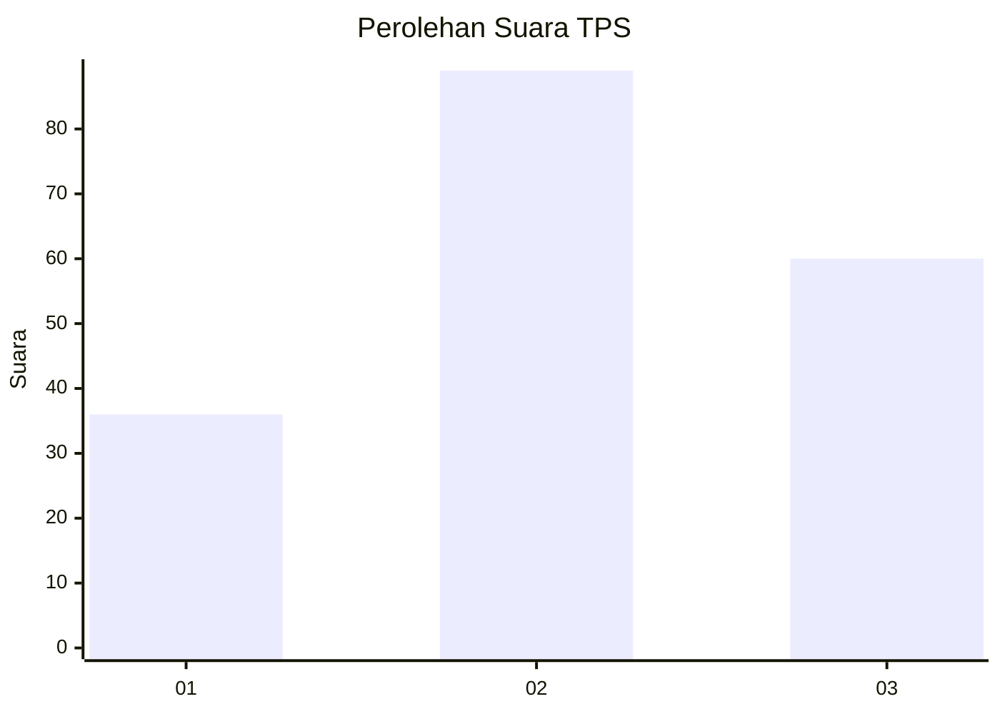
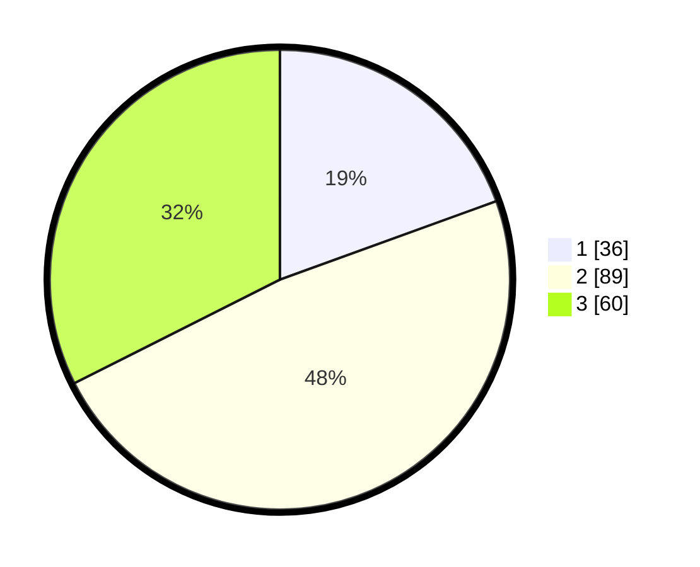

# Hasil

## Grafik

## Tabel

| No. | Nama Paslon    | Suara | Suara (raw) | Persentase |
|:--- |:-------------- | -----:| -----------:| ----------:|
| 1   | ANIES MUHAIMIN | 36    | [36][p-1]   | 19,46      |
| 2   | PRABOWO GIBRAN | 89    | [89][p-2]   | 48,11      |
| 3   | GANJAR MAHFUD  | 60    | [60][p-3]   | 32,43      |

[p-1]: https://github.com/gigit-pemilu/pemilu-2024-34-di-yogyakarta/blob/main/pilpres/hitung-suara/sub/34-di-yogyakarta/sub/02-bantul/sub/16-kasihan/sub/2004-ngestiharjo/sub/010-tps/sub/paslon-1.txt
[p-2]: https://github.com/gigit-pemilu/pemilu-2024-34-di-yogyakarta/blob/main/pilpres/hitung-suara/sub/34-di-yogyakarta/sub/02-bantul/sub/16-kasihan/sub/2004-ngestiharjo/sub/010-tps/sub/paslon-2.txt
[p-3]: https://github.com/gigit-pemilu/pemilu-2024-34-di-yogyakarta/blob/main/pilpres/hitung-suara/sub/34-di-yogyakarta/sub/02-bantul/sub/16-kasihan/sub/2004-ngestiharjo/sub/010-tps/sub/paslon-3.txt

## Foto C Plano

https://sirekap-obj-formc.kpu.go.id/b1db/pemilu/ppwp/34/02/16/20/04/3402162004010-20240214-235957--a4dc0bd3-d57b-4382-bf04-bea23e25191c.jpg

https://sirekap-obj-formc.kpu.go.id/b1db/pemilu/ppwp/34/02/16/20/04/3402162004010-20240215-000030--c56bcb13-a5af-4171-89a9-1694024162e1.jpg

https://sirekap-obj-formc.kpu.go.id/b1db/pemilu/ppwp/34/02/16/20/04/3402162004010-20240215-000159--ae525eab-3692-4803-881f-2cea38332772.jpg

## Metadata

| Key        | Value               |
| ---------- | ------------------- |
| Time Stamp | 2024-02-24 22:31:28 |

