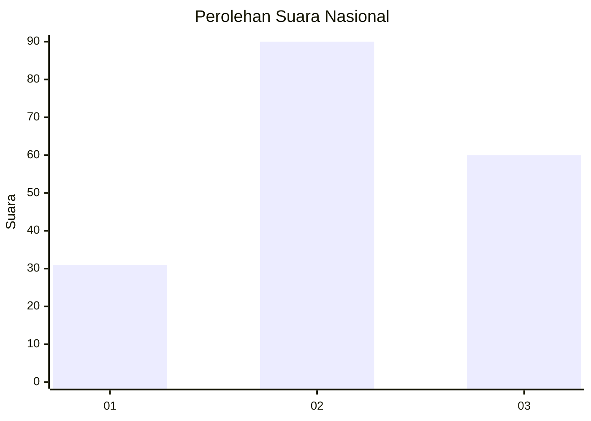
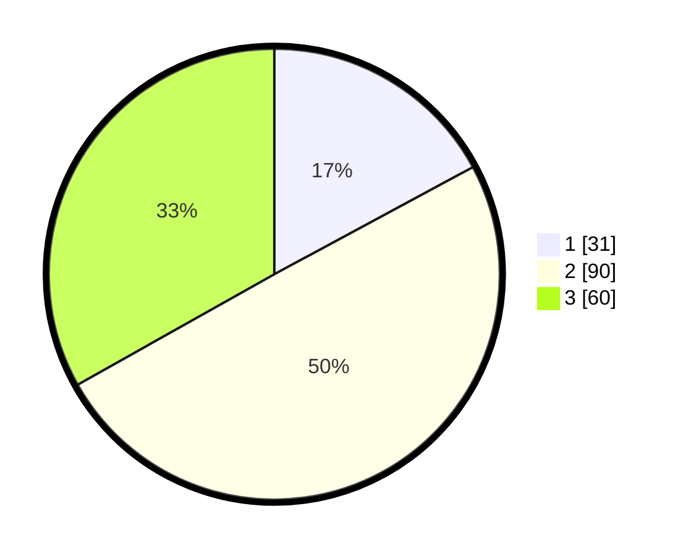

# Hasil

## Grafik

## Tabel

| No. | Nama Paslon    | Suara | Suara (raw) | Persentase |
|:--- |:-------------- | -----:| -----------:| ----------:|
| 1   | ANIES MUHAIMIN | 31    | [31][p-1]   | 17,13      |
| 2   | PRABOWO GIBRAN | 90    | [90][p-2]   | 49,72      |
| 3   | GANJAR MAHFUD  | 60    | [60][p-3]   | 33,15      |

[p-1]: https://github.com/gigit-pemilu/pemilu-2024/blob/main/pilpres/hitung-suara/sub/34-di-yogyakarta/sub/02-bantul/sub/16-kasihan/sub/2004-ngestiharjo/sub/022-tps/sub/paslon-1.txt
[p-2]: https://github.com/gigit-pemilu/pemilu-2024/blob/main/pilpres/hitung-suara/sub/34-di-yogyakarta/sub/02-bantul/sub/16-kasihan/sub/2004-ngestiharjo/sub/022-tps/sub/paslon-2.txt
[p-3]: https://github.com/gigit-pemilu/pemilu-2024/blob/main/pilpres/hitung-suara/sub/34-di-yogyakarta/sub/02-bantul/sub/16-kasihan/sub/2004-ngestiharjo/sub/022-tps/sub/paslon-3.txt

## Foto C Plano

https://sirekap-obj-formc.kpu.go.id/c90e/pemilu/ppwp/34/02/16/20/04/3402162004022-20240222-201105--bd09115f-665a-4396-974e-cb311428632d.jpg

https://sirekap-obj-formc.kpu.go.id/c90e/pemilu/ppwp/34/02/16/20/04/3402162004022-20240222-201956--ba96b6a1-93fd-4bd6-be54-5907e492f5c2.jpg

https://sirekap-obj-formc.kpu.go.id/c90e/pemilu/ppwp/34/02/16/20/04/3402162004022-20240222-202141--987e4dbd-9ee3-4859-a9f9-7e97815e26a0.jpg

## Metadata

| Key        | Value               |
| ---------- | ------------------- |
| Time Stamp | 2024-02-24 22:31:28 |

