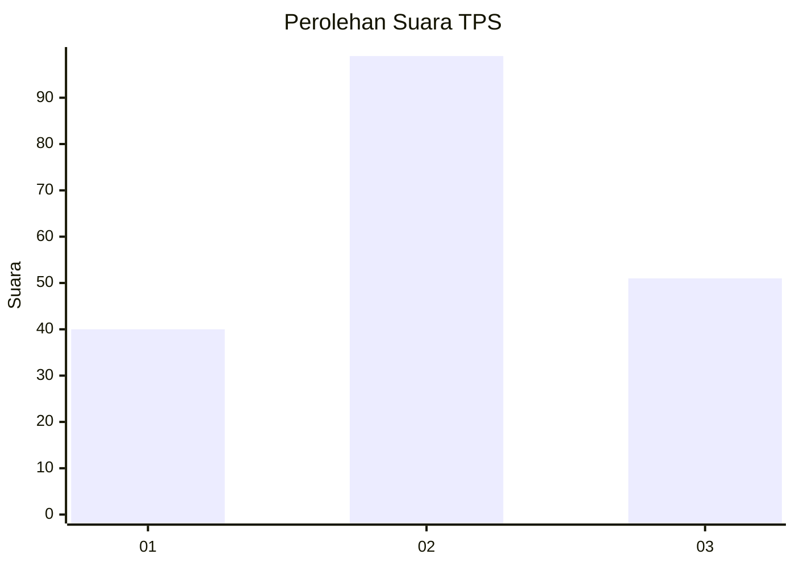
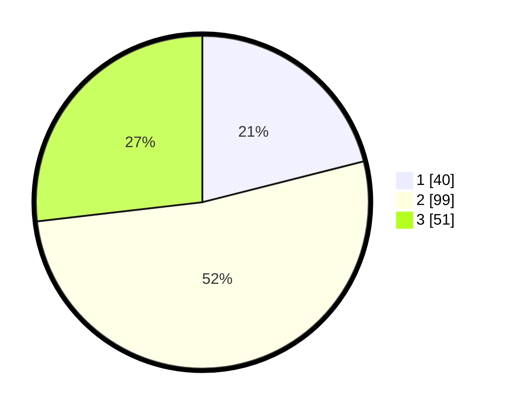

# Hasil

## Grafik

## Tabel

| No. | Nama Paslon    | Suara | Suara (raw) | Persentase |
|:--- |:-------------- | -----:| -----------:| ----------:|
| 1   | ANIES MUHAIMIN | 40    | [40][p-1]   | 21,05      |
| 2   | PRABOWO GIBRAN | 99    | [99][p-2]   | 52,11      |
| 3   | GANJAR MAHFUD  | 51    | [51][p-3]   | 26,84      |

[p-1]: https://github.com/gigit-pemilu/pemilu-2024-34-di-yogyakarta/blob/main/pilpres/hitung-suara/sub/34-di-yogyakarta/sub/02-bantul/sub/16-kasihan/sub/2004-ngestiharjo/sub/027-tps/sub/paslon-1.txt
[p-2]: https://github.com/gigit-pemilu/pemilu-2024-34-di-yogyakarta/blob/main/pilpres/hitung-suara/sub/34-di-yogyakarta/sub/02-bantul/sub/16-kasihan/sub/2004-ngestiharjo/sub/027-tps/sub/paslon-2.txt
[p-3]: https://github.com/gigit-pemilu/pemilu-2024-34-di-yogyakarta/blob/main/pilpres/hitung-suara/sub/34-di-yogyakarta/sub/02-bantul/sub/16-kasihan/sub/2004-ngestiharjo/sub/027-tps/sub/paslon-3.txt

## Foto C Plano

https://sirekap-obj-formc.kpu.go.id/7945/pemilu/ppwp/34/02/16/20/04/3402162004027-20240214-203102--86c3278b-71d3-4f31-8728-54099adf43d1.jpg

https://sirekap-obj-formc.kpu.go.id/7945/pemilu/ppwp/34/02/16/20/04/3402162004027-20240214-212209--f779842a-246b-48dc-96b0-70239d3a0ae0.jpg

https://sirekap-obj-formc.kpu.go.id/7945/pemilu/ppwp/34/02/16/20/04/3402162004027-20240214-204008--13ae2a5f-e65b-4205-86f1-208d5ec3f504.jpg

## Metadata

| Key        | Value               |
| ---------- | ------------------- |
| Time Stamp | 2024-02-15 00:41:44 |

