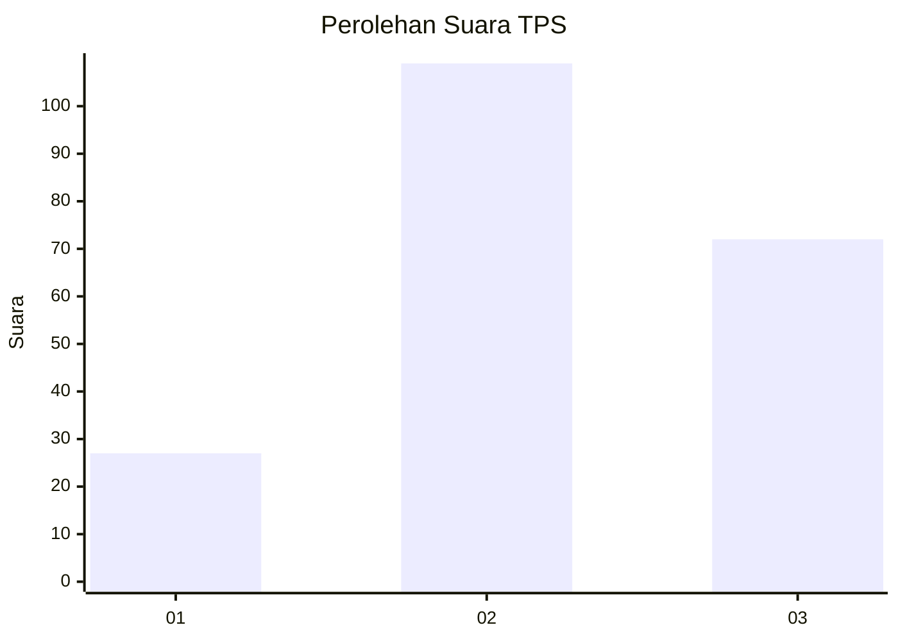
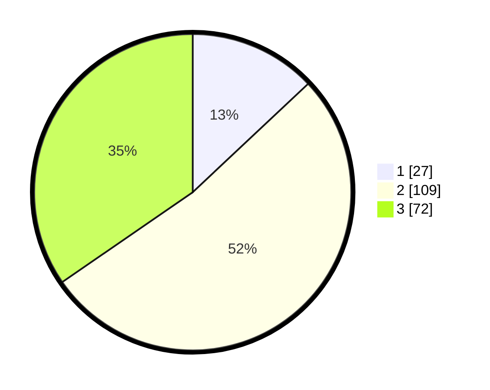

# Hasil

## Grafik

## Tabel

| No. | Nama Paslon    | Suara | Suara (raw) | Persentase |
|:--- |:-------------- | -----:| -----------:| ----------:|
| 1   | ANIES MUHAIMIN | 27    | [27][p-1]   | 12,98      |
| 2   | PRABOWO GIBRAN | 109   | [109][p-2]  | 52,40      |
| 3   | GANJAR MAHFUD  | 72    | [72][p-3]   | 34,62      |

[p-1]: https://github.com/gigit-pemilu/pemilu-2024-34-di-yogyakarta/blob/main/pilpres/hitung-suara/sub/34-di-yogyakarta/sub/02-bantul/sub/16-kasihan/sub/2004-ngestiharjo/sub/028-tps/sub/paslon-1.txt
[p-2]: https://github.com/gigit-pemilu/pemilu-2024-34-di-yogyakarta/blob/main/pilpres/hitung-suara/sub/34-di-yogyakarta/sub/02-bantul/sub/16-kasihan/sub/2004-ngestiharjo/sub/028-tps/sub/paslon-2.txt
[p-3]: https://github.com/gigit-pemilu/pemilu-2024-34-di-yogyakarta/blob/main/pilpres/hitung-suara/sub/34-di-yogyakarta/sub/02-bantul/sub/16-kasihan/sub/2004-ngestiharjo/sub/028-tps/sub/paslon-3.txt

## Foto C Plano

https://sirekap-obj-formc.kpu.go.id/fd4a/pemilu/ppwp/34/02/16/20/04/3402162004028-20240215-004453--a2353e09-4690-4aaf-9d76-fda4a7553908.jpg

https://sirekap-obj-formc.kpu.go.id/fd4a/pemilu/ppwp/34/02/16/20/04/3402162004028-20240215-004531--c64bc85e-15bb-4f69-87c0-c6b506a08f8b.jpg

https://sirekap-obj-formc.kpu.go.id/fd4a/pemilu/ppwp/34/02/16/20/04/3402162004028-20240215-004850--0c401f93-af5a-4dcc-b3ef-4f3519b7b603.jpg

## Metadata

| Key        | Value               |
| ---------- | ------------------- |
| Time Stamp | 2024-02-15 20:30:46 |

