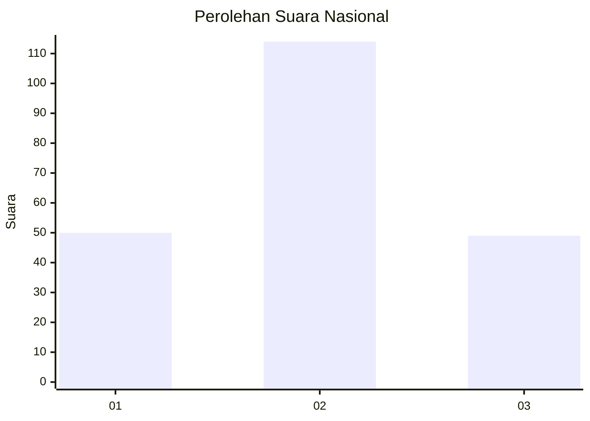
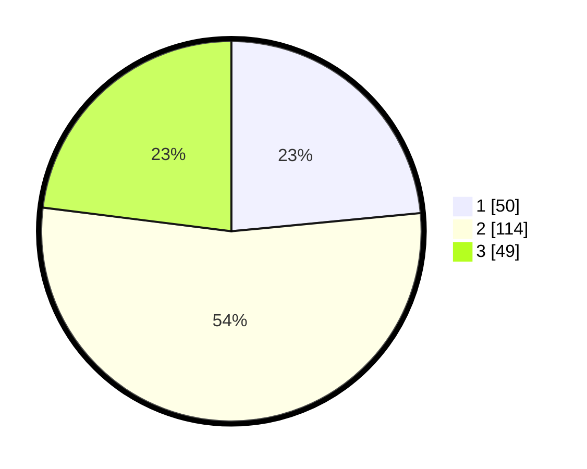

# Hasil

## Grafik

## Tabel

| No. | Nama Paslon    | Suara | Suara (raw) | Persentase |
|:--- |:-------------- | -----:| -----------:| ----------:|
| 1   | ANIES MUHAIMIN | 50    | [50][p-1]   | 23,47      |
| 2   | PRABOWO GIBRAN | 114   | [114][p-2]  | 53,52      |
| 3   | GANJAR MAHFUD  | 49    | [49][p-3]   | 23,00      |

[p-1]: https://github.com/gigit-pemilu/pemilu-2024/blob/main/pilpres/hitung-suara/sub/34-di-yogyakarta/sub/02-bantul/sub/16-kasihan/sub/2004-ngestiharjo/sub/044-tps/sub/paslon-1.txt
[p-2]: https://github.com/gigit-pemilu/pemilu-2024/blob/main/pilpres/hitung-suara/sub/34-di-yogyakarta/sub/02-bantul/sub/16-kasihan/sub/2004-ngestiharjo/sub/044-tps/sub/paslon-2.txt
[p-3]: https://github.com/gigit-pemilu/pemilu-2024/blob/main/pilpres/hitung-suara/sub/34-di-yogyakarta/sub/02-bantul/sub/16-kasihan/sub/2004-ngestiharjo/sub/044-tps/sub/paslon-3.txt

## Foto C Plano

https://sirekap-obj-formc.kpu.go.id/1da4/pemilu/ppwp/34/02/16/20/04/3402162004044-20240214-224407--a0273ea9-9a02-43a5-ae1d-2a041aa5005e.jpg

https://sirekap-obj-formc.kpu.go.id/1da4/pemilu/ppwp/34/02/16/20/04/3402162004044-20240221-224702--6ab3921f-4a12-45a3-b660-71ca60de3deb.jpg

https://sirekap-obj-formc.kpu.go.id/1da4/pemilu/ppwp/34/02/16/20/04/3402162004044-20240215-053515--733b758b-1916-4fc0-b1f3-73ca0bef56a6.jpg

## Metadata

| Key        | Value               |
| ---------- | ------------------- |
| Time Stamp | 2024-02-21 23:00:00 |

