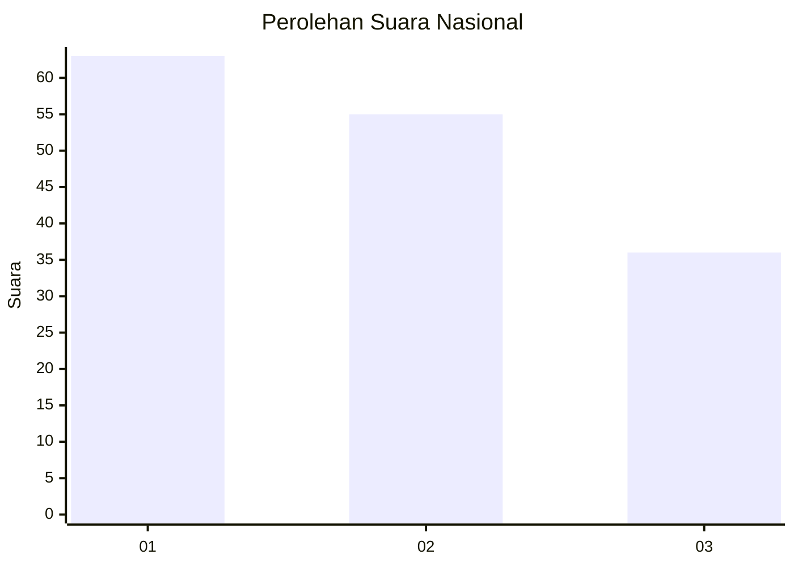
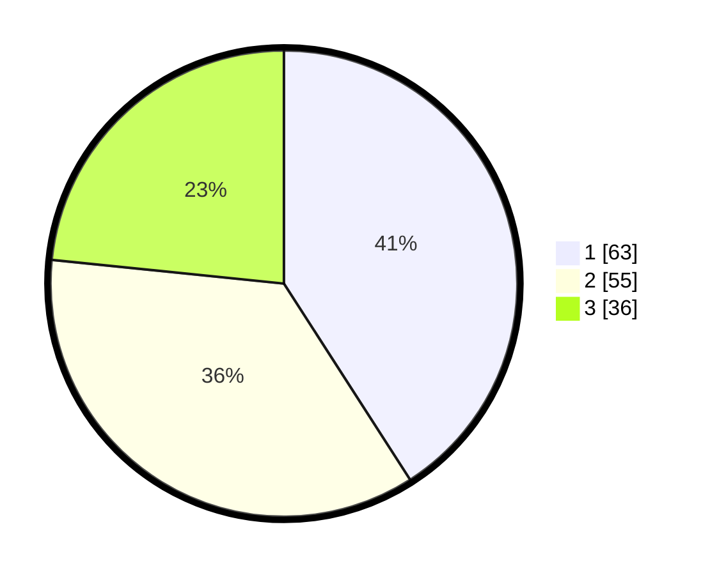

# Hasil

## Grafik

## Tabel

| No. | Nama Paslon    | Suara | Suara (raw) | Persentase |
|:--- |:-------------- | -----:| -----------:| ----------:|
| 1   | ANIES MUHAIMIN | 63    | [63][p-1]   | 40,91      |
| 2   | PRABOWO GIBRAN | 55    | [55][p-2]   | 35,71      |
| 3   | GANJAR MAHFUD  | 36    | [36][p-3]   | 23,38      |

[p-1]: https://github.com/gigit-pemilu/pemilu-2024/blob/main/pilpres/hitung-suara/sub/34-di-yogyakarta/sub/02-bantul/sub/16-kasihan/sub/2004-ngestiharjo/sub/045-tps/sub/paslon-1.txt
[p-2]: https://github.com/gigit-pemilu/pemilu-2024/blob/main/pilpres/hitung-suara/sub/34-di-yogyakarta/sub/02-bantul/sub/16-kasihan/sub/2004-ngestiharjo/sub/045-tps/sub/paslon-2.txt
[p-3]: https://github.com/gigit-pemilu/pemilu-2024/blob/main/pilpres/hitung-suara/sub/34-di-yogyakarta/sub/02-bantul/sub/16-kasihan/sub/2004-ngestiharjo/sub/045-tps/sub/paslon-3.txt

## Foto C Plano

https://sirekap-obj-formc.kpu.go.id/92cd/pemilu/ppwp/34/02/16/20/04/3402162004045-20240221-175725--90ed7d52-23f7-451b-84c0-ff9f2184f4cd.jpg

https://sirekap-obj-formc.kpu.go.id/92cd/pemilu/ppwp/34/02/16/20/04/3402162004045-20240221-175727--10ec1fe3-4129-47d6-915d-5c105cee990f.jpg

https://sirekap-obj-formc.kpu.go.id/92cd/pemilu/ppwp/34/02/16/20/04/3402162004045-20240221-175726--614cb7e0-b8df-4e51-8286-7bca96ca7471.jpg

## Metadata

| Key        | Value               |
| ---------- | ------------------- |
| Time Stamp | 2024-02-21 20:00:00 |

## DATA PEMILIH TETAP

Jumlah pemilih dalam DPT: **198**.
 * L: **92**.
 * P: **106**.

## DATA PENGGUNA HAK PILIH

Jumlah pengguna hak pilih dalam DPT: **154**.
 * L: **72**.
 * P: **82**.

Jumlah pengguna hak pilih dalam DPTb: **4**.
 * L: **2**.
 * P: **2**.

Jumlah pengguna hak pilih dalam DPK: **158**.
 * L: **74**.
 * P: **84**.

Jumlah pengguna hak pilih: **158**.
 * L: **74**.
 * P: **84**.

## JUMLAH SUARA SAH DAN TIDAK SAH

JUMLAH SELURUH SUARA SAH: **154**.

JUMLAH SUARA TIDAK SAH: **4**.

JUMLAH SELURUH SUARA SAH DAN SUARA TIDAK SAH: **158**.

