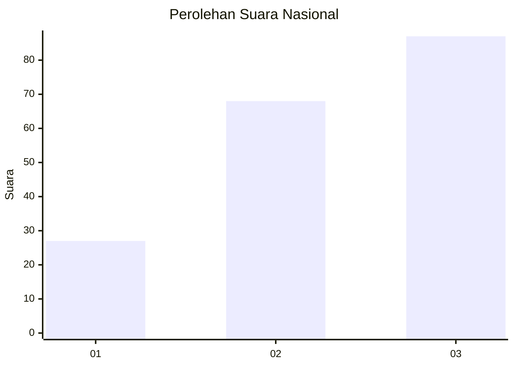
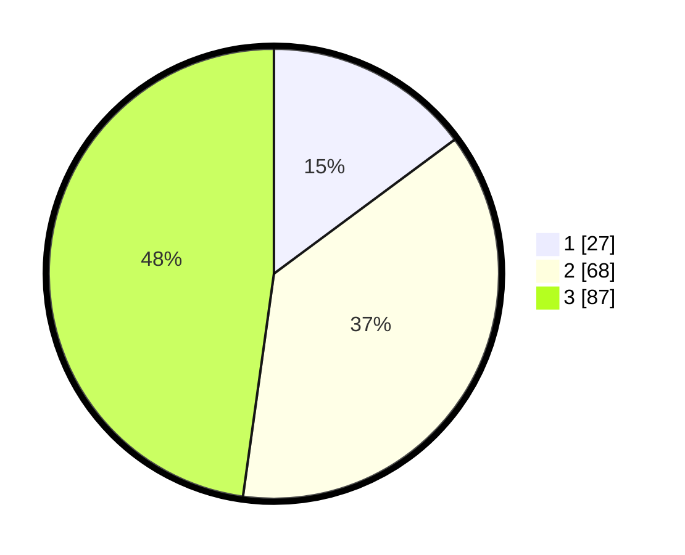

# Hasil

## Grafik

## Tabel

| No. | Nama Paslon    | Suara | Suara (raw) | Persentase |
|:--- |:-------------- | -----:| -----------:| ----------:|
| 1   | ANIES MUHAIMIN | 27    | [27][p-1]   | 14,84      |
| 2   | PRABOWO GIBRAN | 68    | [68][p-2]   | 37,36      |
| 3   | GANJAR MAHFUD  | 87    | [87][p-3]   | 47,80      |

[p-1]: https://github.com/gigit-pemilu/pemilu-2024/blob/main/pilpres/hitung-suara/sub/34-di-yogyakarta/sub/02-bantul/sub/16-kasihan/sub/2004-ngestiharjo/sub/053-tps/sub/paslon-1.txt
[p-2]: https://github.com/gigit-pemilu/pemilu-2024/blob/main/pilpres/hitung-suara/sub/34-di-yogyakarta/sub/02-bantul/sub/16-kasihan/sub/2004-ngestiharjo/sub/053-tps/sub/paslon-2.txt
[p-3]: https://github.com/gigit-pemilu/pemilu-2024/blob/main/pilpres/hitung-suara/sub/34-di-yogyakarta/sub/02-bantul/sub/16-kasihan/sub/2004-ngestiharjo/sub/053-tps/sub/paslon-3.txt

## Foto C Plano

https://sirekap-obj-formc.kpu.go.id/16b0/pemilu/ppwp/34/02/16/20/04/3402162004053-20240215-023910--df30be82-6b24-4c73-b48d-e78c91fe3426.jpg

https://sirekap-obj-formc.kpu.go.id/16b0/pemilu/ppwp/34/02/16/20/04/3402162004053-20240215-024017--d5471741-3c1d-4e0c-a71a-935991e7eb0f.jpg

https://sirekap-obj-formc.kpu.go.id/16b0/pemilu/ppwp/34/02/16/20/04/3402162004053-20240215-024124--deeef87d-061f-4baa-ade0-10fe395cf0bb.jpg

## Metadata

| Key        | Value               |
| ---------- | ------------------- |
| Time Stamp | 2024-02-24 22:31:28 |

