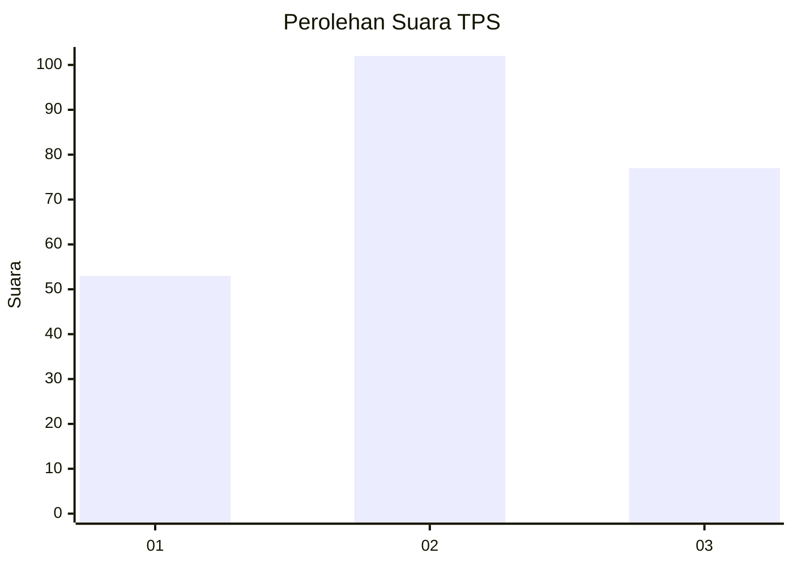
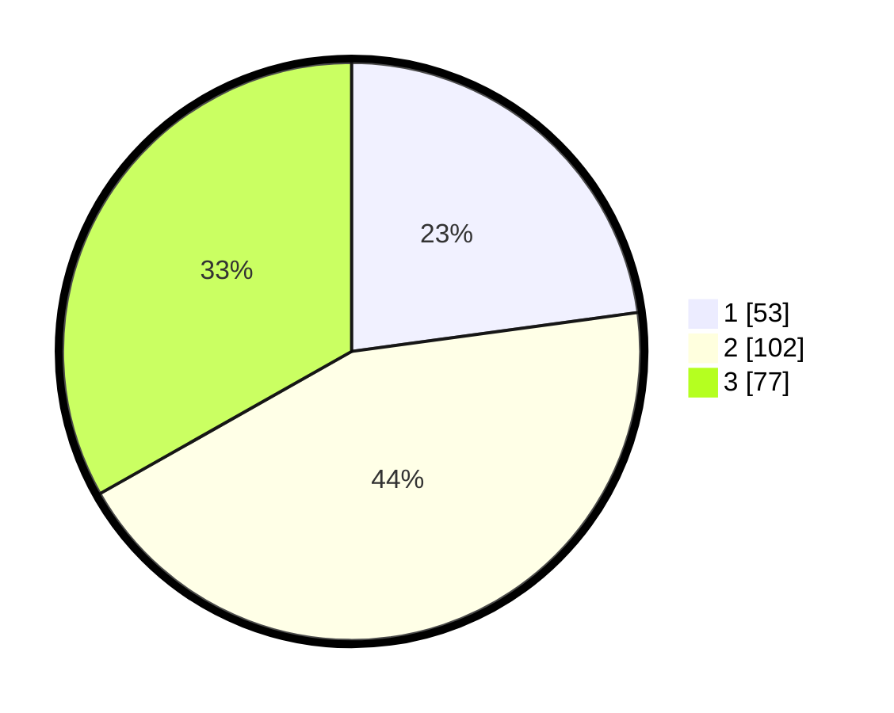

# Hasil

## Grafik

## Tabel

| No. | Nama Paslon    | Suara | Suara (raw) | Persentase |
|:--- |:-------------- | -----:| -----------:| ----------:|
| 1   | ANIES MUHAIMIN | 53    | [53][p-1]   | 22,84      |
| 2   | PRABOWO GIBRAN | 102   | [102][p-2]  | 43,97      |
| 3   | GANJAR MAHFUD  | 77    | [77][p-3]   | 33,19      |

[p-1]: https://github.com/gigit-pemilu/pemilu-2024-34-di-yogyakarta/blob/main/pilpres/hitung-suara/sub/34-di-yogyakarta/sub/02-bantul/sub/16-kasihan/sub/2004-ngestiharjo/sub/091-tps/sub/paslon-1.txt
[p-2]: https://github.com/gigit-pemilu/pemilu-2024-34-di-yogyakarta/blob/main/pilpres/hitung-suara/sub/34-di-yogyakarta/sub/02-bantul/sub/16-kasihan/sub/2004-ngestiharjo/sub/091-tps/sub/paslon-2.txt
[p-3]: https://github.com/gigit-pemilu/pemilu-2024-34-di-yogyakarta/blob/main/pilpres/hitung-suara/sub/34-di-yogyakarta/sub/02-bantul/sub/16-kasihan/sub/2004-ngestiharjo/sub/091-tps/sub/paslon-3.txt

## Foto C Plano

https://sirekap-obj-formc.kpu.go.id/14e4/pemilu/ppwp/34/02/16/20/04/3402162004091-20240215-043116--6f0a7aeb-c9ee-44c8-9df0-f5235af15566.jpg

https://sirekap-obj-formc.kpu.go.id/14e4/pemilu/ppwp/34/02/16/20/04/3402162004091-20240215-043206--4d3c4d13-25ee-489a-83dc-9e03e12b353d.jpg

https://sirekap-obj-formc.kpu.go.id/14e4/pemilu/ppwp/34/02/16/20/04/3402162004091-20240215-043300--7f873e56-30e1-45f4-9092-0da776671fd0.jpg

## Metadata

| Key        | Value               |
| ---------- | ------------------- |
| Time Stamp | 2024-02-24 22:31:28 |

