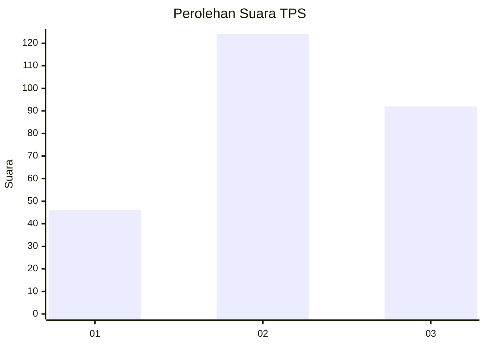
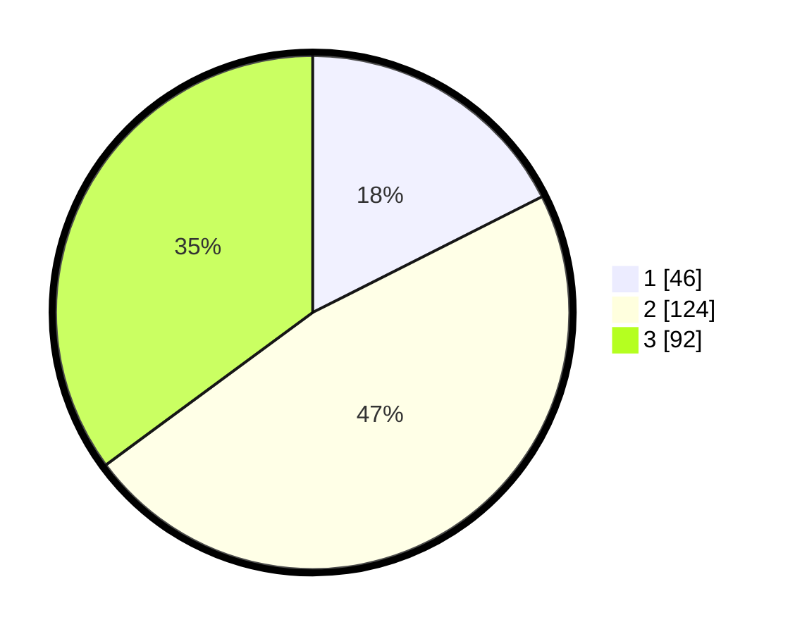

# Hasil

## Grafik

## Tabel

| No. | Nama Paslon    | Suara | Suara (raw) | Persentase |
|:--- |:-------------- | -----:| -----------:| ----------:|
| 1   | ANIES MUHAIMIN | 46    | [46][p-1]   | 17,56      |
| 2   | PRABOWO GIBRAN | 124   | [124][p-2]  | 47,33      |
| 3   | GANJAR MAHFUD  | 92    | [92][p-3]   | 35,11      |

[p-1]: https://github.com/gigit-pemilu/pemilu-2024-34-di-yogyakarta/blob/main/pilpres/hitung-suara/sub/34-di-yogyakarta/sub/02-bantul/sub/16-kasihan/sub/2004-ngestiharjo/sub/095-tps/sub/paslon-1.txt
[p-2]: https://github.com/gigit-pemilu/pemilu-2024-34-di-yogyakarta/blob/main/pilpres/hitung-suara/sub/34-di-yogyakarta/sub/02-bantul/sub/16-kasihan/sub/2004-ngestiharjo/sub/095-tps/sub/paslon-2.txt
[p-3]: https://github.com/gigit-pemilu/pemilu-2024-34-di-yogyakarta/blob/main/pilpres/hitung-suara/sub/34-di-yogyakarta/sub/02-bantul/sub/16-kasihan/sub/2004-ngestiharjo/sub/095-tps/sub/paslon-3.txt

## Foto C Plano

https://sirekap-obj-formc.kpu.go.id/ead7/pemilu/ppwp/34/02/16/20/04/3402162004095-20240215-094924--f05d76b4-c4e3-492a-81fd-a475dbcdd54b.jpg

https://sirekap-obj-formc.kpu.go.id/ead7/pemilu/ppwp/34/02/16/20/04/3402162004095-20240215-095113--d50a4ca4-49ac-4e42-933b-7584625cd732.jpg

https://sirekap-obj-formc.kpu.go.id/ead7/pemilu/ppwp/34/02/16/20/04/3402162004095-20240215-100735--ee7a831b-3dba-41e5-ae51-e1e76660baed.jpg

## Metadata

| Key        | Value               |
| ---------- | ------------------- |
| Time Stamp | 2024-02-15 21:30:27 |

