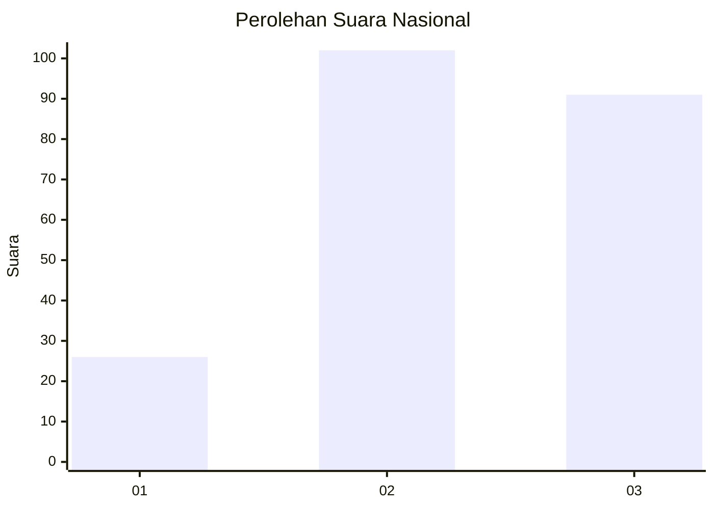
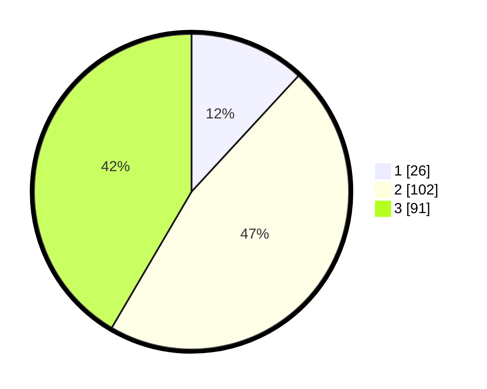

# Hasil

## Grafik

## Tabel

| No. | Nama Paslon    | Suara | Suara (raw) | Persentase |
|:--- |:-------------- | -----:| -----------:| ----------:|
| 1   | ANIES MUHAIMIN | 26    | [26][p-1]   | 11,87      |
| 2   | PRABOWO GIBRAN | 102   | [102][p-2]  | 46,58      |
| 3   | GANJAR MAHFUD  | 91    | [91][p-3]   | 41,55      |

[p-1]: https://github.com/gigit-pemilu/pemilu-2024/blob/main/pilpres/hitung-suara/sub/34-di-yogyakarta/sub/02-bantul/sub/16-kasihan/sub/2004-ngestiharjo/sub/096-tps/sub/paslon-1.txt
[p-2]: https://github.com/gigit-pemilu/pemilu-2024/blob/main/pilpres/hitung-suara/sub/34-di-yogyakarta/sub/02-bantul/sub/16-kasihan/sub/2004-ngestiharjo/sub/096-tps/sub/paslon-2.txt
[p-3]: https://github.com/gigit-pemilu/pemilu-2024/blob/main/pilpres/hitung-suara/sub/34-di-yogyakarta/sub/02-bantul/sub/16-kasihan/sub/2004-ngestiharjo/sub/096-tps/sub/paslon-3.txt

## Foto C Plano

https://sirekap-obj-formc.kpu.go.id/2d4c/pemilu/ppwp/34/02/16/20/04/3402162004096-20240222-114850--eb6015e2-32ed-4dbe-9f10-5a854c7c982d.jpg

https://sirekap-obj-formc.kpu.go.id/2d4c/pemilu/ppwp/34/02/16/20/04/3402162004096-20240214-235358--f2b1f072-5938-45b8-8a65-d60f45c117c6.jpg

https://sirekap-obj-formc.kpu.go.id/2d4c/pemilu/ppwp/34/02/16/20/04/3402162004096-20240214-235808--3a030644-5888-4825-be21-5bb4fdc7a7bf.jpg

## Metadata

| Key        | Value               |
| ---------- | ------------------- |
| Time Stamp | 2024-02-24 22:31:28 |

