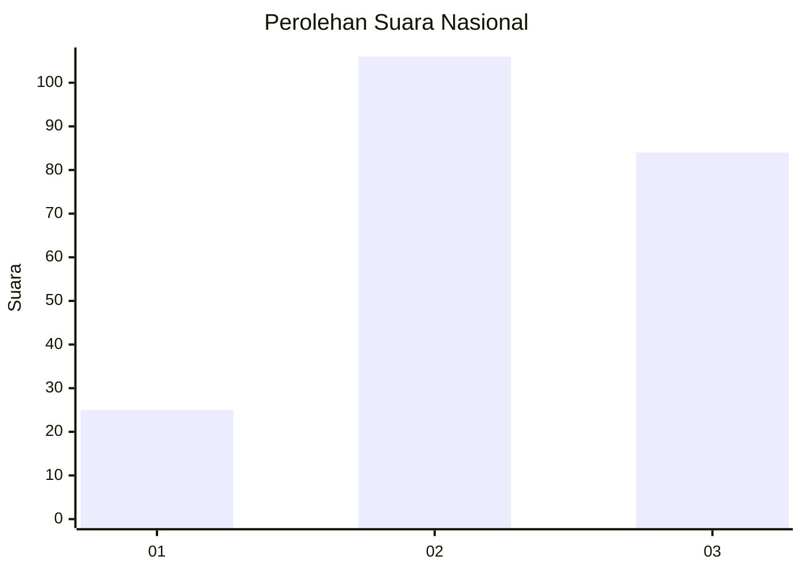
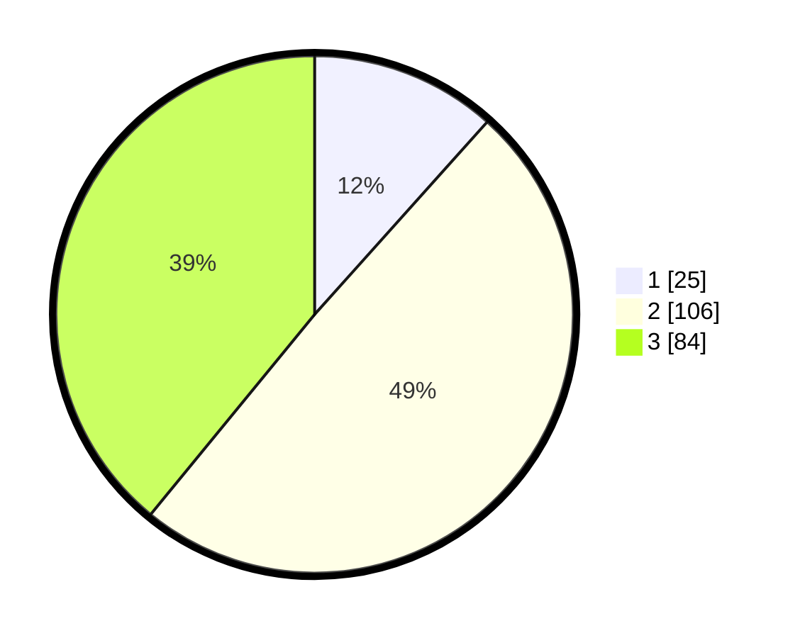

# Hasil

## Grafik

## Tabel

| No. | Nama Paslon    | Suara | Suara (raw) | Persentase |
|:--- |:-------------- | -----:| -----------:| ----------:|
| 1   | ANIES MUHAIMIN | 25    | [25][p-1]   | 11,63      |
| 2   | PRABOWO GIBRAN | 106   | [106][p-2]  | 49,30      |
| 3   | GANJAR MAHFUD  | 84    | [84][p-3]   | 39,07      |

[p-1]: https://github.com/gigit-pemilu/pemilu-2024/blob/main/pilpres/hitung-suara/sub/34-di-yogyakarta/sub/02-bantul/sub/16-kasihan/sub/2004-ngestiharjo/sub/097-tps/sub/paslon-1.txt
[p-2]: https://github.com/gigit-pemilu/pemilu-2024/blob/main/pilpres/hitung-suara/sub/34-di-yogyakarta/sub/02-bantul/sub/16-kasihan/sub/2004-ngestiharjo/sub/097-tps/sub/paslon-2.txt
[p-3]: https://github.com/gigit-pemilu/pemilu-2024/blob/main/pilpres/hitung-suara/sub/34-di-yogyakarta/sub/02-bantul/sub/16-kasihan/sub/2004-ngestiharjo/sub/097-tps/sub/paslon-3.txt

## Foto C Plano

https://sirekap-obj-formc.kpu.go.id/7fc6/pemilu/ppwp/34/02/16/20/04/3402162004097-20240215-022704--ac9fcf07-7be5-4357-ae2f-4c2199e45090.jpg

https://sirekap-obj-formc.kpu.go.id/7fc6/pemilu/ppwp/34/02/16/20/04/3402162004097-20240215-022956--10257aea-3695-4869-a722-ea8fce5e1e65.jpg

https://sirekap-obj-formc.kpu.go.id/7fc6/pemilu/ppwp/34/02/16/20/04/3402162004097-20240215-023316--3008d88e-45b0-4a2b-988d-7e05fde7b426.jpg

## Metadata

| Key        | Value               |
| ---------- | ------------------- |
| Time Stamp | 2024-02-24 22:31:28 |

