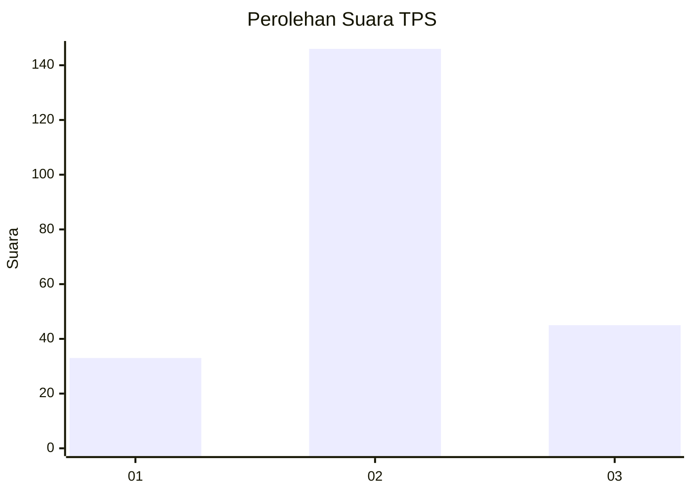
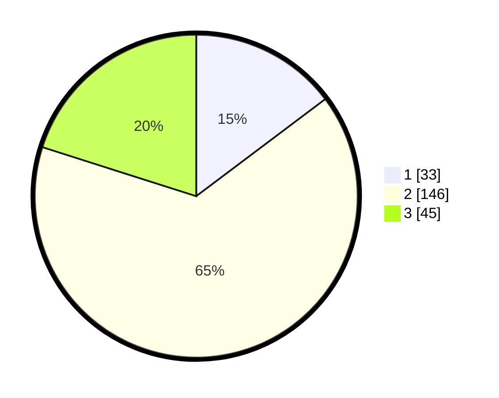

# Hasil

## Grafik

## Tabel

| No. | Nama Paslon    | Suara | Suara (raw) | Persentase |
|:--- |:-------------- | -----:| -----------:| ----------:|
| 1   | ANIES MUHAIMIN | 33    | [33][p-1]   | 14,73      |
| 2   | PRABOWO GIBRAN | 146   | [146][p-2]  | 65,18      |
| 3   | GANJAR MAHFUD  | 45    | [45][p-3]   | 20,09      |

[p-1]: https://github.com/gigit-pemilu/pemilu-2024-34-di-yogyakarta/blob/main/pilpres/hitung-suara/sub/34-di-yogyakarta/sub/02-bantul/sub/17-sedayu/sub/2001-argodadi/sub/002-tps/sub/paslon-1.txt
[p-2]: https://github.com/gigit-pemilu/pemilu-2024-34-di-yogyakarta/blob/main/pilpres/hitung-suara/sub/34-di-yogyakarta/sub/02-bantul/sub/17-sedayu/sub/2001-argodadi/sub/002-tps/sub/paslon-2.txt
[p-3]: https://github.com/gigit-pemilu/pemilu-2024-34-di-yogyakarta/blob/main/pilpres/hitung-suara/sub/34-di-yogyakarta/sub/02-bantul/sub/17-sedayu/sub/2001-argodadi/sub/002-tps/sub/paslon-3.txt

## Foto C Plano

https://sirekap-obj-formc.kpu.go.id/e387/pemilu/ppwp/34/02/17/20/01/3402172001002-20240215-030449--f4267346-a141-467b-a480-d809cacd85cd.jpg

https://sirekap-obj-formc.kpu.go.id/e387/pemilu/ppwp/34/02/17/20/01/3402172001002-20240215-014828--fc3d1388-8fcc-45ce-a08e-31bcc90c9d32.jpg

https://sirekap-obj-formc.kpu.go.id/e387/pemilu/ppwp/34/02/17/20/01/3402172001002-20240215-015109--ac77bd08-0210-47a7-860d-92a10917e2ee.jpg

## Metadata

| Key        | Value               |
| ---------- | ------------------- |
| Time Stamp | 2024-02-15 20:00:44 |

