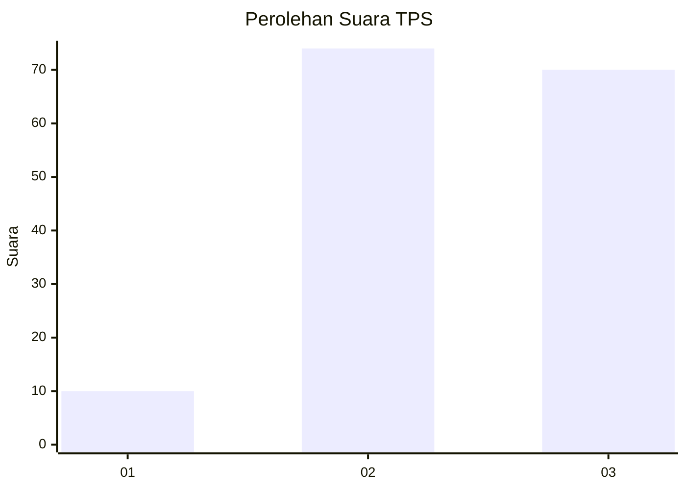
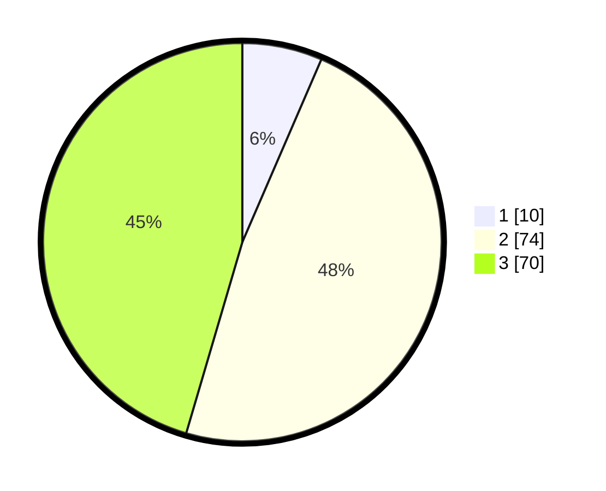

# Hasil

## Grafik

## Tabel

| No. | Nama Paslon    | Suara | Suara (raw) | Persentase |
|:--- |:-------------- | -----:| -----------:| ----------:|
| 1   | ANIES MUHAIMIN | 10    | [10][p-1]   | 6,49       |
| 2   | PRABOWO GIBRAN | 74    | [74][p-2]   | 48,05      |
| 3   | GANJAR MAHFUD  | 70    | [70][p-3]   | 45,45      |

[p-1]: https://github.com/gigit-pemilu/pemilu-2024-34-di-yogyakarta/blob/main/pilpres/hitung-suara/sub/34-di-yogyakarta/sub/02-bantul/sub/17-sedayu/sub/2001-argodadi/sub/008-tps/sub/paslon-1.txt
[p-2]: https://github.com/gigit-pemilu/pemilu-2024-34-di-yogyakarta/blob/main/pilpres/hitung-suara/sub/34-di-yogyakarta/sub/02-bantul/sub/17-sedayu/sub/2001-argodadi/sub/008-tps/sub/paslon-2.txt
[p-3]: https://github.com/gigit-pemilu/pemilu-2024-34-di-yogyakarta/blob/main/pilpres/hitung-suara/sub/34-di-yogyakarta/sub/02-bantul/sub/17-sedayu/sub/2001-argodadi/sub/008-tps/sub/paslon-3.txt

## Foto C Plano

https://sirekap-obj-formc.kpu.go.id/897d/pemilu/ppwp/34/02/17/20/01/3402172001008-20240214-214530--50ddc020-be21-4bae-bb18-797455b01ab7.jpg

https://sirekap-obj-formc.kpu.go.id/897d/pemilu/ppwp/34/02/17/20/01/3402172001008-20240214-214648--0d88388c-4064-4536-9910-668c892d14d4.jpg

https://sirekap-obj-formc.kpu.go.id/897d/pemilu/ppwp/34/02/17/20/01/3402172001008-20240214-215357--efd9f3a3-744e-4535-8dd1-d7c8274afe3d.jpg

## Metadata

| Key        | Value               |
| ---------- | ------------------- |
| Time Stamp | 2024-02-15 20:30:46 |

