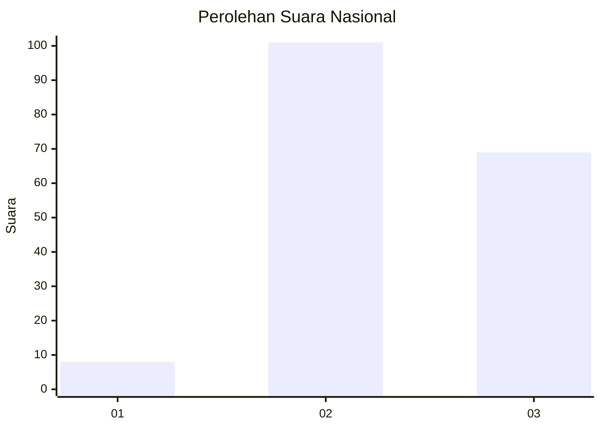
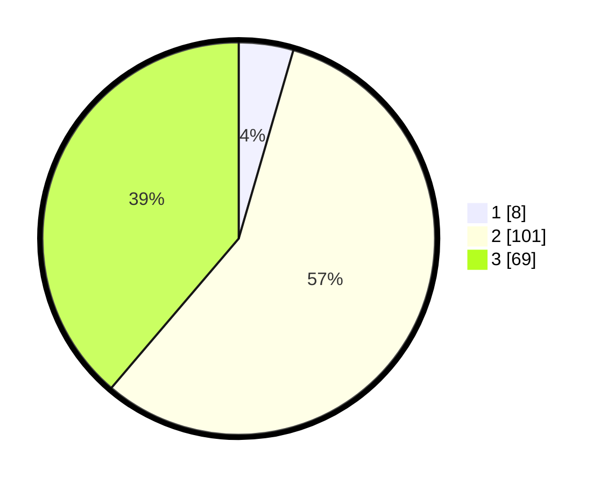

# Hasil

## Grafik

## Tabel

| No. | Nama Paslon    | Suara | Suara (raw) | Persentase |
|:--- |:-------------- | -----:| -----------:| ----------:|
| 1   | ANIES MUHAIMIN | 8     | [8][p-1]    | 4,49       |
| 2   | PRABOWO GIBRAN | 101   | [101][p-2]  | 56,74      |
| 3   | GANJAR MAHFUD  | 69    | [69][p-3]   | 38,76      |

[p-1]: https://github.com/gigit-pemilu/pemilu-2024/blob/main/pilpres/hitung-suara/sub/34-di-yogyakarta/sub/02-bantul/sub/17-sedayu/sub/2001-argodadi/sub/009-tps/sub/paslon-1.txt
[p-2]: https://github.com/gigit-pemilu/pemilu-2024/blob/main/pilpres/hitung-suara/sub/34-di-yogyakarta/sub/02-bantul/sub/17-sedayu/sub/2001-argodadi/sub/009-tps/sub/paslon-2.txt
[p-3]: https://github.com/gigit-pemilu/pemilu-2024/blob/main/pilpres/hitung-suara/sub/34-di-yogyakarta/sub/02-bantul/sub/17-sedayu/sub/2001-argodadi/sub/009-tps/sub/paslon-3.txt

## Foto C Plano

https://sirekap-obj-formc.kpu.go.id/8ba0/pemilu/ppwp/34/02/17/20/01/3402172001009-20240214-230553--ff43c29c-966e-4eb8-adce-3921d53e14d9.jpg

https://sirekap-obj-formc.kpu.go.id/8ba0/pemilu/ppwp/34/02/17/20/01/3402172001009-20240214-230752--209f8d0c-8987-45ef-afb4-21e64f99be98.jpg

https://sirekap-obj-formc.kpu.go.id/8ba0/pemilu/ppwp/34/02/17/20/01/3402172001009-20240214-231058--bc78a209-aa5a-41e2-a447-cdf328b88a83.jpg

## Metadata

| Key        | Value               |
| ---------- | ------------------- |
| Time Stamp | 2024-02-15 15:00:29 |

