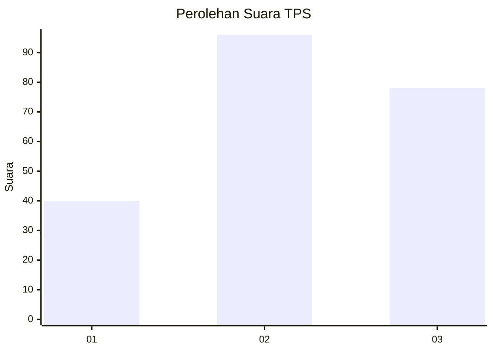
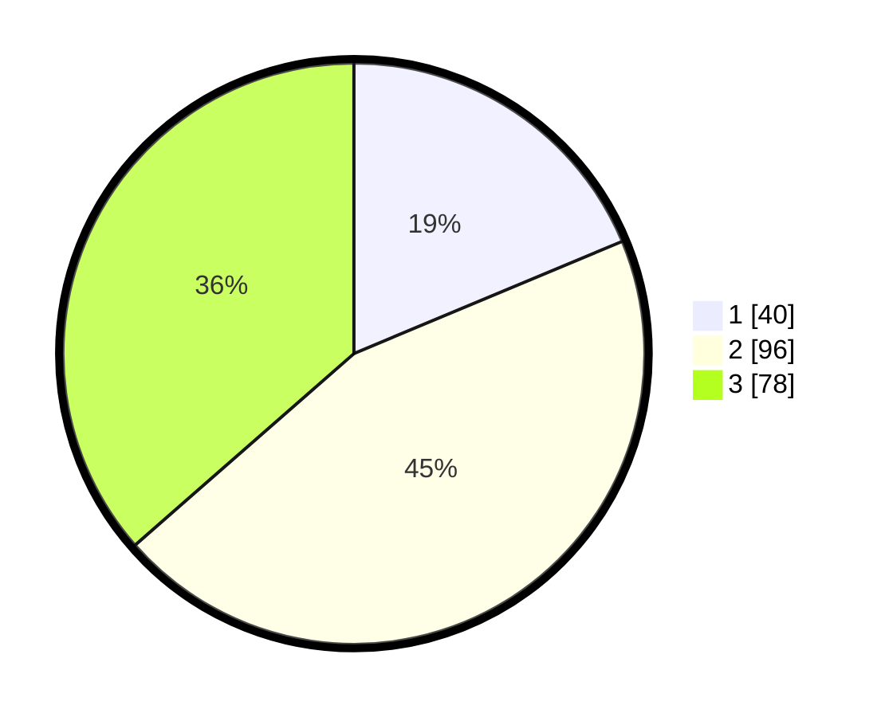

# Hasil

## Grafik

## Tabel

| No. | Nama Paslon    | Suara | Suara (raw) | Persentase |
|:--- |:-------------- | -----:| -----------:| ----------:|
| 1   | ANIES MUHAIMIN | 40    | [40][p-1]   | 18,69      |
| 2   | PRABOWO GIBRAN | 96    | [96][p-2]   | 44,86      |
| 3   | GANJAR MAHFUD  | 78    | [78][p-3]   | 36,45      |

[p-1]: https://github.com/gigit-pemilu/pemilu-2024-34-di-yogyakarta/blob/main/pilpres/hitung-suara/sub/34-di-yogyakarta/sub/02-bantul/sub/17-sedayu/sub/2001-argodadi/sub/012-tps/sub/paslon-1.txt
[p-2]: https://github.com/gigit-pemilu/pemilu-2024-34-di-yogyakarta/blob/main/pilpres/hitung-suara/sub/34-di-yogyakarta/sub/02-bantul/sub/17-sedayu/sub/2001-argodadi/sub/012-tps/sub/paslon-2.txt
[p-3]: https://github.com/gigit-pemilu/pemilu-2024-34-di-yogyakarta/blob/main/pilpres/hitung-suara/sub/34-di-yogyakarta/sub/02-bantul/sub/17-sedayu/sub/2001-argodadi/sub/012-tps/sub/paslon-3.txt

## Foto C Plano

https://sirekap-obj-formc.kpu.go.id/11a2/pemilu/ppwp/34/02/17/20/01/3402172001012-20240215-003722--884dd35d-c7a6-4c5d-9dfe-9c1a51635a06.jpg

https://sirekap-obj-formc.kpu.go.id/11a2/pemilu/ppwp/34/02/17/20/01/3402172001012-20240215-004132--7ceed19c-048c-423e-8a16-8824d812825b.jpg

https://sirekap-obj-formc.kpu.go.id/11a2/pemilu/ppwp/34/02/17/20/01/3402172001012-20240215-011825--9d0a9447-8728-4aea-ad4d-9f40a207e576.jpg

## Metadata

| Key        | Value               |
| ---------- | ------------------- |
| Time Stamp | 2024-02-15 20:30:46 |

