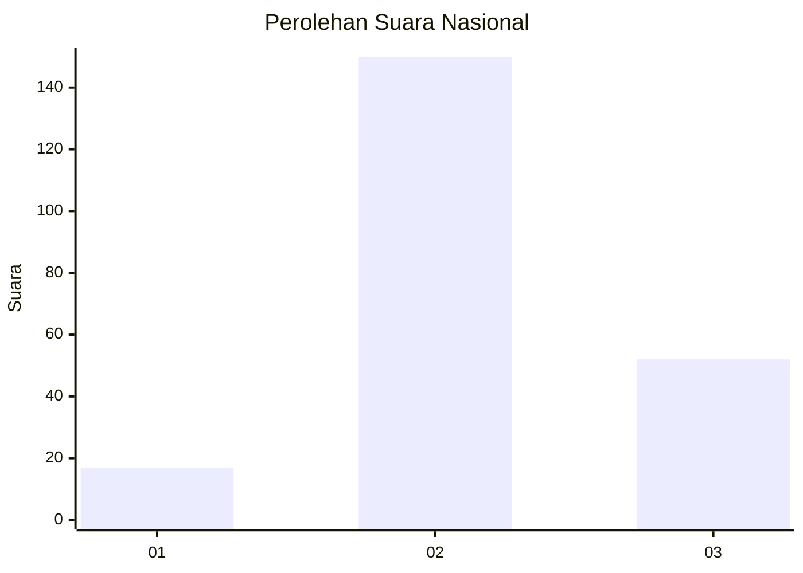
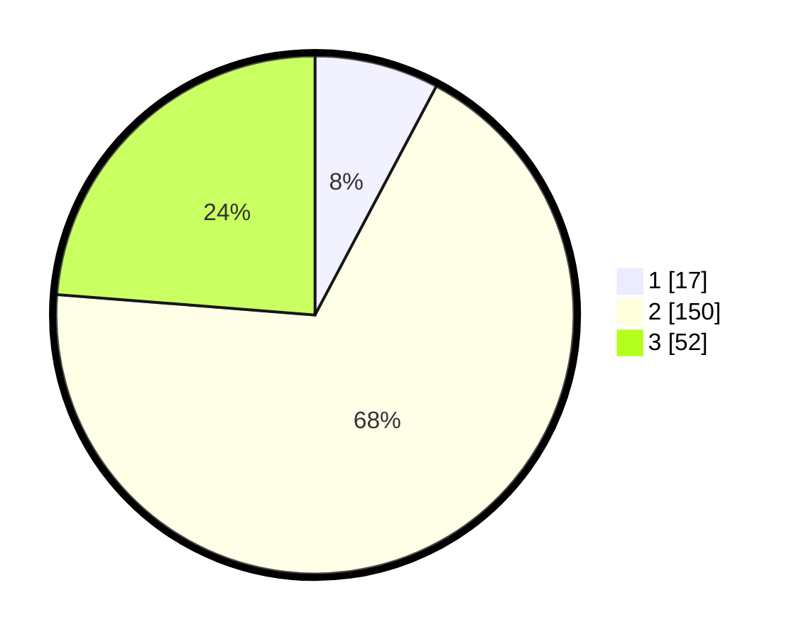

# Hasil

## Grafik

## Tabel

| No. | Nama Paslon    | Suara | Suara (raw) | Persentase |
|:--- |:-------------- | -----:| -----------:| ----------:|
| 1   | ANIES MUHAIMIN | 17    | [17][p-1]   | 7,76       |
| 2   | PRABOWO GIBRAN | 150   | [150][p-2]  | 68,49      |
| 3   | GANJAR MAHFUD  | 52    | [52][p-3]   | 23,74      |

[p-1]: https://github.com/gigit-pemilu/pemilu-2024/blob/main/pilpres/hitung-suara/sub/34-di-yogyakarta/sub/02-bantul/sub/17-sedayu/sub/2001-argodadi/sub/013-tps/sub/paslon-1.txt
[p-2]: https://github.com/gigit-pemilu/pemilu-2024/blob/main/pilpres/hitung-suara/sub/34-di-yogyakarta/sub/02-bantul/sub/17-sedayu/sub/2001-argodadi/sub/013-tps/sub/paslon-2.txt
[p-3]: https://github.com/gigit-pemilu/pemilu-2024/blob/main/pilpres/hitung-suara/sub/34-di-yogyakarta/sub/02-bantul/sub/17-sedayu/sub/2001-argodadi/sub/013-tps/sub/paslon-3.txt

## Foto C Plano

https://sirekap-obj-formc.kpu.go.id/85ed/pemilu/ppwp/34/02/17/20/01/3402172001013-20240215-020410--71550b83-ca92-4ff9-b134-f16d47a3b03e.jpg

https://sirekap-obj-formc.kpu.go.id/85ed/pemilu/ppwp/34/02/17/20/01/3402172001013-20240215-020628--3586e1b2-5cad-42bf-a758-7731796b96fe.jpg

https://sirekap-obj-formc.kpu.go.id/85ed/pemilu/ppwp/34/02/17/20/01/3402172001013-20240215-020823--45aab845-6e0d-4f06-9957-d264587794fe.jpg

## Metadata

| Key        | Value               |
| ---------- | ------------------- |
| Time Stamp | 2024-02-15 20:30:46 |

