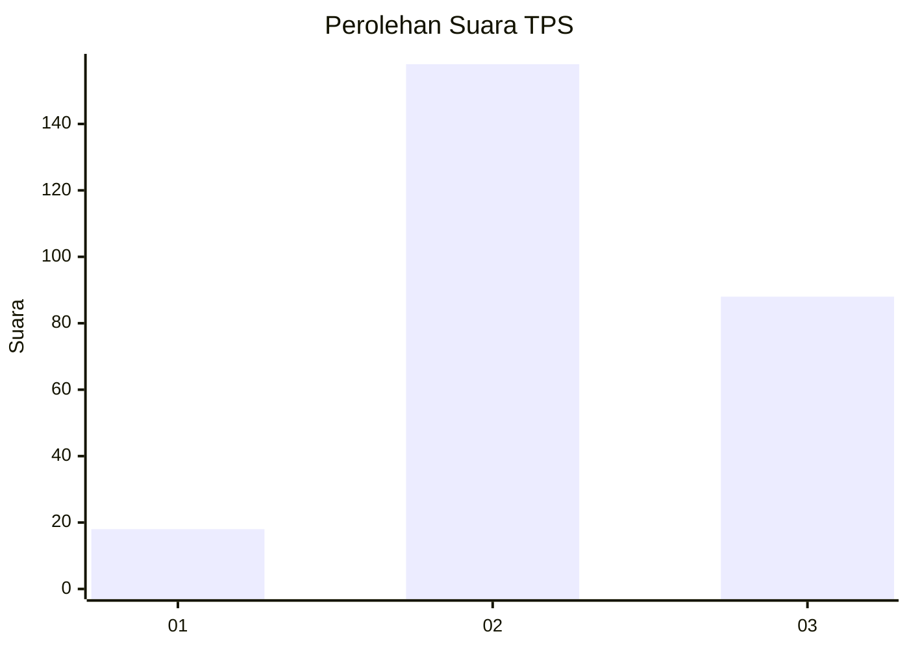
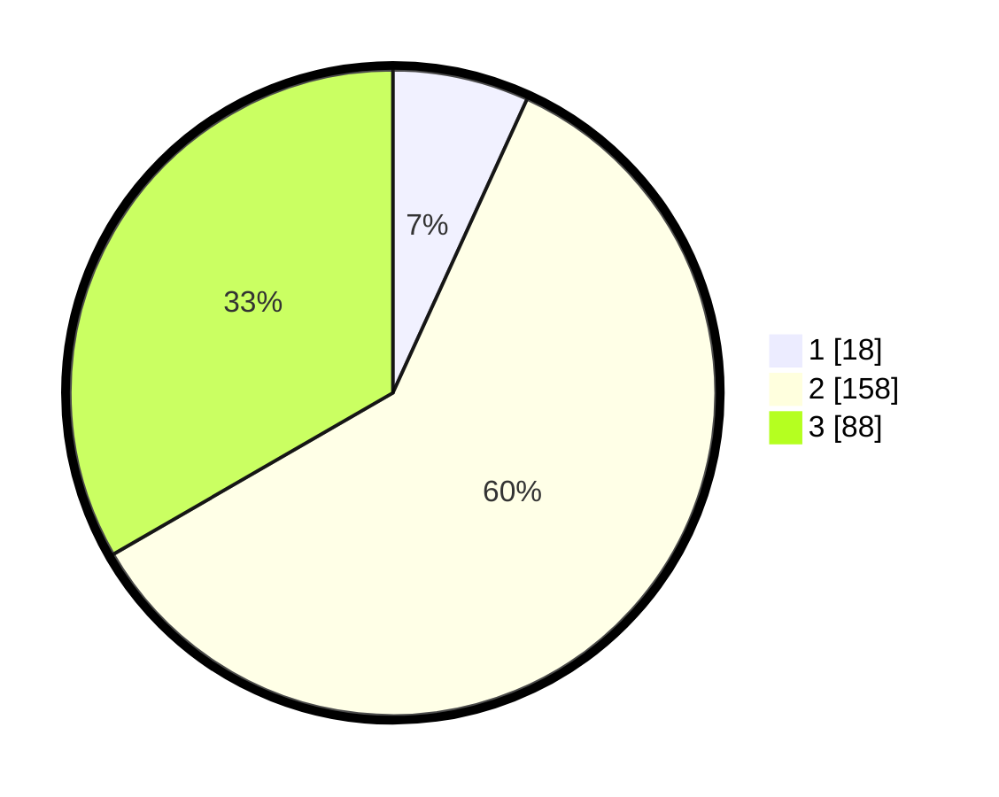

# Hasil

## Grafik

## Tabel

| No. | Nama Paslon    | Suara | Suara (raw) | Persentase |
|:--- |:-------------- | -----:| -----------:| ----------:|
| 1   | ANIES MUHAIMIN | 18    | [18][p-1]   | 6,82       |
| 2   | PRABOWO GIBRAN | 158   | [158][p-2]  | 59,85      |
| 3   | GANJAR MAHFUD  | 88    | [88][p-3]   | 33,33      |

[p-1]: https://github.com/gigit-pemilu/pemilu-2024-34-di-yogyakarta/blob/main/pilpres/hitung-suara/sub/34-di-yogyakarta/sub/02-bantul/sub/17-sedayu/sub/2001-argodadi/sub/017-tps/sub/paslon-1.txt
[p-2]: https://github.com/gigit-pemilu/pemilu-2024-34-di-yogyakarta/blob/main/pilpres/hitung-suara/sub/34-di-yogyakarta/sub/02-bantul/sub/17-sedayu/sub/2001-argodadi/sub/017-tps/sub/paslon-2.txt
[p-3]: https://github.com/gigit-pemilu/pemilu-2024-34-di-yogyakarta/blob/main/pilpres/hitung-suara/sub/34-di-yogyakarta/sub/02-bantul/sub/17-sedayu/sub/2001-argodadi/sub/017-tps/sub/paslon-3.txt

## Foto C Plano

https://sirekap-obj-formc.kpu.go.id/e49a/pemilu/ppwp/34/02/17/20/01/3402172001017-20240215-030859--04ae127a-cc76-4bda-86fc-cc51b292d3a8.jpg

https://sirekap-obj-formc.kpu.go.id/e49a/pemilu/ppwp/34/02/17/20/01/3402172001017-20240215-030824--28292089-13b1-4681-9697-7172d82c7d4c.jpg

https://sirekap-obj-formc.kpu.go.id/e49a/pemilu/ppwp/34/02/17/20/01/3402172001017-20240215-031215--bd924d89-01ae-4e30-97b4-3b36305ab103.jpg

## Metadata

| Key        | Value               |
| ---------- | ------------------- |
| Time Stamp | 2024-02-15 21:01:18 |

