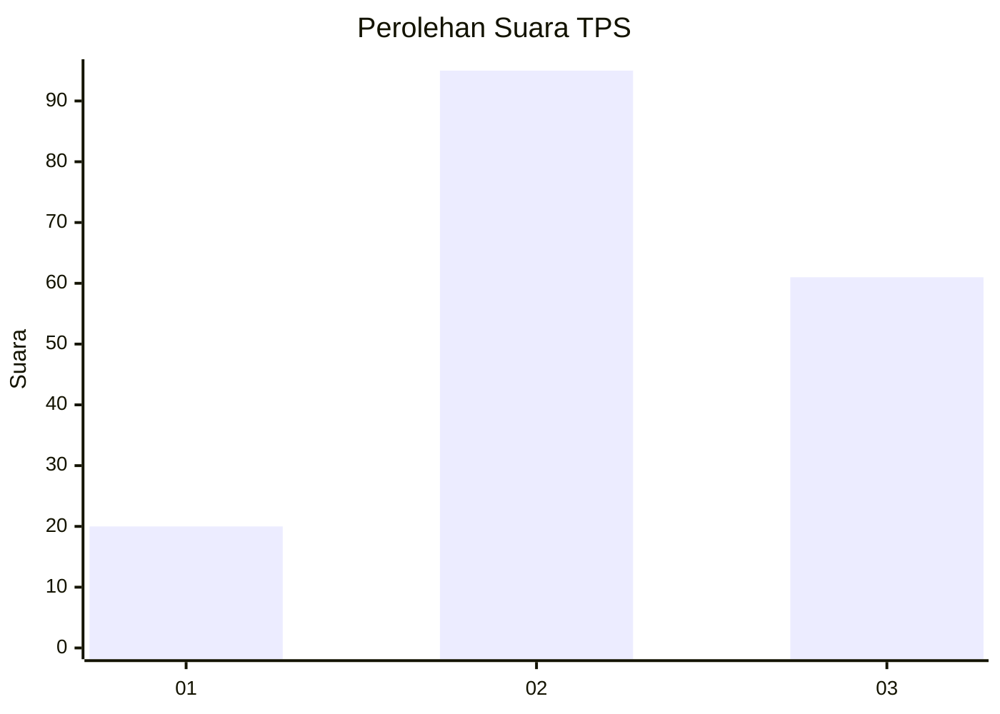
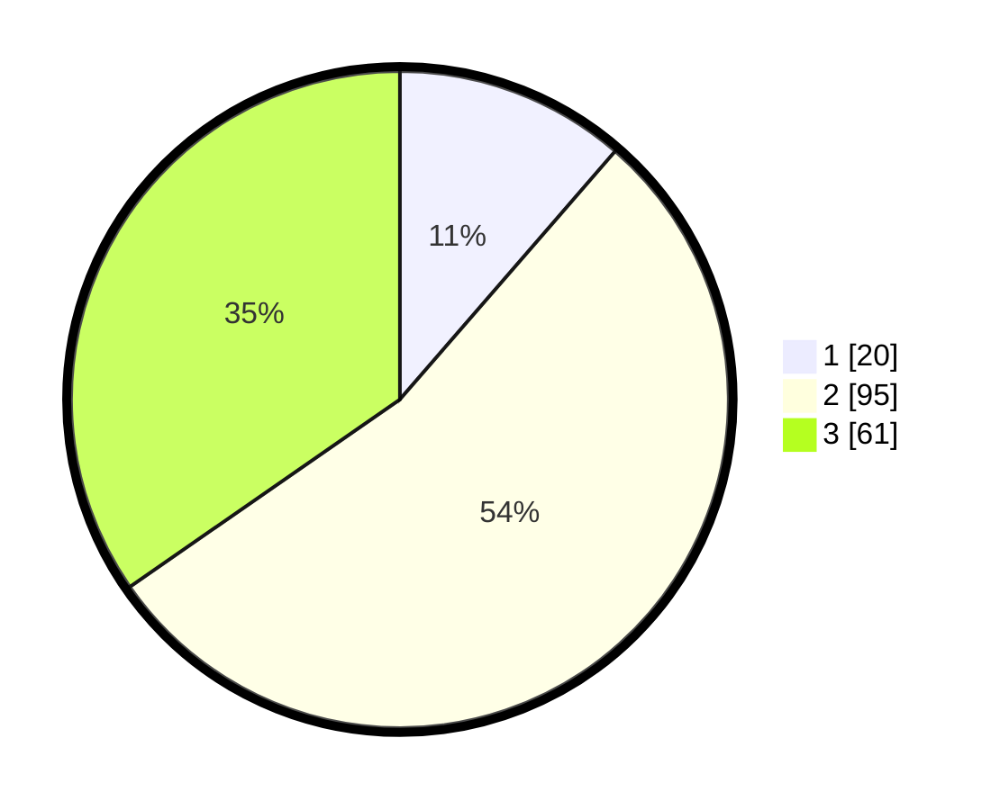

# Hasil

## Grafik

## Tabel

| No. | Nama Paslon    | Suara | Suara (raw) | Persentase |
|:--- |:-------------- | -----:| -----------:| ----------:|
| 1   | ANIES MUHAIMIN | 20    | [20][p-1]   | 11,36      |
| 2   | PRABOWO GIBRAN | 95    | [95][p-2]   | 53,98      |
| 3   | GANJAR MAHFUD  | 61    | [61][p-3]   | 34,66      |

[p-1]: https://github.com/gigit-pemilu/pemilu-2024-34-di-yogyakarta/blob/main/pilpres/hitung-suara/sub/34-di-yogyakarta/sub/02-bantul/sub/17-sedayu/sub/2001-argodadi/sub/022-tps/sub/paslon-1.txt
[p-2]: https://github.com/gigit-pemilu/pemilu-2024-34-di-yogyakarta/blob/main/pilpres/hitung-suara/sub/34-di-yogyakarta/sub/02-bantul/sub/17-sedayu/sub/2001-argodadi/sub/022-tps/sub/paslon-2.txt
[p-3]: https://github.com/gigit-pemilu/pemilu-2024-34-di-yogyakarta/blob/main/pilpres/hitung-suara/sub/34-di-yogyakarta/sub/02-bantul/sub/17-sedayu/sub/2001-argodadi/sub/022-tps/sub/paslon-3.txt

## Foto C Plano

https://sirekap-obj-formc.kpu.go.id/ac16/pemilu/ppwp/34/02/17/20/01/3402172001022-20240214-230235--1e248f07-5a77-43cd-9158-7b0d16cfc3d9.jpg

https://sirekap-obj-formc.kpu.go.id/ac16/pemilu/ppwp/34/02/17/20/01/3402172001022-20240214-220833--608695f0-5e2b-4efe-87fd-5b874a09c69b.jpg

https://sirekap-obj-formc.kpu.go.id/ac16/pemilu/ppwp/34/02/17/20/01/3402172001022-20240214-230841--9ae49863-6341-486c-8cb4-43cbd303b36d.jpg

## Metadata

| Key        | Value               |
| ---------- | ------------------- |
| Time Stamp | 2024-02-24 22:31:28 |

