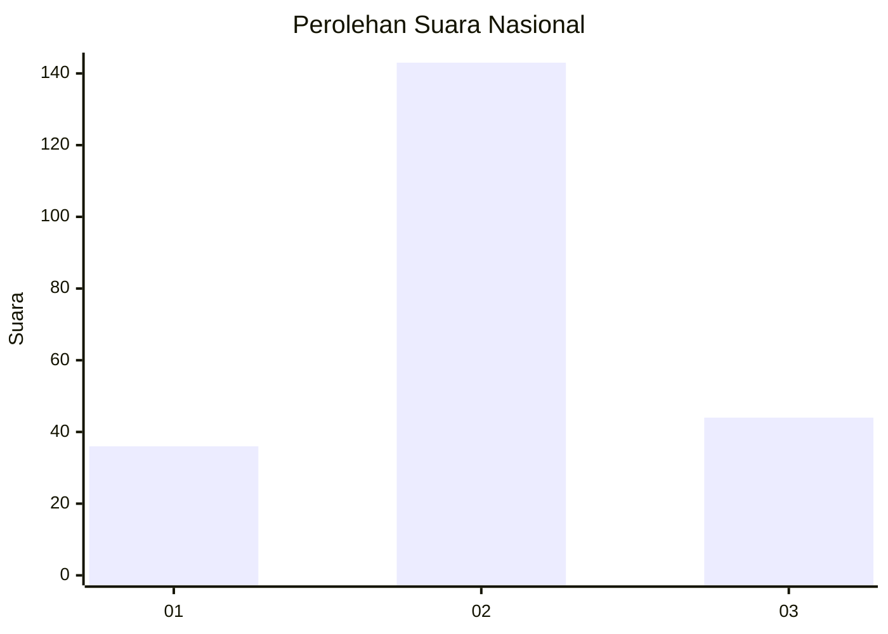
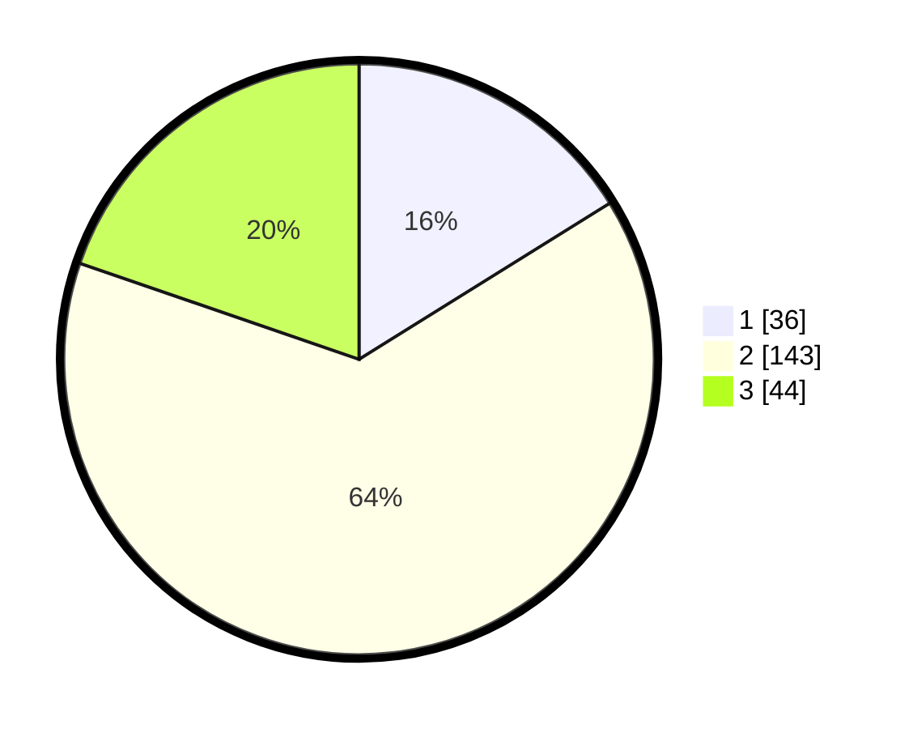

# Hasil

## Grafik

## Tabel

| No. | Nama Paslon    | Suara | Suara (raw) | Persentase |
|:--- |:-------------- | -----:| -----------:| ----------:|
| 1   | ANIES MUHAIMIN | 36    | [36][p-1]   | 16,14      |
| 2   | PRABOWO GIBRAN | 143   | [143][p-2]  | 64,13      |
| 3   | GANJAR MAHFUD  | 44    | [44][p-3]   | 19,73      |

[p-1]: https://github.com/gigit-pemilu/pemilu-2024/blob/main/pilpres/hitung-suara/sub/34-di-yogyakarta/sub/02-bantul/sub/17-sedayu/sub/2001-argodadi/sub/024-tps/sub/paslon-1.txt
[p-2]: https://github.com/gigit-pemilu/pemilu-2024/blob/main/pilpres/hitung-suara/sub/34-di-yogyakarta/sub/02-bantul/sub/17-sedayu/sub/2001-argodadi/sub/024-tps/sub/paslon-2.txt
[p-3]: https://github.com/gigit-pemilu/pemilu-2024/blob/main/pilpres/hitung-suara/sub/34-di-yogyakarta/sub/02-bantul/sub/17-sedayu/sub/2001-argodadi/sub/024-tps/sub/paslon-3.txt

## Foto C Plano

https://sirekap-obj-formc.kpu.go.id/c64b/pemilu/ppwp/34/02/17/20/01/3402172001024-20240215-053722--fb838066-ad88-4a5c-b8c5-06d15f251120.jpg

https://sirekap-obj-formc.kpu.go.id/c64b/pemilu/ppwp/34/02/17/20/01/3402172001024-20240215-053841--6592fb55-1e25-4e6d-a466-afa625a98490.jpg

https://sirekap-obj-formc.kpu.go.id/c64b/pemilu/ppwp/34/02/17/20/01/3402172001024-20240215-060656--7a8e8595-e9f7-4d9e-b319-b8214daa5fd5.jpg

## Metadata

| Key        | Value               |
| ---------- | ------------------- |
| Time Stamp | 2024-02-24 22:31:28 |

