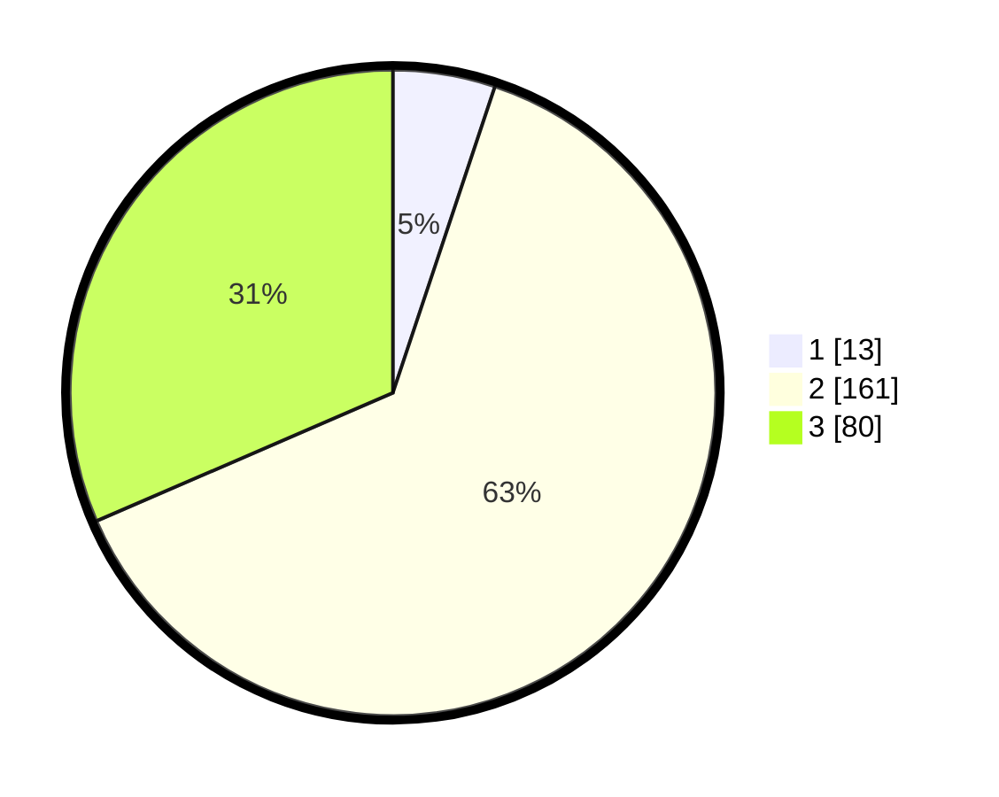

# Hasil

## Grafik

## Tabel

| No. | Nama Paslon    | Suara | Suara (raw) | Persentase |
|:--- |:-------------- | -----:| -----------:| ----------:|
| 1   | ANIES MUHAIMIN | 13    | [13][p-1]   | 5,12       |
| 2   | PRABOWO GIBRAN | 161   | [161][p-2]  | 63,39      |
| 3   | GANJAR MAHFUD  | 80    | [80][p-3]   | 31,50      |

[p-1]: https://github.com/gigit-pemilu/pemilu-2024-34-di-yogyakarta/blob/main/pilpres/hitung-suara/sub/34-di-yogyakarta/sub/02-bantul/sub/17-sedayu/sub/2001-argodadi/sub/025-tps/sub/paslon-1.txt
[p-2]: https://github.com/gigit-pemilu/pemilu-2024-34-di-yogyakarta/blob/main/pilpres/hitung-suara/sub/34-di-yogyakarta/sub/02-bantul/sub/17-sedayu/sub/2001-argodadi/sub/025-tps/sub/paslon-2.txt
[p-3]: https://github.com/gigit-pemilu/pemilu-2024-34-di-yogyakarta/blob/main/pilpres/hitung-suara/sub/34-di-yogyakarta/sub/02-bantul/sub/17-sedayu/sub/2001-argodadi/sub/025-tps/sub/paslon-3.txt

## Foto C Plano

https://sirekap-obj-formc.kpu.go.id/5c7d/pemilu/ppwp/34/02/17/20/01/3402172001025-20240215-063603--0e236c79-4a2b-4d3e-838e-887f619d4f94.jpg

https://sirekap-obj-formc.kpu.go.id/5c7d/pemilu/ppwp/34/02/17/20/01/3402172001025-20240215-063715--c2785c82-39a8-4040-bd3f-04dec26cba62.jpg

https://sirekap-obj-formc.kpu.go.id/5c7d/pemilu/ppwp/34/02/17/20/01/3402172001025-20240215-063812--b3784a50-9138-4c5d-b402-07ceac8a2e9a.jpg

## Metadata

| Key        | Value               |
| ---------- | ------------------- |
| Time Stamp | 2024-02-24 22:31:28 |

