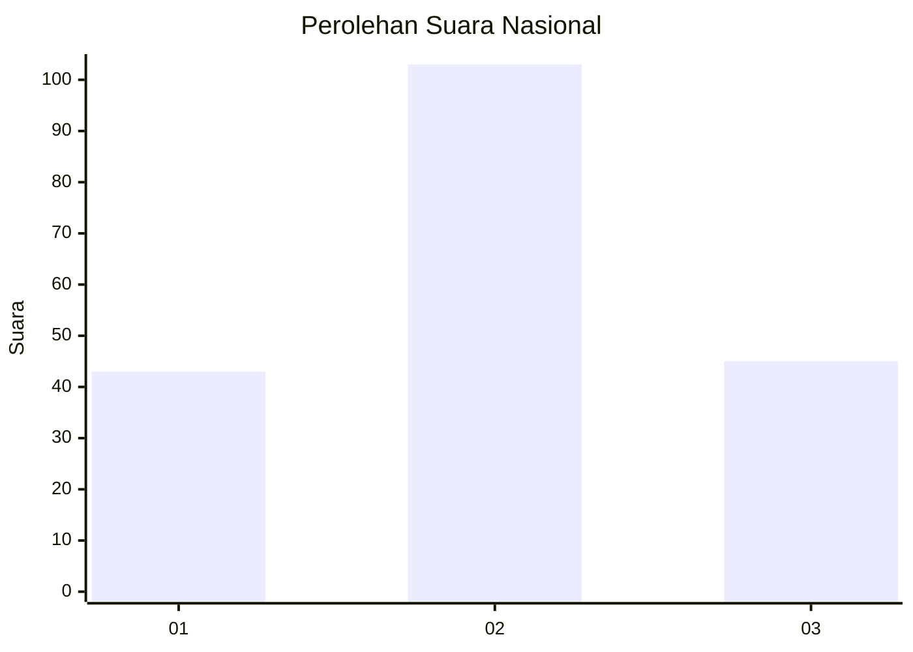
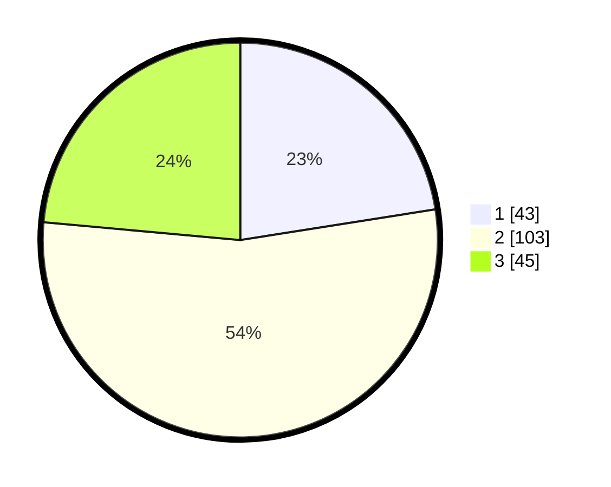

# Hasil

## Grafik

## Tabel

| No. | Nama Paslon    | Suara | Suara (raw) | Persentase |
|:--- |:-------------- | -----:| -----------:| ----------:|
| 1   | ANIES MUHAIMIN | 43    | [43][p-1]   | 22,51      |
| 2   | PRABOWO GIBRAN | 103   | [103][p-2]  | 53,93      |
| 3   | GANJAR MAHFUD  | 45    | [45][p-3]   | 23,56      |

[p-1]: https://github.com/gigit-pemilu/pemilu-2024/blob/main/pilpres/hitung-suara/sub/34-di-yogyakarta/sub/02-bantul/sub/17-sedayu/sub/2001-argodadi/sub/026-tps/sub/paslon-1.txt
[p-2]: https://github.com/gigit-pemilu/pemilu-2024/blob/main/pilpres/hitung-suara/sub/34-di-yogyakarta/sub/02-bantul/sub/17-sedayu/sub/2001-argodadi/sub/026-tps/sub/paslon-2.txt
[p-3]: https://github.com/gigit-pemilu/pemilu-2024/blob/main/pilpres/hitung-suara/sub/34-di-yogyakarta/sub/02-bantul/sub/17-sedayu/sub/2001-argodadi/sub/026-tps/sub/paslon-3.txt

## Foto C Plano

https://sirekap-obj-formc.kpu.go.id/28b2/pemilu/ppwp/34/02/17/20/01/3402172001026-20240215-051658--40981d7e-bea4-4fd6-84be-c4d2242f1abe.jpg

https://sirekap-obj-formc.kpu.go.id/28b2/pemilu/ppwp/34/02/17/20/01/3402172001026-20240215-051857--51bef15e-5d99-4cbf-b69e-1f3f6e20bf13.jpg

https://sirekap-obj-formc.kpu.go.id/28b2/pemilu/ppwp/34/02/17/20/01/3402172001026-20240215-051952--76c39405-7f14-456c-a989-2ca060f087e8.jpg

## Metadata

| Key        | Value               |
| ---------- | ------------------- |
| Time Stamp | 2024-02-26 11:00:00 |

