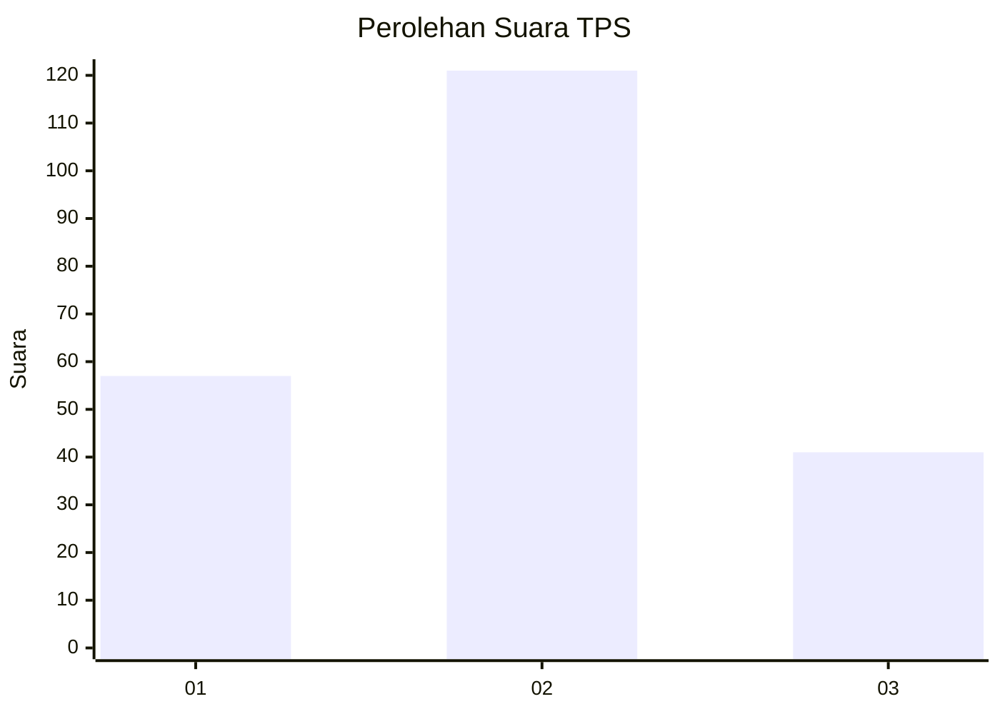
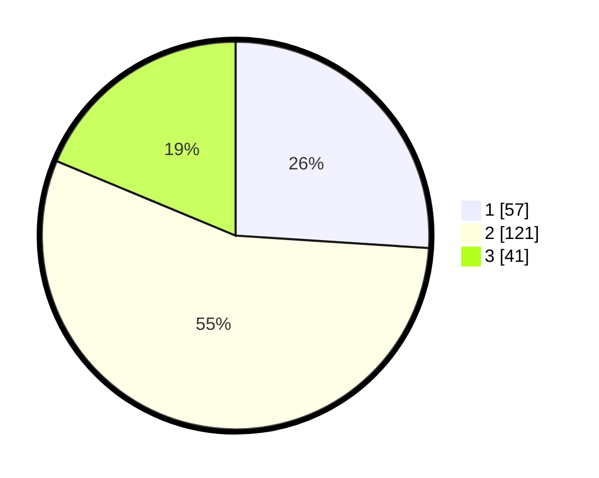

# Hasil

## Grafik

## Tabel

| No. | Nama Paslon    | Suara | Suara (raw) | Persentase |
|:--- |:-------------- | -----:| -----------:| ----------:|
| 1   | ANIES MUHAIMIN | 57    | [57][p-1]   | 26,03      |
| 2   | PRABOWO GIBRAN | 121   | [121][p-2]  | 55,25      |
| 3   | GANJAR MAHFUD  | 41    | [41][p-3]   | 18,72      |

[p-1]: https://github.com/gigit-pemilu/pemilu-2024-34-di-yogyakarta/blob/main/pilpres/hitung-suara/sub/34-di-yogyakarta/sub/02-bantul/sub/17-sedayu/sub/2001-argodadi/sub/029-tps/sub/paslon-1.txt
[p-2]: https://github.com/gigit-pemilu/pemilu-2024-34-di-yogyakarta/blob/main/pilpres/hitung-suara/sub/34-di-yogyakarta/sub/02-bantul/sub/17-sedayu/sub/2001-argodadi/sub/029-tps/sub/paslon-2.txt
[p-3]: https://github.com/gigit-pemilu/pemilu-2024-34-di-yogyakarta/blob/main/pilpres/hitung-suara/sub/34-di-yogyakarta/sub/02-bantul/sub/17-sedayu/sub/2001-argodadi/sub/029-tps/sub/paslon-3.txt

## Foto C Plano

https://sirekap-obj-formc.kpu.go.id/25ba/pemilu/ppwp/34/02/17/20/01/3402172001029-20240215-021203--1947784c-f1a5-46f1-9a94-160d33a66664.jpg

https://sirekap-obj-formc.kpu.go.id/25ba/pemilu/ppwp/34/02/17/20/01/3402172001029-20240215-021444--d455dd45-bff7-4cea-aabf-e5d8b0e9cb86.jpg

https://sirekap-obj-formc.kpu.go.id/25ba/pemilu/ppwp/34/02/17/20/01/3402172001029-20240214-192315--9ef1b102-e98f-4336-a419-6c5f6c7014cd.jpg

## Metadata

| Key        | Value               |
| ---------- | ------------------- |
| Time Stamp | 2024-02-24 22:31:28 |

