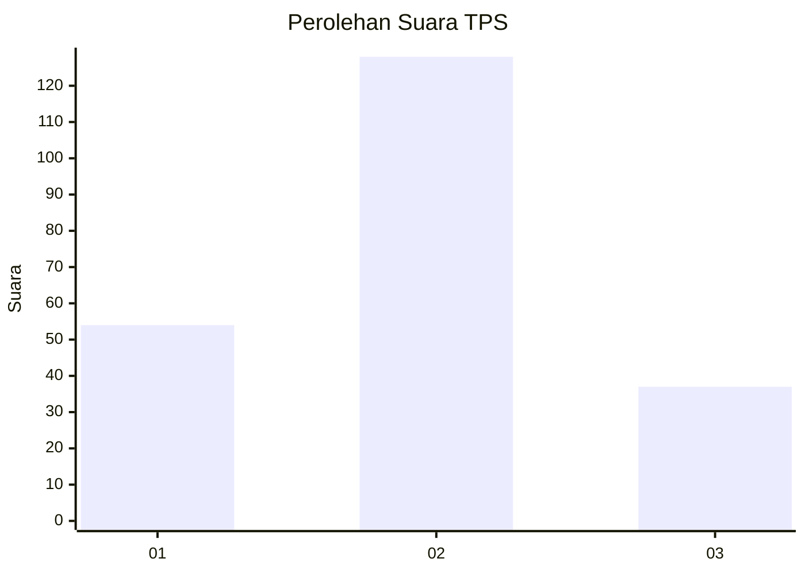

# Hasil

## Grafik

## Tabel

| No. | Nama Paslon    | Suara | Suara (raw) | Persentase |
|:--- |:-------------- | -----:| -----------:| ----------:|
| 1   | ANIES MUHAIMIN | 54    | [54][p-1]   | 24,66      |
| 2   | PRABOWO GIBRAN | 128   | [128][p-2]  | 58,45      |
| 3   | GANJAR MAHFUD  | 37    | [37][p-3]   | 16,89      |

[p-1]: https://github.com/gigit-pemilu/pemilu-2024-34-di-yogyakarta/blob/main/pilpres/hitung-suara/sub/34-di-yogyakarta/sub/02-bantul/sub/17-sedayu/sub/2001-argodadi/sub/031-tps/sub/paslon-1.txt
[p-2]: https://github.com/gigit-pemilu/pemilu-2024-34-di-yogyakarta/blob/main/pilpres/hitung-suara/sub/34-di-yogyakarta/sub/02-bantul/sub/17-sedayu/sub/2001-argodadi/sub/031-tps/sub/paslon-2.txt
[p-3]: https://github.com/gigit-pemilu/pemilu-2024-34-di-yogyakarta/blob/main/pilpres/hitung-suara/sub/34-di-yogyakarta/sub/02-bantul/sub/17-sedayu/sub/2001-argodadi/sub/031-tps/sub/paslon-3.txt

## Foto C Plano

https://sirekap-obj-formc.kpu.go.id/5d86/pemilu/ppwp/34/02/17/20/01/3402172001031-20240215-071921--621b94c7-51ca-47b2-825a-7960e52fa08c.jpg

https://sirekap-obj-formc.kpu.go.id/5d86/pemilu/ppwp/34/02/17/20/01/3402172001031-20240215-051522--483f7edd-f9b2-4e63-b4e8-70487cd97dd6.jpg

https://sirekap-obj-formc.kpu.go.id/5d86/pemilu/ppwp/34/02/17/20/01/3402172001031-20240215-051645--876750b1-4508-43af-99c8-eade31a93bda.jpg

## Metadata

| Key        | Value               |
| ---------- | ------------------- |
| Time Stamp | 2024-02-24 22:31:28 |

