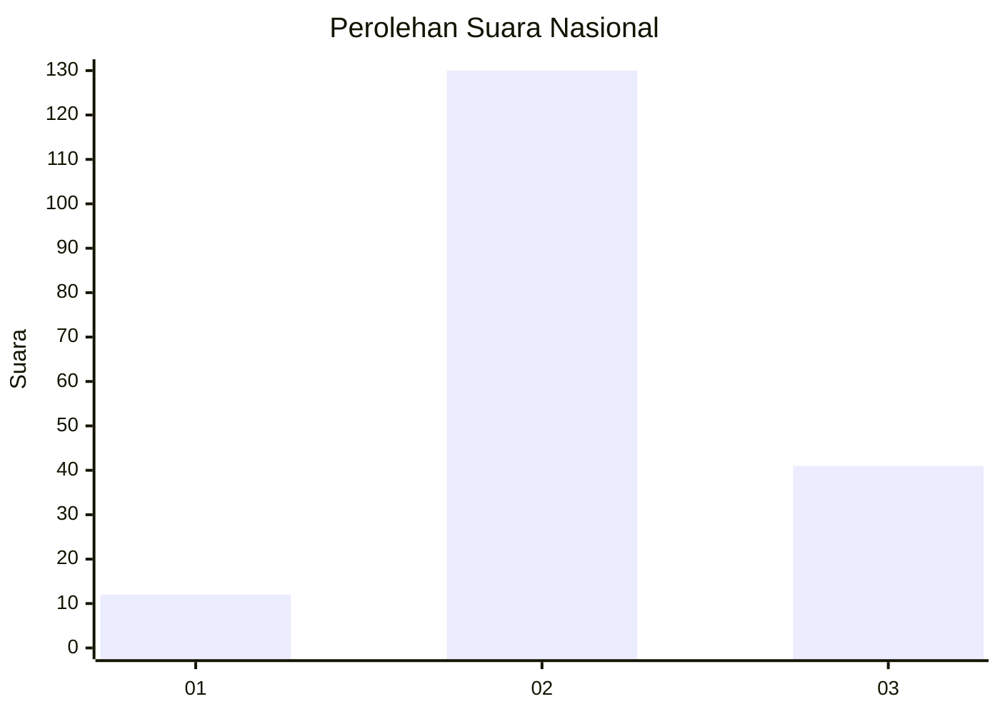
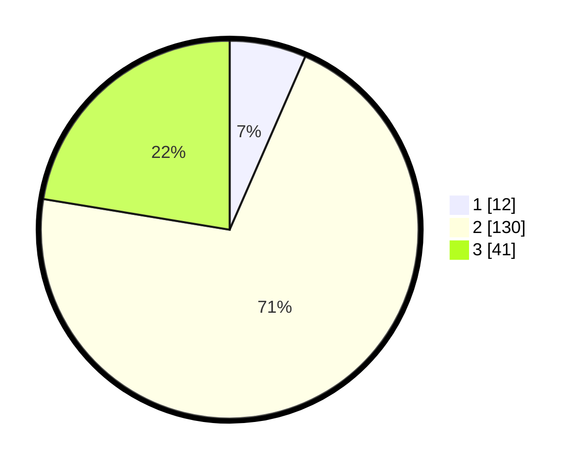

# Hasil

## Grafik

## Tabel

| No. | Nama Paslon    | Suara | Suara (raw) | Persentase |
|:--- |:-------------- | -----:| -----------:| ----------:|
| 1   | ANIES MUHAIMIN | 12    | [12][p-1]   | 6,56       |
| 2   | PRABOWO GIBRAN | 130   | [130][p-2]  | 71,04      |
| 3   | GANJAR MAHFUD  | 41    | [41][p-3]   | 22,40      |

[p-1]: https://github.com/gigit-pemilu/pemilu-2024/blob/main/pilpres/hitung-suara/sub/34-di-yogyakarta/sub/02-bantul/sub/17-sedayu/sub/2001-argodadi/sub/033-tps/sub/paslon-1.txt
[p-2]: https://github.com/gigit-pemilu/pemilu-2024/blob/main/pilpres/hitung-suara/sub/34-di-yogyakarta/sub/02-bantul/sub/17-sedayu/sub/2001-argodadi/sub/033-tps/sub/paslon-2.txt
[p-3]: https://github.com/gigit-pemilu/pemilu-2024/blob/main/pilpres/hitung-suara/sub/34-di-yogyakarta/sub/02-bantul/sub/17-sedayu/sub/2001-argodadi/sub/033-tps/sub/paslon-3.txt

## Foto C Plano

https://sirekap-obj-formc.kpu.go.id/b1d2/pemilu/ppwp/34/02/17/20/01/3402172001033-20240222-123654--2e96a9e7-25a4-4fb2-a0b1-385600a3e5f5.jpg

https://sirekap-obj-formc.kpu.go.id/b1d2/pemilu/ppwp/34/02/17/20/01/3402172001033-20240222-123657--ddb43cdb-142f-4adc-b946-98103c40c00c.jpg

## Metadata

| Key        | Value               |
| ---------- | ------------------- |
| Time Stamp | 2024-02-22 13:00:00 |

