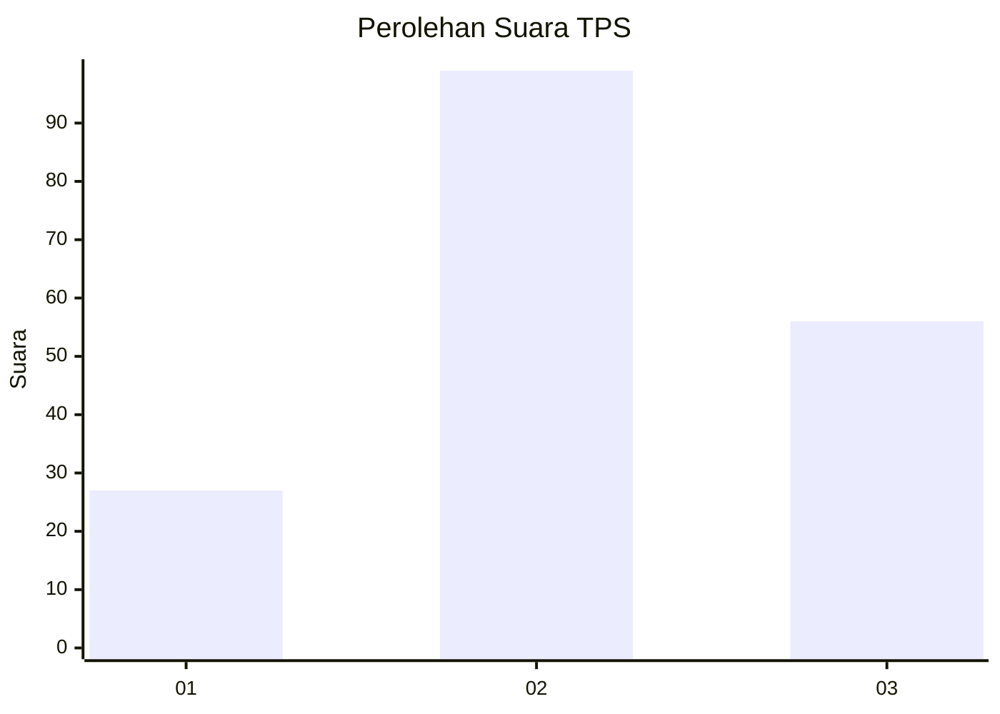
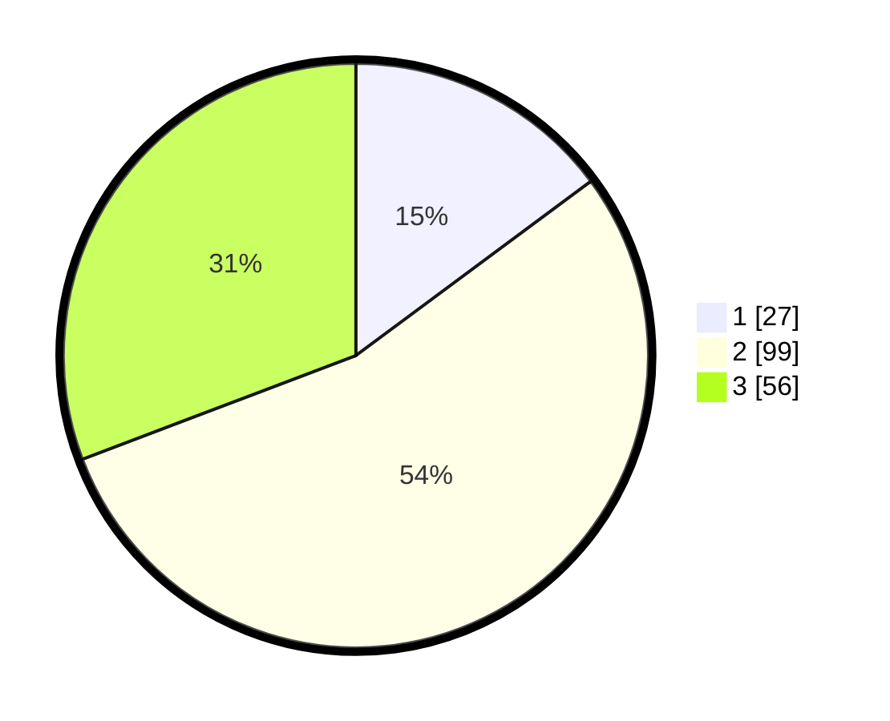

# Hasil

## Grafik

## Tabel

| No. | Nama Paslon    | Suara | Suara (raw) | Persentase |
|:--- |:-------------- | -----:| -----------:| ----------:|
| 1   | ANIES MUHAIMIN | 27    | [27][p-1]   | 14,84      |
| 2   | PRABOWO GIBRAN | 99    | [99][p-2]   | 54,40      |
| 3   | GANJAR MAHFUD  | 56    | [56][p-3]   | 30,77      |

[p-1]: https://github.com/gigit-pemilu/pemilu-2024-34-di-yogyakarta/blob/main/pilpres/hitung-suara/sub/34-di-yogyakarta/sub/02-bantul/sub/17-sedayu/sub/2001-argodadi/sub/034-tps/sub/paslon-1.txt
[p-2]: https://github.com/gigit-pemilu/pemilu-2024-34-di-yogyakarta/blob/main/pilpres/hitung-suara/sub/34-di-yogyakarta/sub/02-bantul/sub/17-sedayu/sub/2001-argodadi/sub/034-tps/sub/paslon-2.txt
[p-3]: https://github.com/gigit-pemilu/pemilu-2024-34-di-yogyakarta/blob/main/pilpres/hitung-suara/sub/34-di-yogyakarta/sub/02-bantul/sub/17-sedayu/sub/2001-argodadi/sub/034-tps/sub/paslon-3.txt

## Foto C Plano

https://sirekap-obj-formc.kpu.go.id/f398/pemilu/ppwp/34/02/17/20/01/3402172001034-20240214-234826--47c8158d-7df8-4dae-9f6a-ca9b38f48d85.jpg

https://sirekap-obj-formc.kpu.go.id/f398/pemilu/ppwp/34/02/17/20/01/3402172001034-20240214-234844--19b34400-9eff-4273-ab28-cf9c43849605.jpg

https://sirekap-obj-formc.kpu.go.id/f398/pemilu/ppwp/34/02/17/20/01/3402172001034-20240214-234852--f089af58-2445-4051-b913-80f0f37b6721.jpg

## Metadata

| Key        | Value               |
| ---------- | ------------------- |
| Time Stamp | 2024-02-24 22:31:28 |

