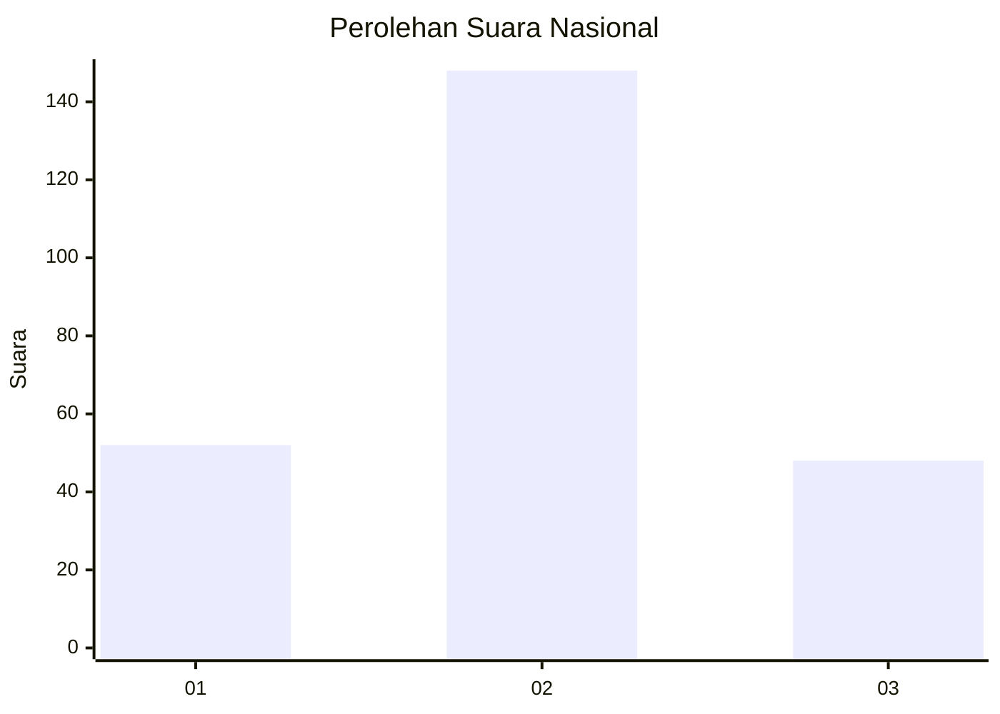
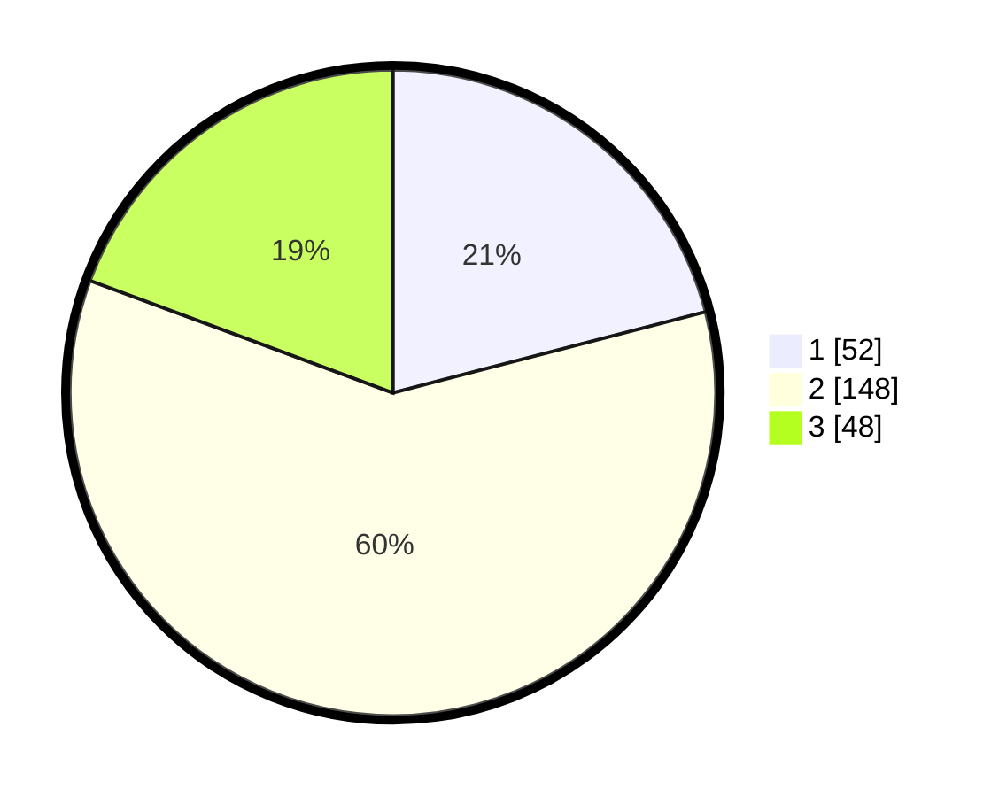

# Hasil

## Grafik

## Tabel

| No. | Nama Paslon    | Suara | Suara (raw) | Persentase |
|:--- |:-------------- | -----:| -----------:| ----------:|
| 1   | ANIES MUHAIMIN | 52    | [52][p-1]   | 20,97      |
| 2   | PRABOWO GIBRAN | 148   | [148][p-2]  | 59,68      |
| 3   | GANJAR MAHFUD  | 48    | [48][p-3]   | 19,35      |

[p-1]: https://github.com/gigit-pemilu/pemilu-2024/blob/main/pilpres/hitung-suara/sub/34-di-yogyakarta/sub/02-bantul/sub/17-sedayu/sub/2001-argodadi/sub/035-tps/sub/paslon-1.txt
[p-2]: https://github.com/gigit-pemilu/pemilu-2024/blob/main/pilpres/hitung-suara/sub/34-di-yogyakarta/sub/02-bantul/sub/17-sedayu/sub/2001-argodadi/sub/035-tps/sub/paslon-2.txt
[p-3]: https://github.com/gigit-pemilu/pemilu-2024/blob/main/pilpres/hitung-suara/sub/34-di-yogyakarta/sub/02-bantul/sub/17-sedayu/sub/2001-argodadi/sub/035-tps/sub/paslon-3.txt

## Foto C Plano

https://sirekap-obj-formc.kpu.go.id/2d09/pemilu/ppwp/34/02/17/20/01/3402172001035-20240215-075309--4f47ef88-1f96-46cc-94b3-5fb593ec50a7.jpg

https://sirekap-obj-formc.kpu.go.id/2d09/pemilu/ppwp/34/02/17/20/01/3402172001035-20240215-075523--562a2233-f201-45b1-8d2a-5ef88b968860.jpg

https://sirekap-obj-formc.kpu.go.id/2d09/pemilu/ppwp/34/02/17/20/01/3402172001035-20240215-080005--c49af9b9-9477-4c2a-93f1-113e6e23f5a9.jpg

## Metadata

| Key        | Value               |
| ---------- | ------------------- |
| Time Stamp | 2024-02-24 22:31:28 |

