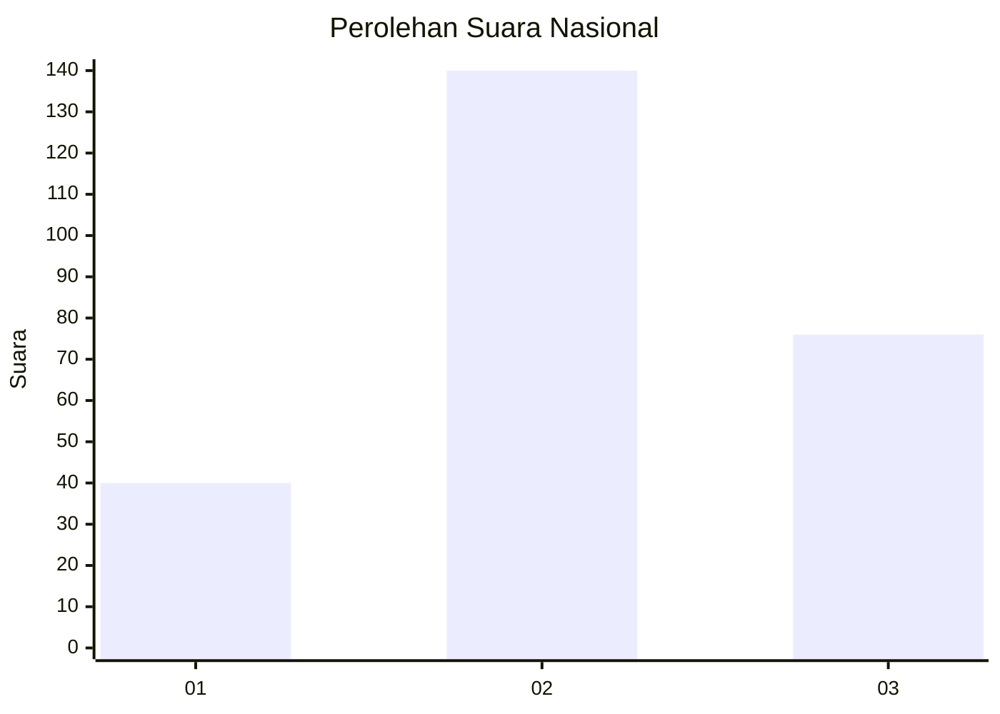
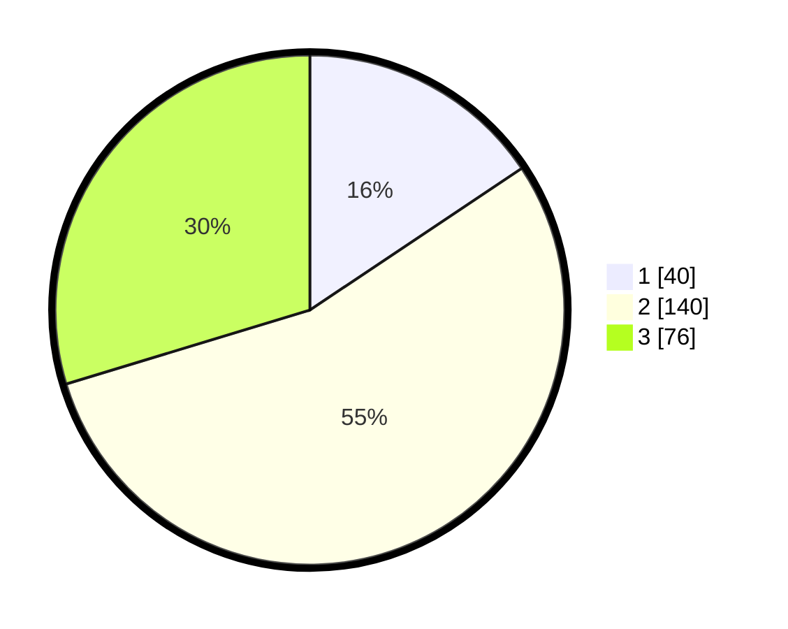

# Hasil

## Grafik

## Tabel

| No. | Nama Paslon    | Suara | Suara (raw) | Persentase |
|:--- |:-------------- | -----:| -----------:| ----------:|
| 1   | ANIES MUHAIMIN | 40    | [40][p-1]   | 15,63      |
| 2   | PRABOWO GIBRAN | 140   | [140][p-2]  | 54,69      |
| 3   | GANJAR MAHFUD  | 76    | [76][p-3]   | 29,69      |

[p-1]: https://github.com/gigit-pemilu/pemilu-2024/blob/main/pilpres/hitung-suara/sub/34-di-yogyakarta/sub/02-bantul/sub/17-sedayu/sub/2001-argodadi/sub/038-tps/sub/paslon-1.txt
[p-2]: https://github.com/gigit-pemilu/pemilu-2024/blob/main/pilpres/hitung-suara/sub/34-di-yogyakarta/sub/02-bantul/sub/17-sedayu/sub/2001-argodadi/sub/038-tps/sub/paslon-2.txt
[p-3]: https://github.com/gigit-pemilu/pemilu-2024/blob/main/pilpres/hitung-suara/sub/34-di-yogyakarta/sub/02-bantul/sub/17-sedayu/sub/2001-argodadi/sub/038-tps/sub/paslon-3.txt

## Foto C Plano

https://sirekap-obj-formc.kpu.go.id/7fe0/pemilu/ppwp/34/02/17/20/01/3402172001038-20240215-064935--0a50979f-8906-4bc7-a7c0-71663ab83d07.jpg

https://sirekap-obj-formc.kpu.go.id/7fe0/pemilu/ppwp/34/02/17/20/01/3402172001038-20240215-064444--490993f1-d3cc-4b76-8667-b996dc953d63.jpg

https://sirekap-obj-formc.kpu.go.id/7fe0/pemilu/ppwp/34/02/17/20/01/3402172001038-20240215-065649--688c739a-ea2d-4bbe-abb4-e05a47a4ba37.jpg

## Metadata

| Key        | Value               |
| ---------- | ------------------- |
| Time Stamp | 2024-02-24 22:31:28 |

