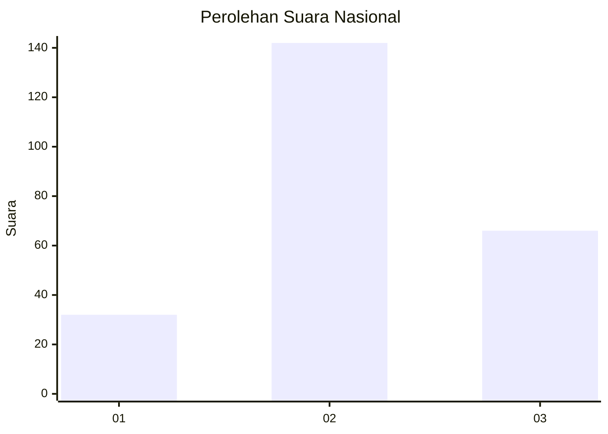
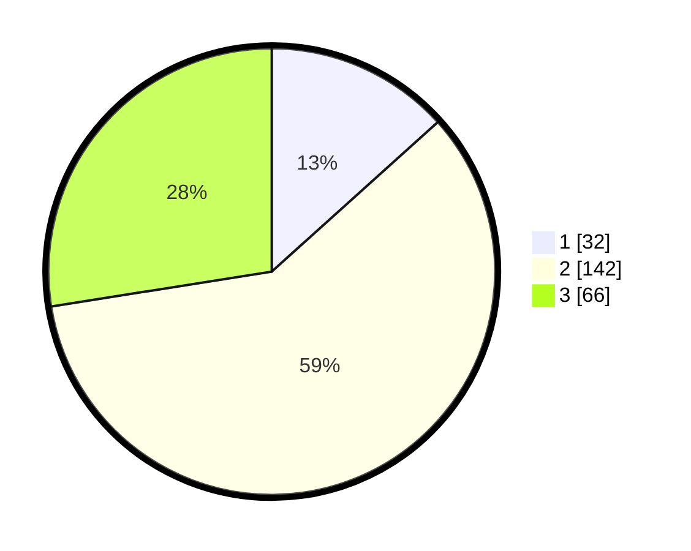

# Hasil

## Grafik

## Tabel

| No. | Nama Paslon    | Suara | Suara (raw) | Persentase |
|:--- |:-------------- | -----:| -----------:| ----------:|
| 1   | ANIES MUHAIMIN | 32    | [32][p-1]   | 13,33      |
| 2   | PRABOWO GIBRAN | 142   | [142][p-2]  | 59,17      |
| 3   | GANJAR MAHFUD  | 66    | [66][p-3]   | 27,50      |

[p-1]: https://github.com/gigit-pemilu/pemilu-2024/blob/main/pilpres/hitung-suara/sub/34-di-yogyakarta/sub/02-bantul/sub/17-sedayu/sub/2002-argorejo/sub/005-tps/sub/paslon-1.txt
[p-2]: https://github.com/gigit-pemilu/pemilu-2024/blob/main/pilpres/hitung-suara/sub/34-di-yogyakarta/sub/02-bantul/sub/17-sedayu/sub/2002-argorejo/sub/005-tps/sub/paslon-2.txt
[p-3]: https://github.com/gigit-pemilu/pemilu-2024/blob/main/pilpres/hitung-suara/sub/34-di-yogyakarta/sub/02-bantul/sub/17-sedayu/sub/2002-argorejo/sub/005-tps/sub/paslon-3.txt

## Foto C Plano

https://sirekap-obj-formc.kpu.go.id/f5e6/pemilu/ppwp/34/02/17/20/02/3402172002005-20240215-051922--1127ffc1-9555-4e21-a034-8b1f4f613063.jpg

https://sirekap-obj-formc.kpu.go.id/f5e6/pemilu/ppwp/34/02/17/20/02/3402172002005-20240215-052110--d8d10ad6-5e05-4187-a005-3b9c1f4576ff.jpg

https://sirekap-obj-formc.kpu.go.id/f5e6/pemilu/ppwp/34/02/17/20/02/3402172002005-20240215-052234--8926abfb-1b85-429b-8d27-1655153dd761.jpg

## Metadata

| Key        | Value               |
| ---------- | ------------------- |
| Time Stamp | 2024-02-24 22:31:28 |

