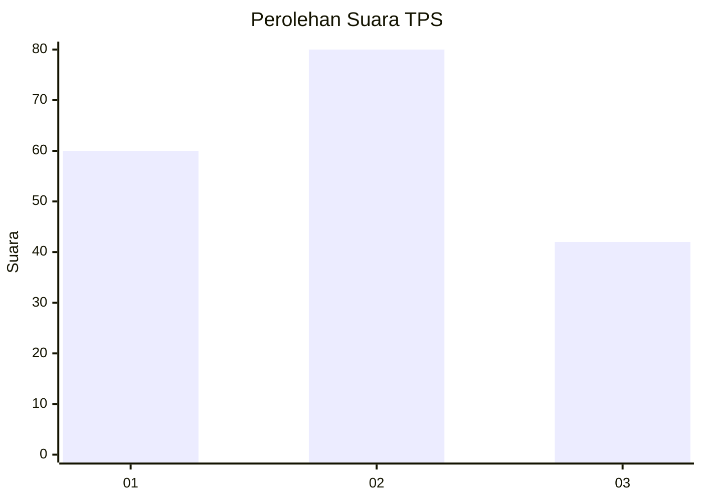
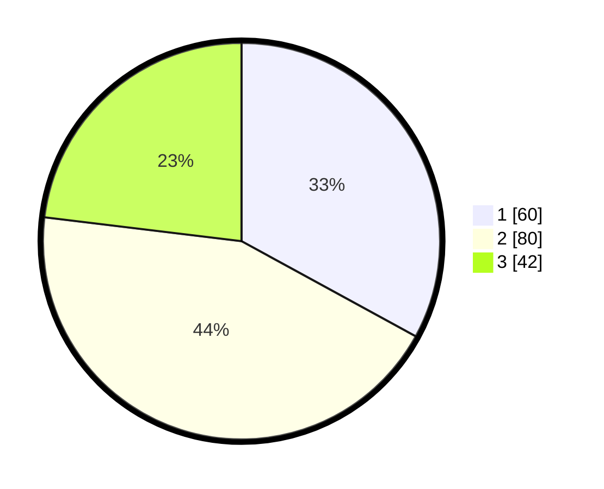

# Hasil

## Grafik

## Tabel

| No. | Nama Paslon    | Suara | Suara (raw) | Persentase |
|:--- |:-------------- | -----:| -----------:| ----------:|
| 1   | ANIES MUHAIMIN | 60    | [60][p-1]   | 32,97      |
| 2   | PRABOWO GIBRAN | 80    | [80][p-2]   | 43,96      |
| 3   | GANJAR MAHFUD  | 42    | [42][p-3]   | 23,08      |

[p-1]: https://github.com/gigit-pemilu/pemilu-2024-34-di-yogyakarta/blob/main/pilpres/hitung-suara/sub/34-di-yogyakarta/sub/02-bantul/sub/17-sedayu/sub/2002-argorejo/sub/006-tps/sub/paslon-1.txt
[p-2]: https://github.com/gigit-pemilu/pemilu-2024-34-di-yogyakarta/blob/main/pilpres/hitung-suara/sub/34-di-yogyakarta/sub/02-bantul/sub/17-sedayu/sub/2002-argorejo/sub/006-tps/sub/paslon-2.txt
[p-3]: https://github.com/gigit-pemilu/pemilu-2024-34-di-yogyakarta/blob/main/pilpres/hitung-suara/sub/34-di-yogyakarta/sub/02-bantul/sub/17-sedayu/sub/2002-argorejo/sub/006-tps/sub/paslon-3.txt

## Foto C Plano

https://sirekap-obj-formc.kpu.go.id/213b/pemilu/ppwp/34/02/17/20/02/3402172002006-20240215-055039--09aeffa0-ff44-46f7-8948-add496383558.jpg

https://sirekap-obj-formc.kpu.go.id/213b/pemilu/ppwp/34/02/17/20/02/3402172002006-20240214-194840--8cddd615-59a4-4ec4-ae8f-c7d30b1546de.jpg

https://sirekap-obj-formc.kpu.go.id/213b/pemilu/ppwp/34/02/17/20/02/3402172002006-20240215-055223--e8fdd76f-161d-4df9-b8f6-73dbb04a2ea9.jpg

## Metadata

| Key        | Value               |
| ---------- | ------------------- |
| Time Stamp | 2024-02-15 06:00:23 |

