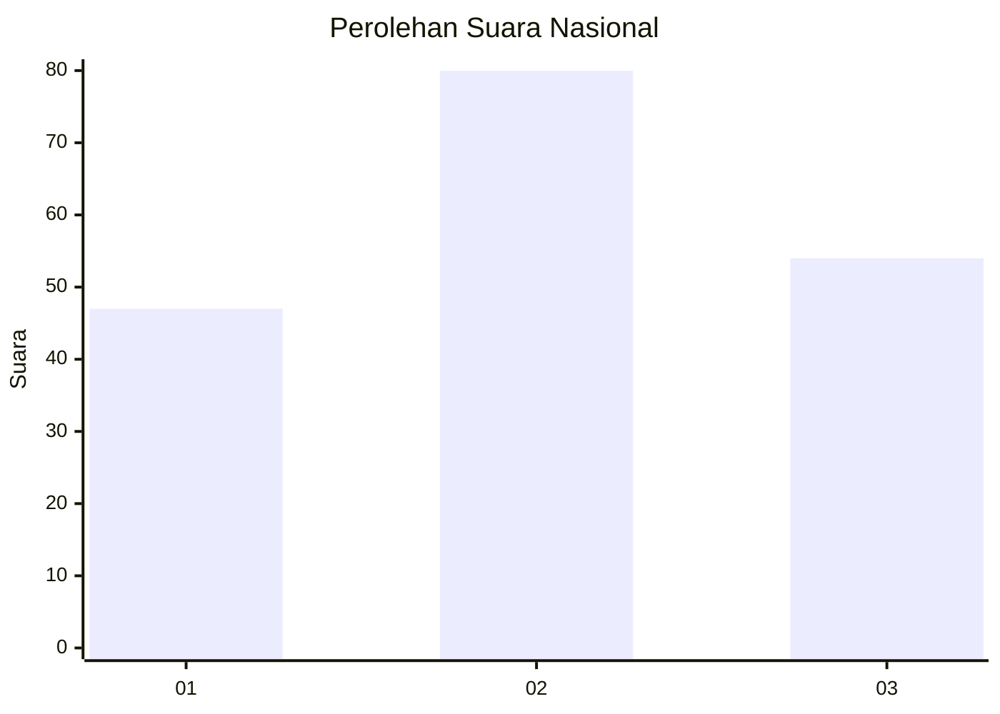
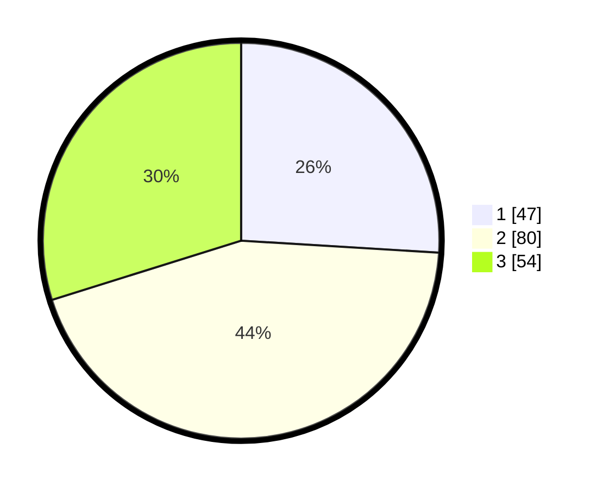

# Hasil

## Grafik

## Tabel

| No. | Nama Paslon    | Suara | Suara (raw) | Persentase |
|:--- |:-------------- | -----:| -----------:| ----------:|
| 1   | ANIES MUHAIMIN | 47    | [47][p-1]   | 25,97      |
| 2   | PRABOWO GIBRAN | 80    | [80][p-2]   | 44,20      |
| 3   | GANJAR MAHFUD  | 54    | [54][p-3]   | 29,83      |

[p-1]: https://github.com/gigit-pemilu/pemilu-2024/blob/main/pilpres/hitung-suara/sub/34-di-yogyakarta/sub/02-bantul/sub/17-sedayu/sub/2002-argorejo/sub/007-tps/sub/paslon-1.txt
[p-2]: https://github.com/gigit-pemilu/pemilu-2024/blob/main/pilpres/hitung-suara/sub/34-di-yogyakarta/sub/02-bantul/sub/17-sedayu/sub/2002-argorejo/sub/007-tps/sub/paslon-2.txt
[p-3]: https://github.com/gigit-pemilu/pemilu-2024/blob/main/pilpres/hitung-suara/sub/34-di-yogyakarta/sub/02-bantul/sub/17-sedayu/sub/2002-argorejo/sub/007-tps/sub/paslon-3.txt

## Foto C Plano

https://sirekap-obj-formc.kpu.go.id/82d0/pemilu/ppwp/34/02/17/20/02/3402172002007-20240214-221349--85085d8d-4723-4c94-97f5-032d046fda6b.jpg

https://sirekap-obj-formc.kpu.go.id/82d0/pemilu/ppwp/34/02/17/20/02/3402172002007-20240214-221508--23d5cc25-b6f9-4f9d-b04c-e6e57375b813.jpg

https://sirekap-obj-formc.kpu.go.id/82d0/pemilu/ppwp/34/02/17/20/02/3402172002007-20240214-221627--aa85cf6f-2a7e-478d-a9b8-0bc066198669.jpg

## Metadata

| Key        | Value               |
| ---------- | ------------------- |
| Time Stamp | 2024-02-15 15:00:29 |

