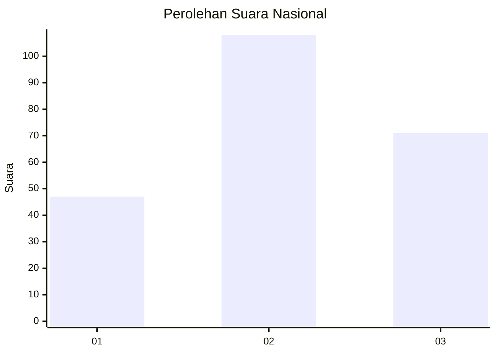
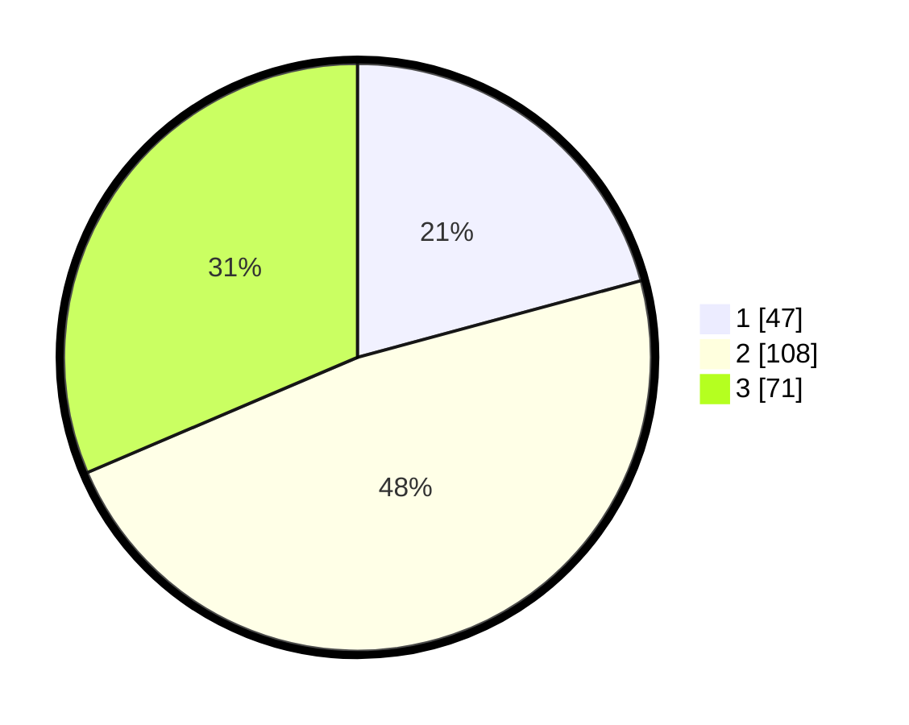

# Hasil

## Grafik

## Tabel

| No. | Nama Paslon    | Suara | Suara (raw) | Persentase |
|:--- |:-------------- | -----:| -----------:| ----------:|
| 1   | ANIES MUHAIMIN | 47    | [47][p-1]   | 20,80      |
| 2   | PRABOWO GIBRAN | 108   | [108][p-2]  | 47,79      |
| 3   | GANJAR MAHFUD  | 71    | [71][p-3]   | 31,42      |

[p-1]: https://github.com/gigit-pemilu/pemilu-2024/blob/main/pilpres/hitung-suara/sub/34-di-yogyakarta/sub/02-bantul/sub/17-sedayu/sub/2002-argorejo/sub/008-tps/sub/paslon-1.txt
[p-2]: https://github.com/gigit-pemilu/pemilu-2024/blob/main/pilpres/hitung-suara/sub/34-di-yogyakarta/sub/02-bantul/sub/17-sedayu/sub/2002-argorejo/sub/008-tps/sub/paslon-2.txt
[p-3]: https://github.com/gigit-pemilu/pemilu-2024/blob/main/pilpres/hitung-suara/sub/34-di-yogyakarta/sub/02-bantul/sub/17-sedayu/sub/2002-argorejo/sub/008-tps/sub/paslon-3.txt

## Foto C Plano

https://sirekap-obj-formc.kpu.go.id/376c/pemilu/ppwp/34/02/17/20/02/3402172002008-20240214-232313--9d577984-6895-41e8-b5c0-df40bdb8be46.jpg

https://sirekap-obj-formc.kpu.go.id/376c/pemilu/ppwp/34/02/17/20/02/3402172002008-20240217-234033--391846e2-e778-421d-9011-1be04874958f.jpg

https://sirekap-obj-formc.kpu.go.id/376c/pemilu/ppwp/34/02/17/20/02/3402172002008-20240217-234038--c41f1103-6e7f-4d5e-9c40-0601dc14b967.jpg

## Metadata

| Key        | Value               |
| ---------- | ------------------- |
| Time Stamp | 2024-02-19 06:16:00 |

