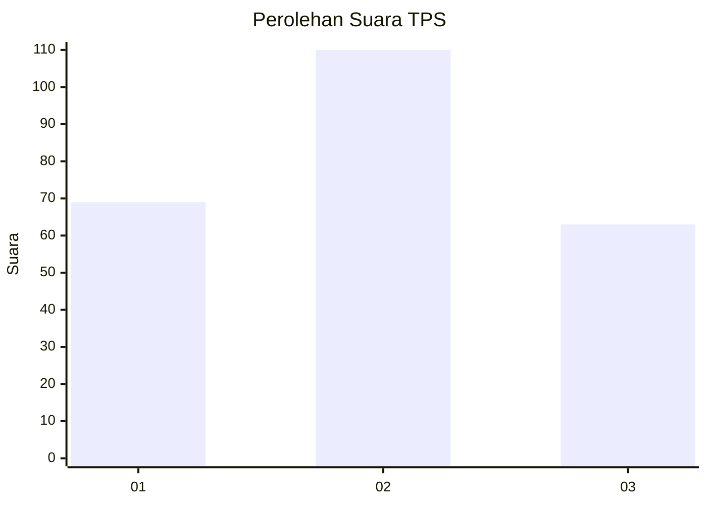
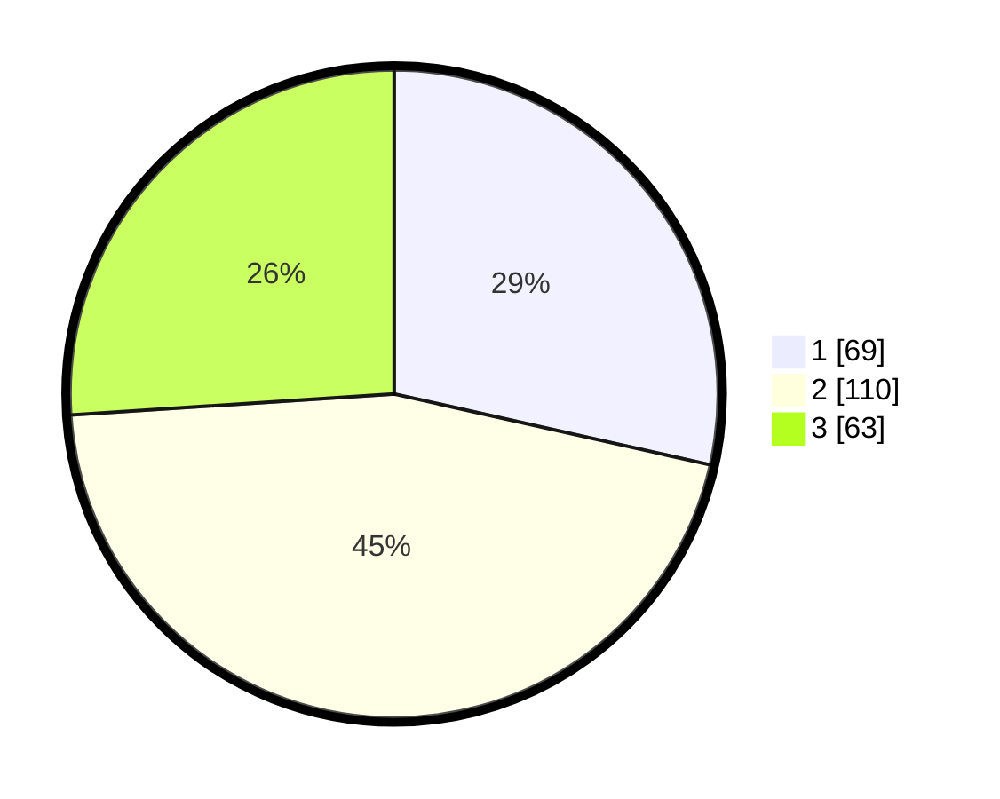

# Hasil

## Grafik

## Tabel

| No. | Nama Paslon    | Suara | Suara (raw) | Persentase |
|:--- |:-------------- | -----:| -----------:| ----------:|
| 1   | ANIES MUHAIMIN | 69    | [69][p-1]   | 28,51      |
| 2   | PRABOWO GIBRAN | 110   | [110][p-2]  | 45,45      |
| 3   | GANJAR MAHFUD  | 63    | [63][p-3]   | 26,03      |

[p-1]: https://github.com/gigit-pemilu/pemilu-2024-34-di-yogyakarta/blob/main/pilpres/hitung-suara/sub/34-di-yogyakarta/sub/02-bantul/sub/17-sedayu/sub/2002-argorejo/sub/009-tps/sub/paslon-1.txt
[p-2]: https://github.com/gigit-pemilu/pemilu-2024-34-di-yogyakarta/blob/main/pilpres/hitung-suara/sub/34-di-yogyakarta/sub/02-bantul/sub/17-sedayu/sub/2002-argorejo/sub/009-tps/sub/paslon-2.txt
[p-3]: https://github.com/gigit-pemilu/pemilu-2024-34-di-yogyakarta/blob/main/pilpres/hitung-suara/sub/34-di-yogyakarta/sub/02-bantul/sub/17-sedayu/sub/2002-argorejo/sub/009-tps/sub/paslon-3.txt

## Foto C Plano

https://sirekap-obj-formc.kpu.go.id/3cc5/pemilu/ppwp/34/02/17/20/02/3402172002009-20240215-134628--06f0fd8f-8a34-4ec0-88d3-fa8be5f833e5.jpg

https://sirekap-obj-formc.kpu.go.id/3cc5/pemilu/ppwp/34/02/17/20/02/3402172002009-20240222-202038--6e0c2508-98dd-462f-ba0b-302469f8520c.jpg

https://sirekap-obj-formc.kpu.go.id/3cc5/pemilu/ppwp/34/02/17/20/02/3402172002009-20240222-185658--eaa1699c-6ea8-42d3-8cf8-941331da9191.jpg

## Metadata

| Key        | Value               |
| ---------- | ------------------- |
| Time Stamp | 2024-02-22 21:00:00 |

