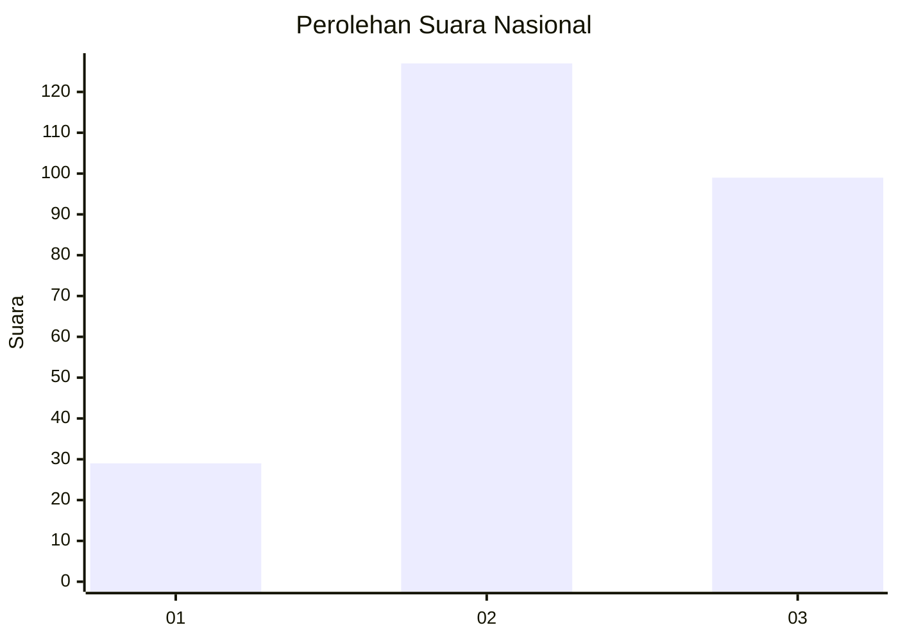
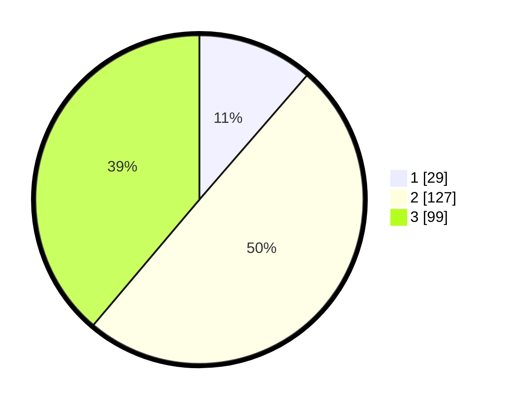

# Hasil

## Grafik

## Tabel

| No. | Nama Paslon    | Suara | Suara (raw) | Persentase |
|:--- |:-------------- | -----:| -----------:| ----------:|
| 1   | ANIES MUHAIMIN | 29    | [29][p-1]   | 11,37      |
| 2   | PRABOWO GIBRAN | 127   | [127][p-2]  | 49,80      |
| 3   | GANJAR MAHFUD  | 99    | [99][p-3]   | 38,82      |

[p-1]: https://github.com/gigit-pemilu/pemilu-2024/blob/main/pilpres/hitung-suara/sub/34-di-yogyakarta/sub/02-bantul/sub/17-sedayu/sub/2002-argorejo/sub/010-tps/sub/paslon-1.txt
[p-2]: https://github.com/gigit-pemilu/pemilu-2024/blob/main/pilpres/hitung-suara/sub/34-di-yogyakarta/sub/02-bantul/sub/17-sedayu/sub/2002-argorejo/sub/010-tps/sub/paslon-2.txt
[p-3]: https://github.com/gigit-pemilu/pemilu-2024/blob/main/pilpres/hitung-suara/sub/34-di-yogyakarta/sub/02-bantul/sub/17-sedayu/sub/2002-argorejo/sub/010-tps/sub/paslon-3.txt

## Foto C Plano

https://sirekap-obj-formc.kpu.go.id/f63c/pemilu/ppwp/34/02/17/20/02/3402172002010-20240222-222303--ddbd877e-21a8-436a-8c35-61fdca1e3795.jpg

https://sirekap-obj-formc.kpu.go.id/f63c/pemilu/ppwp/34/02/17/20/02/3402172002010-20240222-223750--3d491241-656d-45cc-8c81-e41d35ae60a5.jpg

https://sirekap-obj-formc.kpu.go.id/f63c/pemilu/ppwp/34/02/17/20/02/3402172002010-20240222-223842--032055c2-1c97-4988-a49b-6d410d3bbf28.jpg

## Metadata

| Key        | Value               |
| ---------- | ------------------- |
| Time Stamp | 2024-02-24 22:31:28 |

