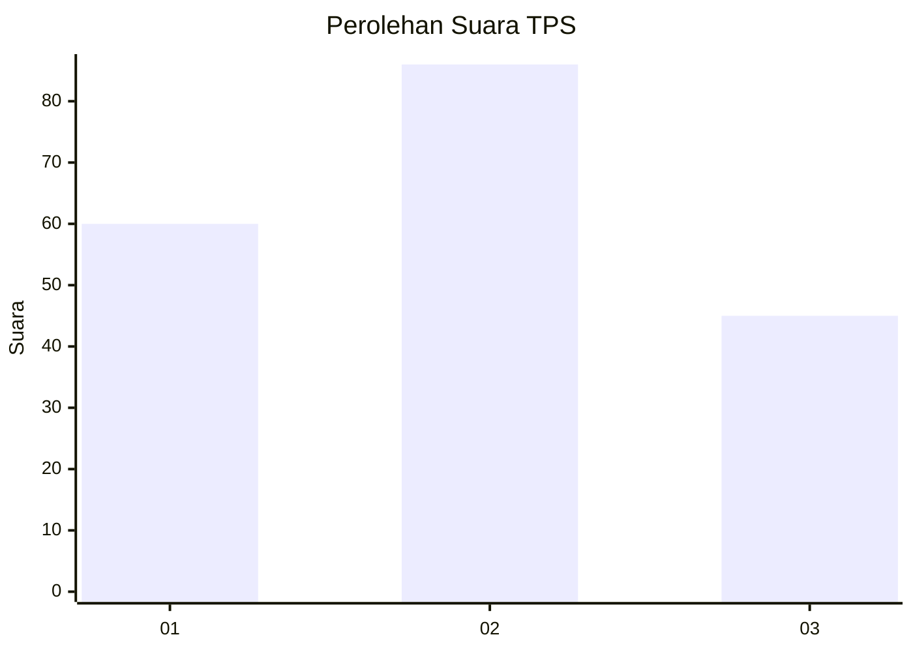
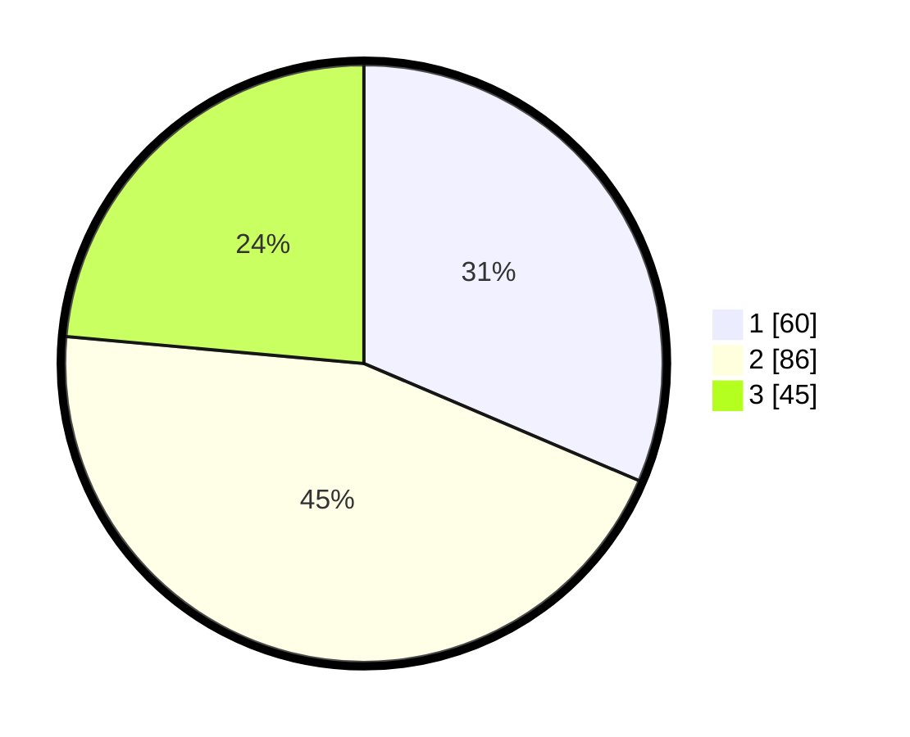

# Hasil

## Grafik

## Tabel

| No. | Nama Paslon    | Suara | Suara (raw) | Persentase |
|:--- |:-------------- | -----:| -----------:| ----------:|
| 1   | ANIES MUHAIMIN | 60    | [60][p-1]   | 31,41      |
| 2   | PRABOWO GIBRAN | 86    | [86][p-2]   | 45,03      |
| 3   | GANJAR MAHFUD  | 45    | [45][p-3]   | 23,56      |

[p-1]: https://github.com/gigit-pemilu/pemilu-2024-34-di-yogyakarta/blob/main/pilpres/hitung-suara/sub/34-di-yogyakarta/sub/02-bantul/sub/17-sedayu/sub/2002-argorejo/sub/015-tps/sub/paslon-1.txt
[p-2]: https://github.com/gigit-pemilu/pemilu-2024-34-di-yogyakarta/blob/main/pilpres/hitung-suara/sub/34-di-yogyakarta/sub/02-bantul/sub/17-sedayu/sub/2002-argorejo/sub/015-tps/sub/paslon-2.txt
[p-3]: https://github.com/gigit-pemilu/pemilu-2024-34-di-yogyakarta/blob/main/pilpres/hitung-suara/sub/34-di-yogyakarta/sub/02-bantul/sub/17-sedayu/sub/2002-argorejo/sub/015-tps/sub/paslon-3.txt

## Foto C Plano

https://sirekap-obj-formc.kpu.go.id/223d/pemilu/ppwp/34/02/17/20/02/3402172002015-20240215-073836--c752ada6-ecf1-44e9-b5ce-b2ce84a7db20.jpg

https://sirekap-obj-formc.kpu.go.id/223d/pemilu/ppwp/34/02/17/20/02/3402172002015-20240214-225017--f4343eb2-3e1e-464f-a5b3-025aafd1ffcc.jpg

https://sirekap-obj-formc.kpu.go.id/223d/pemilu/ppwp/34/02/17/20/02/3402172002015-20240214-225055--b658c064-5a49-4070-90a3-f8529705207b.jpg

## Metadata

| Key        | Value               |
| ---------- | ------------------- |
| Time Stamp | 2024-02-24 22:31:28 |

