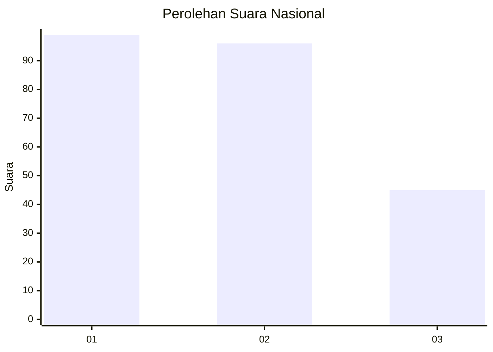
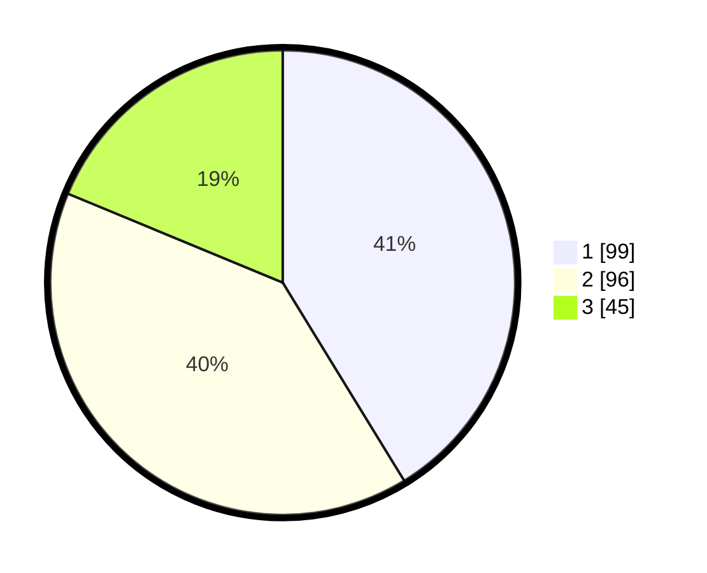

# Hasil

## Grafik

## Tabel

| No. | Nama Paslon    | Suara | Suara (raw) | Persentase |
|:--- |:-------------- | -----:| -----------:| ----------:|
| 1   | ANIES MUHAIMIN | 99    | [99][p-1]   | 41,25      |
| 2   | PRABOWO GIBRAN | 96    | [96][p-2]   | 40,00      |
| 3   | GANJAR MAHFUD  | 45    | [45][p-3]   | 18,75      |

[p-1]: https://github.com/gigit-pemilu/pemilu-2024/blob/main/pilpres/hitung-suara/sub/34-di-yogyakarta/sub/02-bantul/sub/17-sedayu/sub/2002-argorejo/sub/021-tps/sub/paslon-1.txt
[p-2]: https://github.com/gigit-pemilu/pemilu-2024/blob/main/pilpres/hitung-suara/sub/34-di-yogyakarta/sub/02-bantul/sub/17-sedayu/sub/2002-argorejo/sub/021-tps/sub/paslon-2.txt
[p-3]: https://github.com/gigit-pemilu/pemilu-2024/blob/main/pilpres/hitung-suara/sub/34-di-yogyakarta/sub/02-bantul/sub/17-sedayu/sub/2002-argorejo/sub/021-tps/sub/paslon-3.txt

## Foto C Plano

https://sirekap-obj-formc.kpu.go.id/e50b/pemilu/ppwp/34/02/17/20/02/3402172002021-20240215-020509--2951b644-8101-486c-8d94-7ff453048f12.jpg

https://sirekap-obj-formc.kpu.go.id/e50b/pemilu/ppwp/34/02/17/20/02/3402172002021-20240215-020647--89721286-a67b-4e75-a225-675005ca963e.jpg

https://sirekap-obj-formc.kpu.go.id/e50b/pemilu/ppwp/34/02/17/20/02/3402172002021-20240215-020814--aa350d41-2cbd-4d04-9146-8d482a54f5c3.jpg

## Metadata

| Key        | Value               |
| ---------- | ------------------- |
| Time Stamp | 2024-02-24 22:31:28 |

