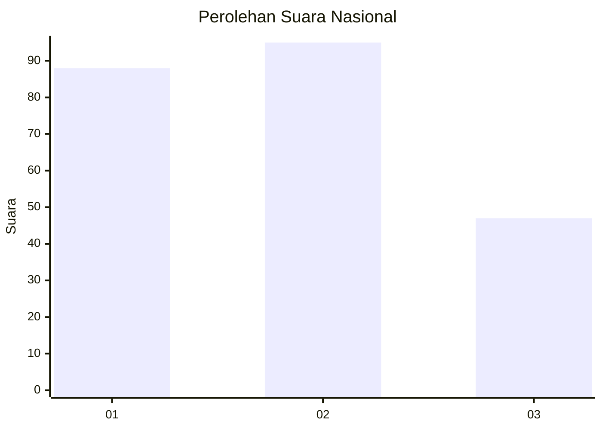
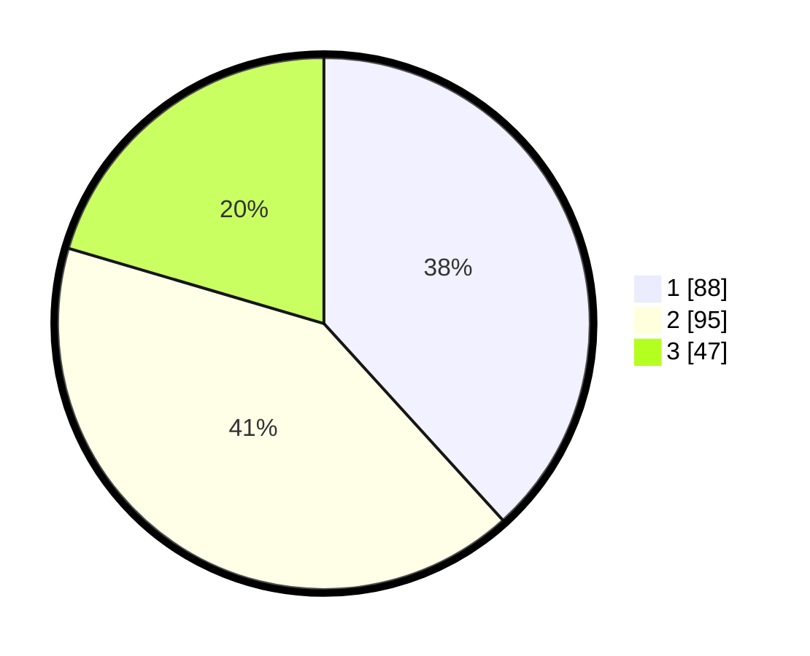

# Hasil

## Grafik

## Tabel

| No. | Nama Paslon    | Suara | Suara (raw) | Persentase |
|:--- |:-------------- | -----:| -----------:| ----------:|
| 1   | ANIES MUHAIMIN | 88    | [88][p-1]   | 38,26      |
| 2   | PRABOWO GIBRAN | 95    | [95][p-2]   | 41,30      |
| 3   | GANJAR MAHFUD  | 47    | [47][p-3]   | 20,43      |

[p-1]: https://github.com/gigit-pemilu/pemilu-2024/blob/main/pilpres/hitung-suara/sub/34-di-yogyakarta/sub/02-bantul/sub/17-sedayu/sub/2002-argorejo/sub/022-tps/sub/paslon-1.txt
[p-2]: https://github.com/gigit-pemilu/pemilu-2024/blob/main/pilpres/hitung-suara/sub/34-di-yogyakarta/sub/02-bantul/sub/17-sedayu/sub/2002-argorejo/sub/022-tps/sub/paslon-2.txt
[p-3]: https://github.com/gigit-pemilu/pemilu-2024/blob/main/pilpres/hitung-suara/sub/34-di-yogyakarta/sub/02-bantul/sub/17-sedayu/sub/2002-argorejo/sub/022-tps/sub/paslon-3.txt

## Foto C Plano

https://sirekap-obj-formc.kpu.go.id/1fd2/pemilu/ppwp/34/02/17/20/02/3402172002022-20240215-165054--10f1c469-105e-4821-be77-25247284fb52.jpg

https://sirekap-obj-formc.kpu.go.id/1fd2/pemilu/ppwp/34/02/17/20/02/3402172002022-20240215-001710--d3881f96-5107-4434-8256-3c75a2346afc.jpg

https://sirekap-obj-formc.kpu.go.id/1fd2/pemilu/ppwp/34/02/17/20/02/3402172002022-20240218-184242--07839e2d-a07f-4226-a110-14946c99aae4.jpg

## Metadata

| Key        | Value               |
| ---------- | ------------------- |
| Time Stamp | 2024-02-19 06:16:00 |

